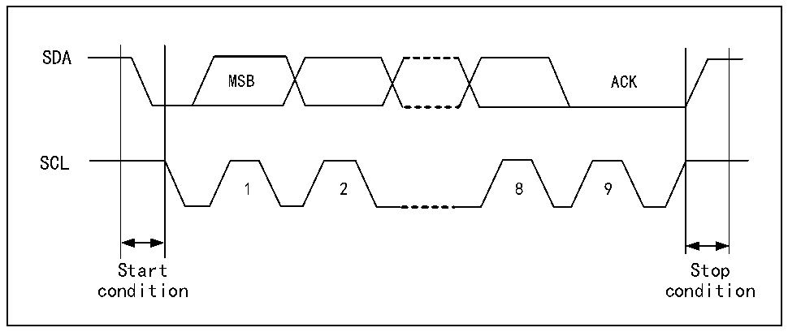

<!-- source-page: 281 -->

[← p.280](0280.md) · [index](../README.md) · [PDF p.281](https://ch32-riscv-ug.github.io/CH32V20x/datasheet_zh/CH32FV2x_V3xRM.PDF#page=281) · [p.282 →](0282.md)

<!-- header: CH32F/V20x_V30x_V31x系列应用手册 https://wch.cn -->

# 第 19 章 两线通信总线（I2C）

本章模块描述适用于CH32F20x、CH32V20x、CH32V30x和CH32V31x微控制器全系列产品。  
内部集成电路总线（I2C）广泛用在微控制器和传感器及其他片外模块的通讯上，它本身支持多  
主多从模式，仅仅使用两根线（SDA和SCL）就能以100kHz（标准）和400kHz（快速）两种速度通讯。  
I2C总线还兼容SMBus协议，不仅支持I2C的时序，还支持仲裁、定时和DMA，拥有CRC校验功能。  

## 19.1 主要特征

● 支持主模式和从模式  
● 支持7位或10位地址  
● 从设备支持双7位地址  
● 支持两种速度模式：100kHz和400kHz  
● 多种状态模式，多种错误标志  
● 支持加长的时钟功能  
● 2个中断向量  
● 支持DMA  
● 支持PEC  
● 兼容SMBus  

## 19.2 概述

I2C是半双工的总线，它同时只能运行在下列四种模式中之一：主设备发送模式、主设备接收模  
式、从设备发送模式和从设备接收模式。I2C模块默认工作在从模式，在产生起始条件后，会自动地  
切换到主模式，当仲裁丢失或产生停止信号后，会切换到从模式。I2C模块支持多主机功能。工作在  
主模式时，I2C模块会主动发出数据和地址。数据和地址都以8位为单位进行传输，高位在前，低位  
在后，在起始事件后的是一个字节（7位地址模式下）或两个字节（10位地址模式下）地址，主机每  
发送8位数据或地址，从机需要回复一个应答ACK，即把SDA总线拉低，如图19-1所示。  

图19-1 I2C时序图  
 <!-- rendered from the PDF; verify at https://ch32-riscv-ug.github.io/CH32V20x/datasheet_zh/CH32FV2x_V3xRM.PDF#page=281 -->

🖼 Text parsed from the figure above

SDA  
MSB ACK  
SCL  
1 2 8 9  
Start Stop  
condition condition  

为了正常使用必须给I2C输入正确的时钟，其中标准模式下，输入时钟最低为2MHz，在快速模式  
下，输入时钟最低为4MHz。  
图19-2是I2C模块功能框图。  
<!-- image: p281-draw-image-00001 bbox=[507.6, 786.0, 527.52, 797.04] -->
<!-- footer: V2.5 278 -->
