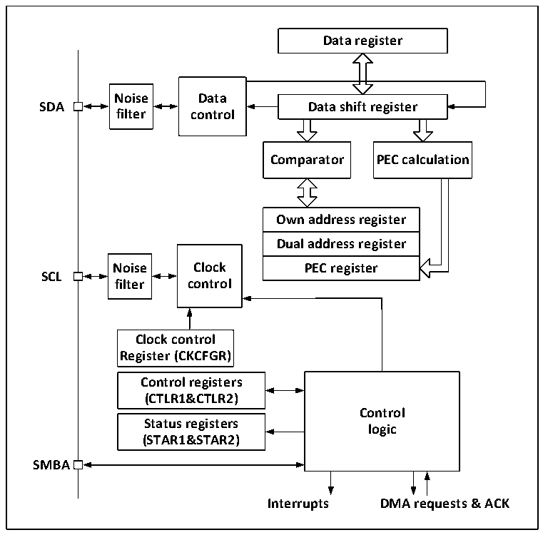

<!-- source-page: 282 -->

[← p.281](0281.md) · [index](../README.md) · [PDF p.282](https://ch32-riscv-ug.github.io/CH32V20x/datasheet_zh/CH32FV2x_V3xRM.PDF#page=282) · [p.283 →](0283.md)

<!-- header: CH32F/V20x_V30x_V31x系列应用手册 https://wch.cn -->

图19-2 I2C功能框图  
 <!-- rendered from the PDF; verify at https://ch32-riscv-ug.github.io/CH32V20x/datasheet_zh/CH32FV2x_V3xRM.PDF#page=282 -->

🖼 Text parsed from the figure above

<strong>Data register</strong>  
<strong>Noise Data</strong>  
<strong>SDA Data shift register</strong>  
<strong>filter control</strong>  
<strong>Comparator PEC calculation</strong>  
Own address register  Dual address register  PEC register  
<strong>Noise Clock PEC register</strong>  
<strong>SCL</strong>  
<strong>filter control</strong>  
<strong>Clock control</strong>  
<strong>Register (CKCFGR)</strong>  
<strong>Control registers</strong>  
<strong>(CTLR1&amp;CTLR2)</strong>  
<strong>Control</strong>  
<strong>Status registers</strong>  
<strong>logic</strong>  
<strong>(STAR1&amp;STAR2)</strong>  
<strong>SMBA</strong>  
<strong>Interrupts DMA requests &amp; ACK</strong>  

## 19.3 主模式

主模式时，I2C模块主导数据传输并输出时钟信号，数据传输以开始事件开始，以结束事件结束。  
使用主模式通讯的步骤为：  
在控制寄存器2（R16_I2Cx_CTLR2）和时钟控制寄存器（R16_I2Cx_CKCFGR）中设置正确的时  
钟；  
在上升沿寄存器（R16_I2Cx_RTR）设置合适的上升沿；  
在控制寄存器（R16_I2Cx_CTLR1）中置PE位启动外设；  
在控制寄存器（R16_I2Cx_CTLR1）中置START位，产生起始事件。  
在置 START 位后，I2C 模块会自动切换到主模式，MSL 位会置位，产生起始事件，在产生起始事  
件后，SB 位会置位，如果 ITEVTEN 位（在 R16_I2Cx_CTLR2）被置位，则会产生中断。此时应该读取  
状态寄存器1（R16_I2Cx_STAR1），写从地址到数据寄存器后，SB位会自动清除；  
如果是使用10位地址模式，那么写数据寄存器发送头序列（头序列为11110xx0b，其中的xx位  
是10位地址的最高两位）。  
在发送完头序列之后，状态寄存器的ADD10位会被置位，如果ITEVTEN位已经置位，则会产生中  
断，此时应读取R16_I2Cx_STAR1寄存器后，写第二个地址字节到数据寄存器后，清除ADD10位。  
然后写数据寄存器发送第二个地址字节，在发送完第二个地址字节后，状态寄存器的 ADDR 位会  
被置位，如果 ITEVTEN 位已经置位，则会产生中断，此时应读取 R16_I2Cx_STAR1 寄存器后再读一次  
R16_I2Cx_STAR2寄存器以清除ADDR位；  
如果使用的是7位地址模式，那么写数据寄存器发送地址字节，在发送完地址字节后，状态寄存  
器的ADDR位会被置位，如果ITEVTEN位已经置位，则会产生中断，此时应读取R16_I2Cx_STAR1寄存  
器后再读一次R16_I2Cx_STAR2寄存器以清除ADDR位；  
<!-- image: p282-draw-image-00001 bbox=[507.6, 786.0, 527.52, 797.04] -->
<!-- footer: V2.5 279 -->
