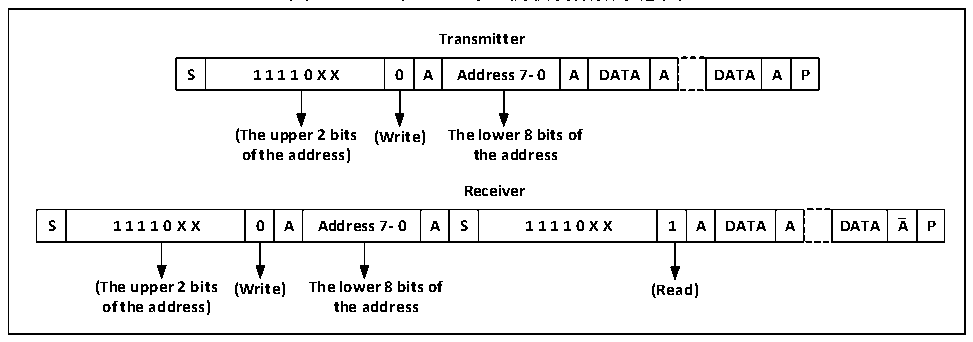
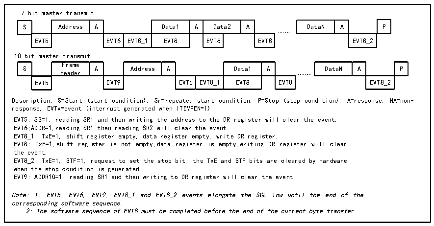

<!-- source-page: 283 -->

[← p.282](0282.md) · [index](../README.md) · [PDF p.283](https://ch32-riscv-ug.github.io/CH32V20x/datasheet_zh/CH32FV2x_V3xRM.PDF#page=283) · [p.284 →](0284.md)

<!-- header: CH32F/V20x_V30x_V31x系列应用手册 https://wch.cn -->
在7位地址模式下，发送的第一个字节为地址字节，头7位代表的是目标从设备地址，第8位决  
定了后续报文的方向，0代表是主设备写入数据到从设备，1代表是主设备向从设备读取信息。  
在10位地址模式下，如图18-3所示，在发送地址阶段，第一个字节为11110xx0，xx为10位地  
址的最高 2 位，第二个字节为 10 位地址的低 8位。若后续进入主设备发送模式，则继续发送数据；  
若后续准备进入主设备接收模式，则需要重新发送一个起始条件，跟随发送一个字节为11110xx1，然  
后进入主设备接收模式。  

图19-3 10位地址时主机收发数据示意图  
 <!-- rendered from the PDF; verify at https://ch32-riscv-ug.github.io/CH32V20x/datasheet_zh/CH32FV2x_V3xRM.PDF#page=283 -->

🖼 Text parsed from the figure above

<strong>Transmitter</strong>  
S  1 1 1 1 0 X X  0  A  Address 7- 0  A  DATA  A  DATA  A  P  
<strong>(The upper 2 bits (Write) The lower 8 bits of</strong>  
<strong>of the address) the address</strong>  
<strong>Receiver</strong>  
S  1 1 1 1 0 X X  0  A  Address 7- 0  A  S  1 1 1 1 0 X X  1  A  DATA  A  DATA  A  P  
<strong>(The upper 2 bits (Write) The lower 8 bits of (Read)</strong>  
<strong>of the address) the address</strong>  

主发送模式：  
主设备内部的移位寄存器将数据从数据寄存器发送到SDA线上，当主设备接收到ACK时，状态寄  
存器1（R16_I2Cx_STAR1）的TxE被置位，如果ITEVTEN和ITBUFEN被置位，还会产生中断。向数据  
寄存器写入数据将会清除TxE位。  
如果 TxE 位被置位且上次发送数据之前没有新的数据被写入数据寄存器，那么 BTF 位会被置位，  
在其被清除之前，SCL将保持低电平，读R16_I2Cx_STAR1后，向数据寄存器写入数据将会清除BTF位。  

图19-4 主发送器传送序列图  
 <!-- rendered from the PDF; verify at https://ch32-riscv-ug.github.io/CH32V20x/datasheet_zh/CH32FV2x_V3xRM.PDF#page=283 -->

🖼 Text parsed from the figure above

7-bit master transmit  
S  Address  A  Data1  A  Data2  A  EVT5  EVT6  EVT8_1  EVT8  EVT8  EVT8  
DataN  A  P  EVT8_2  
……  
10-bit master transmit  
S  Frame header  A  Address  A  Data1  A  EVT5  EVT9  EVT6  EVT8_1  EVT8  … EVT8  
DataN  A  P  EVT8_2  
Description: S=Start (start condition), Sr=repeated start condition, P=Stop (stop condition), A=response, NA=non-  
response, EVTx=event (interrupt generated when ITEVFEN=1)  
EVT5: SB=1, reading SR1 and then writing the address to the DR register will clear the event.  
EVT6;ADDR=1,reading SR1 then reading SR2 will clear the event.  
EVT8_1: TxE=1, shift register empty, data register empty, write DR register.  
EVT8: TxE=1,shift register is not empty,data register is empty,writing DR register will clear  
the event.  
EVT8_2: TxE=1, BTF=1, request to set the stop bit. the TxE and BTF bits are cleared by hardware  
when the stop condition is generated.  
EVT9: ADDR10=1, reading SR1 and then writing to DR register will clear the event.  
Note: 1: EVT5, EVT6, EVT9, EVT8_1 and EVT8_2 events elongate the SCL low until the end of the  
corresponding software sequence.  
2: The software sequence of EVT8 must be completed before the end of the current byte transfer.  

主接收模式：  
I2C模块会从SDA线接收数据，通过移位寄存器写进数据寄存器。在每个字节之后，如果ACK位  
被置位，那么 I2C 模块将会发出一个应答低电平，同时 RxNE 位会被置位，如果 ITEVTEN 和 ITBUFEN  
被置位，还会产生中断。如果RxNE被置位且在新的数据被接收前，原有的数据没有被读出，则BTF位  
将被置位，在清除BTF之前，SCL将保持低电平，读取R16_I2Cx_STAR1后，再读取数据寄存器将会清  
<!-- image: p283-draw-image-00001 bbox=[507.6, 786.0, 527.52, 797.04] -->
<!-- footer: V2.5 280 -->
