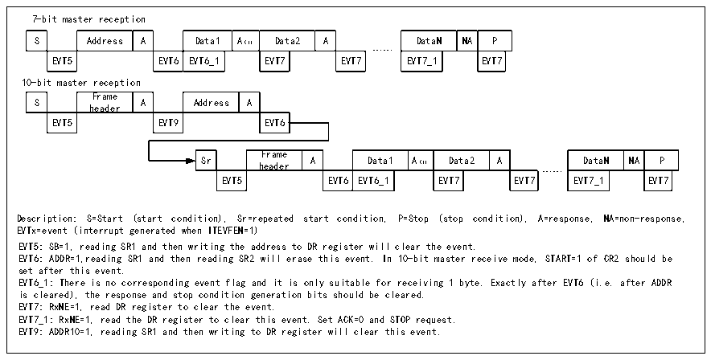

<!-- source-page: 284 -->

[← p.283](0283.md) · [index](../README.md) · [PDF p.284](https://ch32-riscv-ug.github.io/CH32V20x/datasheet_zh/CH32FV2x_V3xRM.PDF#page=284) · [p.285 →](0285.md)

<!-- header: CH32F/V20x_V30x_V31x系列应用手册 https://wch.cn -->
除BTF位。  

图19-5 接收器传送序列图  
 <!-- rendered from the PDF; verify at https://ch32-riscv-ug.github.io/CH32V20x/datasheet_zh/CH32FV2x_V3xRM.PDF#page=284 -->

🖼 Text parsed from the figure above

7-bit master reception  
S  Address  A  Data1  A（1）  Data2  A  EVT5  EVT6  EVT6_1  EVT7  EVT7  
DataN  NA  P  EVT7_1  EVT7  
……  
10-bit master reception  
S  Frame header  A  Address  A  EVT5  EVT9  EVT6  
Sr  Frame header  A  Data1  A（1）  Data2  A  EVT5  EVT6  EVT6_1  EVT7  EVT7  
DataN  NA  P  EVT7_1  EVT7  
……  
Description: S=Start (start condition), Sr=repeated start condition, P=Stop (stop condition), A=response, NA=non-response,  
EVTx=event (interrupt generated when ITEVFEN=1)  
EVT5: SB=1, reading SR1 and then writing the address to DR register will clear the event.  
EVT6: ADDR=1,reading SR1 and then reading SR2 will erase this event. In 10-bit master receive mode, START=1 of CR2 should be  
set after this event.  
EVT6_1: There is no corresponding event flag and it is only suitable for receiving 1 byte. Exactly after EVT6 (i.e. after ADDR  
is cleared), the response and stop condition generation bits should be cleared.  
EVT7: RxNE=1, read DR register to clear the event.  
EVT7_1: RxNE=1, read the DR register to clear this event. Set ACK=0 and STOP request.  
EVT9: ADDR10=1, reading SR1 and then writing to DR register will clear this event.  

主设备在结束发送数据时，会主动发一个结束事件，即置STOP位，I2C将切换至从模式。在接收  
模式时，主设备需要在最后一个数据位的应答位置NAK，接收到NACK后，从设备释放对SCL和SDA线  
的控制；主设备就可以发送一个停止/重起始条件。注意，产生停止条件后，I2C模块将会自动切换至  
从模式。  

## 19.4 从模式

从模式时，I2C模块能识别它自己的地址和广播呼叫地址。软件能控制开启或禁止广播呼叫地  
址的识别。一旦检测到起始事件，I2C模块将SDA的数据通过移位寄存器与自己的地址（位数取决  
于ENDUAL和ADDMODE）或广播地址（ENGC置位时）相比较，如果不匹配将会忽略，直到产生新的起  
始事件；如果与头序列相匹配，则会产生一个ACK信号并等待第二个字节的地址；如果第二字节的  
地址也匹配或者7位地址情况下全段地址匹配，那么：  
首先产生一个ACK应答；  
ADDR位被置位，如果ITEVTEN位已经置位，那么还会产生相应的中断；  
如果使用的是双地址模式（ENDUAL位被置位），还需要读取DUALF位来判断主机唤起的是哪一  
个地址。  
从模式默认是接收模式，在接收的头序列的最后一位为1，或者7位地址最后一位为1后（取  
决于第一次接收到头序列还是普通的7位地址），当接收到重复的起始条件时，I2C模块将进入到  
发送器模式，TRA位将指示当前是接收器还是发送器模式。  
从发送模式：  
在清除ADDR位后，I2C模块将字节从数据寄存器通过移位寄存器发送到SDA线上。从设备保持  
SCL为低电平，直到ADDR位被清除且待发送数据已写入数据寄存器。（见下图中的EVT1和  
EVT3）。在收到一个应答ACK后，TxE位将被置位，如果设置了ITEVTEN和ITBUFEN，还会产生一个  
中断。如果TxE被置位但在下一个数据发送结束前没有新的数据被写入数据寄存器时，BTF位将被  
置位。在清除BTF前，SCL将保持低电平，读取状态寄存器1（R16_I2Cx_STAR1）后，再向数据寄存  
器写入数据将会清除BTF位。  
<!-- image: p284-draw-image-00001 bbox=[507.6, 786.0, 527.52, 797.04] -->
<!-- footer: V2.5 281 -->
