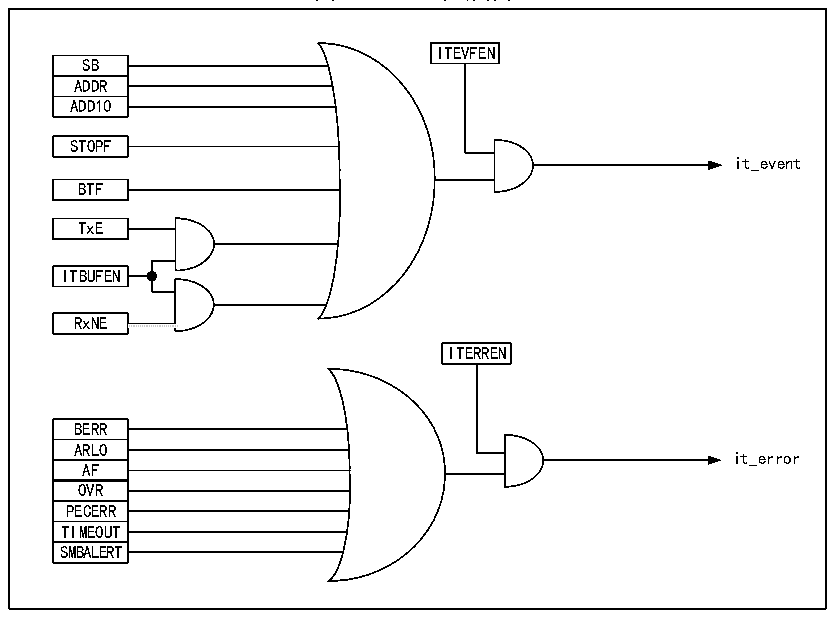

<!-- source-page: 287 -->

[← p.286](0286.md) · [index](../README.md) · [PDF p.287](https://ch32-riscv-ug.github.io/CH32V20x/datasheet_zh/CH32FV2x_V3xRM.PDF#page=287) · [p.288 →](0288.md)

<!-- header: CH32F/V20x_V30x_V31x系列应用手册 https://wch.cn -->
3） 都支持7位地址格式。  
同时SMBus和I2C也存在区别：  
1） I2C支持的速度最高400kHz，而SMBus支持的最高是100kHz，且SMBus有最小10kHz的速度限  
制；  
2） SMBus的时钟为低超过35mS时，会报超时，但I2C无此限制；  
3） SMBus有固定的逻辑电平，而I2C没有，取决于VDD；  
4） SMBus有总线协议，而I2C没有。  
SMBus还包括设备识别、地址解析协议、唯一的设备标识符、SMBus提醒和各种总线协议，具体  
请参考SMBus规范2.0版本。当使用SMBus时，只需要置控制寄存器的SMBus位，按需配置  
SMBTYPE位和ENAARP位。  

## 19.8 中断

每个I2C模块都有两种中断向量，分别是事件中断和错误中断。两种中断支持图19-4的中断  
源。  

图19-8 I2C中断请求  
 <!-- rendered from the PDF; verify at https://ch32-riscv-ug.github.io/CH32V20x/datasheet_zh/CH32FV2x_V3xRM.PDF#page=287 -->

🖼 Text parsed from the figure above

ITEVFEN  
SB  ADDR  ADD10  
STOPF  
it_event  
BTF  
TxE  
ITBUFEN  
RxNE  
<!-- image: p287-draw-image-00002 inside the figure -->
<!-- image: p287-draw-image-00003 inside the figure -->
ITERREN  
BERR  ARLO  AF  OVR  PECERR  TIMEOUT  SMBALERT  
it_error  

## 19.9 DMA

可以使用DMA来进行批量数据的收发。使用DMA时不能对控制寄存器的ITBUFEN位进行置位。  
● 利用DMA发送  
通过将CTLR2寄存器的DMAEN位置位可以激活DMA模式。只要TxE位被置位，数据将由DMA从  
设定的内存装载进I2C的数据寄存器。需要进行以下设定来为I2C分配通道。  
1） 向DMA_PADDRx寄存器设置I2Cx_DATAR寄存器地址，DMA_MADDRx寄存器中设置存储器地址，这  
样在每个TxE事件后，数据将从存储器送至I2Cx_DATAR寄存器。  
2） 在DMA_CNTRx寄存器中设置所需的传输字节数。在每个TxE事件后，此值将被递减。  
3） 利用DMA_CFGRx寄存器中的PL[0:1]位配置通道优先级。  
4） 设置DMA_CFGRx寄存器中的DIR位，并根据应用要求可以配置在整个传输完成一半或全部完成  
<!-- image: p287-draw-image-00001 bbox=[507.6, 786.0, 527.52, 797.04] -->
<!-- footer: V2.5 284 -->
