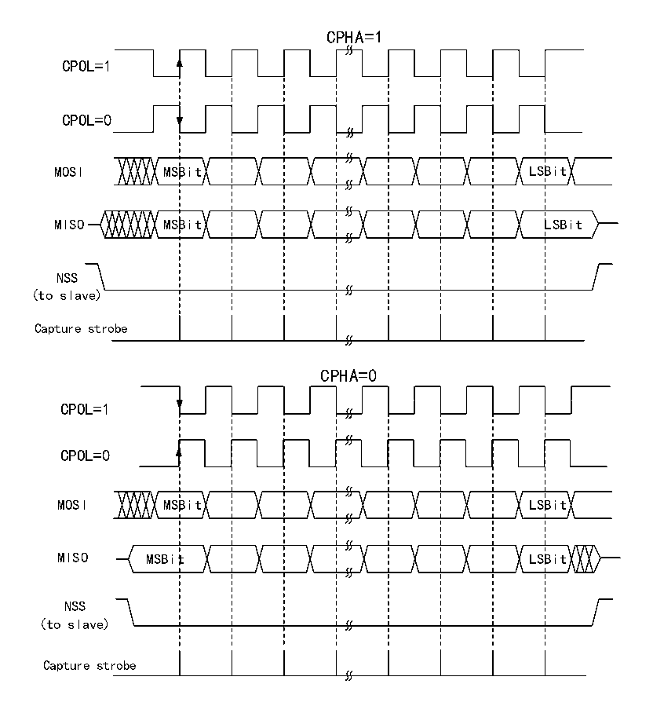

<!-- source-page: 299 -->

[← p.298](0298.md) · [index](../README.md) · [PDF p.299](https://ch32-riscv-ug.github.io/CH32V20x/datasheet_zh/CH32FV2x_V3xRM.PDF#page=299) · [p.300 →](0300.md)

<!-- header: CH32F/V20x_V30x_V31x系列应用手册 https://wch.cn -->

图20-2 SPI模式  
 <!-- rendered from the PDF; verify at https://ch32-riscv-ug.github.io/CH32V20x/datasheet_zh/CH32FV2x_V3xRM.PDF#page=299 -->

🖼 Text parsed from the figure above

CPHA=1  
CPOL=1  
CPOL=0  
MOSI MSBit LSBit  
MISO MSBit LSBit  
NSS  
(to slave)  
Capture strobe  
CPHA=0  
CPOL=1  
CPOL=0  
MOSI MSBit LSBit  
MISO MSBit LSBit  
NSS  
(to slave)  
Capture strobe  

主机和设备需要设置为相同的SPI模式，在配置SPI模式前，需要清除SPE位。DEF位可以决定  
SP的单个数据长度是8位还是16位。LSBFIRST可以控制单个数据字是高位在前还是低位在前。  

### 20.2.2 主模式

在SPI模块工作在主模式时，由SCK产生串行时钟。配置成主模式进行以下步骤：  
配置控制寄存器的BR[2:0]域来确定时钟；  
配置CPOL和CPHA位来确定SPI模式；  
配置DEF确定数据字长；  
配置LSBFIRST确定帧格式；  
配置NSS引脚，比如置SSOE位让硬件去置NSS。也可以置SSM位并把SSI位置高；  
置MSTR位和SPE位，需要保证NSS此时已经是高。  
需要发送数据时只需要向数据寄存器写要发送的数据就行了。SPI会从发送缓冲区并行地把数据  
送到移位寄存器，然后按照 LSBFIRST 的设置将数据从移位寄存器发出去，当数据已经到了移位寄存  
器时，TXE 标志会被置位，如果已经置位了 TXEIE，那么会产生中断。如果 TXE 标志位置位需要向数  
据寄存器里填数据，维持完整的数据流。  
当接收器接收数据时，当数据字的最后一个采样时钟沿到来时，数据从移位寄存器并行地转移到  
接收缓冲区，RXNE位被置位，如果之前置位了RXNEIE位，还会产生中断。此时应该尽快读取数据寄  
<!-- image: p299-draw-image-00001 bbox=[507.6, 786.0, 527.52, 797.04] -->
<!-- footer: V2.5 296 -->
