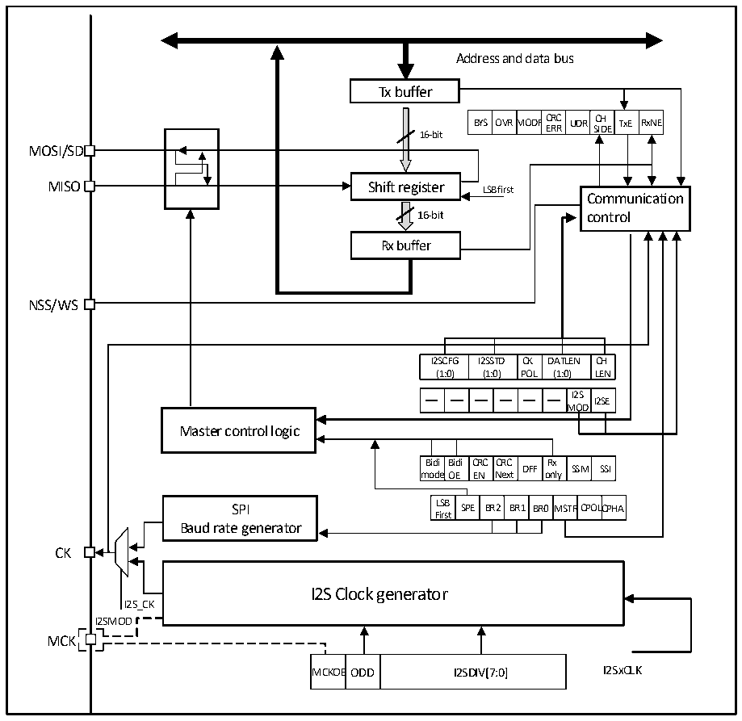

<!-- source-page: 301 -->

[← p.300](0300.md) · [index](../README.md) · [PDF p.301](https://ch32-riscv-ug.github.io/CH32V20x/datasheet_zh/CH32FV2x_V3xRM.PDF#page=301) · [p.302 →](0302.md)

<!-- header: CH32F/V20x_V30x_V31x系列应用手册 https://wch.cn -->
● 溢出错误  
如果主机发送了数据，而从设备的接收缓冲区中还有未读取的数据，就会发生溢出错误，OVR位  
被置位，如果ERRIE被置位还会产生中断。发送溢出错误应该重新开始当前传输。读取数据寄存器再  
读取状态寄存器会消除此位。  
● CRC错误  
当接收到的CRC校验字和RXCRCR的值不匹配时，会产生CRC校验错误，CRCERR位会被置位。  

### 20.2.8 中断

SPI模块的中断支持五个中断源，其中发送缓冲区空、接收缓冲区非空这两个事件分别会置位TXE  
和RXNE，在分别置位了TXEIE和RXNEIE位的情况下会产生中断。除此之外上面提到的三种错误也会  
产生中断，分别是MODF、OVR和CRCERR，在使能了ERRIE位之后，这三种错误也会产生错误中断。  

## 20.3 I2S 功能描述

### 20.3.1 I2S 概述

图20-3 I2S结构框图  
 <!-- rendered from the PDF; verify at https://ch32-riscv-ug.github.io/CH32V20x/datasheet_zh/CH32FV2x_V3xRM.PDF#page=301 -->

🖼 Text parsed from the figure above

Address and data bus  
Tx buffer  
BYS  OVRM  MODF  FCRCERR  UDR  CHSIDE  TxE  RxNE  
16-bit  
MOSI/SD  
MISO Shift register LSB first  
Communication  
16-bit control  
Rx buffer  
NSS/WS  
I2SCFG (1:0)  I2SSTD (1:0)  CKPOL  DATLEN (1:0)  CHLEN  
I2SMOD  I2SE  
OD  
Master control logic  
Bidi mode  Bidi OE  CRCEN  CRCNext  DFF  Rx only  SSM  SSI  
LSBFirst  SPE  BR2  BR1  BR0  MSTR  CPOLC  CPHA  
SPI LSB SPE BR2 BR1 BR0MSTRCPOLCPHA  
Baud rate generator  
CK  
I2S Clock generator  
I2S_CK  
I2SMOD  
MCK  
MCKOE  ODD  I2SDIV[7:0]  

<!-- image: p301-draw-image-00001 bbox=[507.6, 786.0, 527.52, 797.04] -->
<!-- footer: V2.5 298 -->
