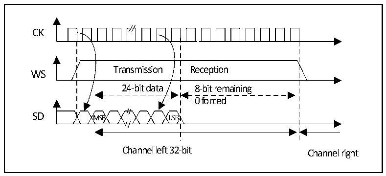
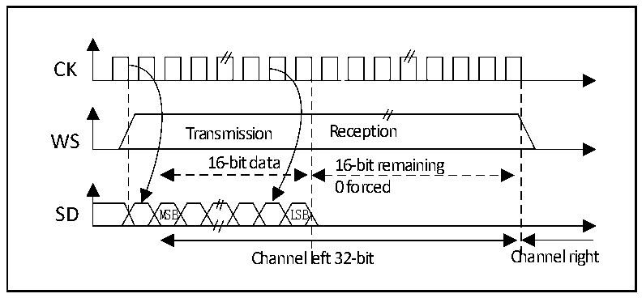
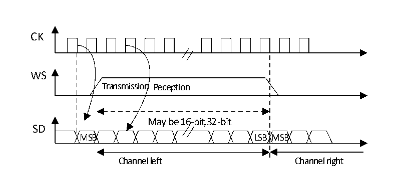

<!-- source-page: 305 -->

[← p.304](0304.md) · [index](../README.md) · [PDF p.305](https://ch32-riscv-ug.github.io/CH32V20x/datasheet_zh/CH32FV2x_V3xRM.PDF#page=305) · [p.306 →](0306.md)

<!-- header: CH32F/V20x_V30x_V31x系列应用手册 https://wch.cn -->

图20-8 MSB对齐24位数据，CPOL = 0  
 <!-- rendered from the PDF; verify at https://ch32-riscv-ug.github.io/CH32V20x/datasheet_zh/CH32FV2x_V3xRM.PDF#page=305 -->

🖼 Text parsed from the figure above

CK  
Transmission Reception  
WS  
24-bit data 8-bit remaining  
0 forced  
SD MSB LSB  
Channel left 32-bit Channel right  

图20-9 MSB对齐16位数据扩展到32位包帧，CPOL = 0  
 <!-- rendered from the PDF; verify at https://ch32-riscv-ug.github.io/CH32V20x/datasheet_zh/CH32FV2x_V3xRM.PDF#page=305 -->

🖼 Text parsed from the figure above

CK  
Transmission Reception  
WS  
16-bit data 16-bit remaining  
0 forced  
SD MSB LSB  
Channel left 32-bit Channel right  

#### 20.3.2.3 LSB 对齐标准

此标准与MSB对齐标准类似（在16位或32位全精度帧格式下无区别）。  

图20-10 LSB对齐16或 32位全精度，CPOL = 0  
 <!-- rendered from the PDF; verify at https://ch32-riscv-ug.github.io/CH32V20x/datasheet_zh/CH32FV2x_V3xRM.PDF#page=305 -->

🖼 Text parsed from the figure above

CK  
WS  
Transmission Peception  
May be 16-bit,32-bit  
SD  
MSB LSB MSB  
Channel left Channel right  

<!-- image: p305-draw-image-00001 bbox=[507.6, 786.0, 527.52, 797.04] -->
<!-- footer: V2.5 302 -->
