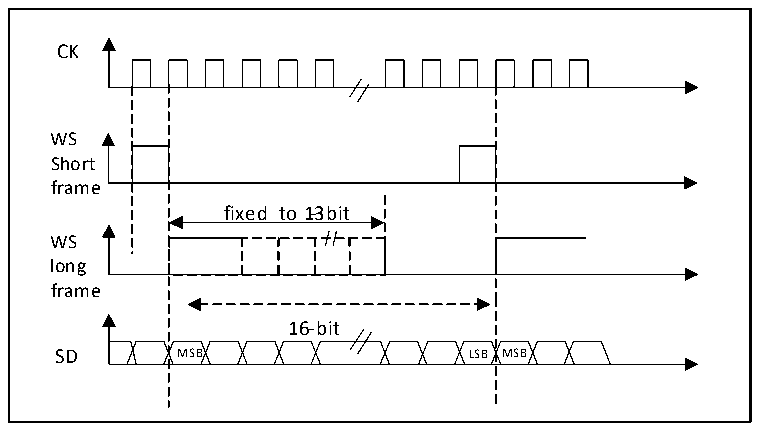
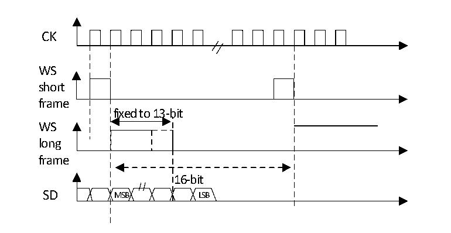

<!-- source-page: 307 -->

[← p.306](0306.md) · [index](../README.md) · [PDF p.307](https://ch32-riscv-ug.github.io/CH32V20x/datasheet_zh/CH32FV2x_V3xRM.PDF#page=307) · [p.308 →](0308.md)

<!-- header: CH32F/V20x_V30x_V31x系列应用手册 https://wch.cn -->
由硬件首先发送出去，一旦有效数据开始从 SD 引脚送出，即发生下一次 TXE 事件。在接收时，一旦  
接收到有效数据（而不是0x0000部分），即发生RXNE事件。这样，在2次读和写之间有更多的时间，  
可以防止下溢或上溢的情况发生。  

#### 20.3.2.4 PCM 标准

在PCM标准下，不存在声道选择的信息。PCM标准有2种可用的帧结构，短帧或长帧，可以通过  
设置寄存器I2SCFGR的PCMSYNC位来选择。  

图20-13 PCM标准波形（16位）  
 <!-- rendered from the PDF; verify at https://ch32-riscv-ug.github.io/CH32V20x/datasheet_zh/CH32FV2x_V3xRM.PDF#page=307 -->

🖼 Text parsed from the figure above

CK  
fixed to 1-3bit  16-bit MSB LSB  
WS  
Short  
frame  
WS  
long  
frame  

对于长帧，主模式下，用来同步的 WS 信号有效的时间固定为 13 位。对于短帧，用来同步的 WS  
信号长度只有1位。  

图20-14 PCM标准波形（16位）  
 <!-- rendered from the PDF; verify at https://ch32-riscv-ug.github.io/CH32V20x/datasheet_zh/CH32FV2x_V3xRM.PDF#page=307 -->

🖼 Text parsed from the figure above

CK  
WS  
short  
frame  
fixed to 13-bit  
WS  
long  
frame  
16-bit  
SD MSB LSB  

无论哪种模式（主或从）、哪种同步方式（短帧或长帧），连续的2帧数据之间和2个同步信号  
之间的时间差，（即使是从模式）需要通过设置I2SCFGR寄存器的DATLEN位和CHLEN位来确定。  

### 20.3.3 时钟发生器

I2S的比特率即确定了在I2S数据线上的数据流和I2S的时钟信号频率。I2S比特率 = 每个声道  
的比特数×声道数目×音频采样频率。  
对于一个具有左右声道和16位音频信号，I2S比特率计算如下：  
I2S比特率 = 16 × 2 × Fs  
<!-- image: p307-draw-image-00001 bbox=[507.6, 786.0, 527.52, 797.04] -->
<!-- footer: V2.5 304 -->
