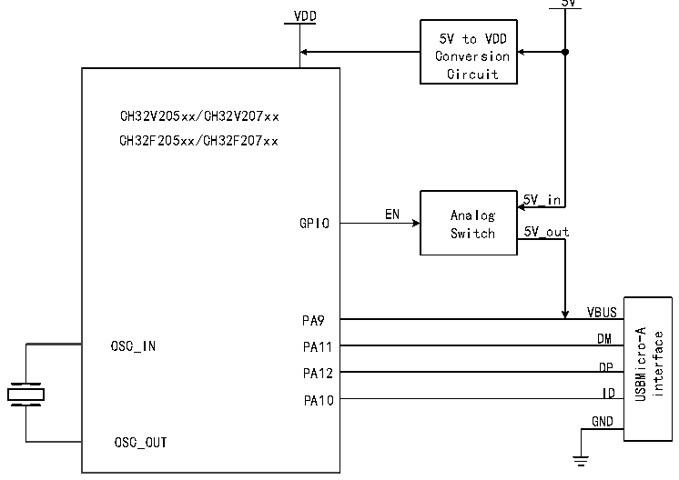

<!-- source-page: 364 -->

[← p.363](0363.md) · [index](../README.md) · [PDF p.364](https://ch32-riscv-ug.github.io/CH32V20x/datasheet_zh/CH32FV2x_V3xRM.PDF#page=364) · [p.365 →](0365.md)

<!-- header: CH32F/V20x_V30x_V31x系列应用手册 https://wch.cn -->

> ⬆ **Table continued** — rendered in full at [page 363](0363.md). <!-- p364-table-001 -->

注：端点配置支持0-7端点，可映射配置端点8-15端点。  

### 23.2.3 USB 主机寄存器

在USB OTG主机模式下，芯片提供了一组双向主机端点，包括一个发送端点OUT和一个接收端点  
IN，一个数据包的最大长度是1023字节，支持控制传输、中断传输、批量传输和实时/同步传输。  
在USB OTG主机模式下，若控制器不能为VUBS提供5V电源，则需外接电荷泵，若应用板能提供5V  
电源则可采用模拟开关控制VBUS的打开和关断，如图23-2所示。  

图23-2 OTG 的A类设备连接  
 <!-- rendered from the PDF; verify at https://ch32-riscv-ug.github.io/CH32V20x/datasheet_zh/CH32FV2x_V3xRM.PDF#page=364 -->

🖼 Text parsed from the figure above

5V  
VDD  
5V to VDD  
Conversion  
Circuit  
CH32V205xx/CH32V207xx  
CH32F205xx/CH32F207xx  
5V_in  
EN Analog  
GPIO  
Switch 5V_out  
VBUS  
PA9  
VBUSDM  DMDP  DPID  
USBMicro-A interface  
OSC_IN  
PA11  
PA12  
PA10  
GND  
OSC_OUT  

主机端点发起的每一个USB事务，在处理结束后总是自动设置RB_UIF_TRANSFER中断标志。应用  
程序可以直接查询或在USB中断服务程序中查询并分析中断标志寄存器R8_USB_INT_FG，根据各中断  
标志分别进行相应的处理；并且，如果RB_UIF_TRANSFER有效，那么还需要继续分析USB中断状态寄  
存器R8_USB_INT_ST，根据当前USB传输事务的应答PID标识MASK_UIS_H_RES进行相应的处理。  
如果事先设定了主机接收端点的 IN 事务的同步触发位（RB_UH_R_TOG），那么可以通过  
RB_U_TOG_OK或RB_UIS_TOG_OK判断当前所接收到的数据包的同步触发位是否与主机接收端点的同步  
触发位匹配，如果数据同步，则数据有效；如果数据不同步，则数据应该被丢弃。每次处理完USB发  
送或接收中断后，都应该正确修改相应主机端点的同步触发位，用于同步下次所发送的数据包和检测  
<!-- image: p364-draw-image-00001 bbox=[507.6, 786.0, 527.52, 797.04] -->
<!-- footer: V2.5 361 -->
