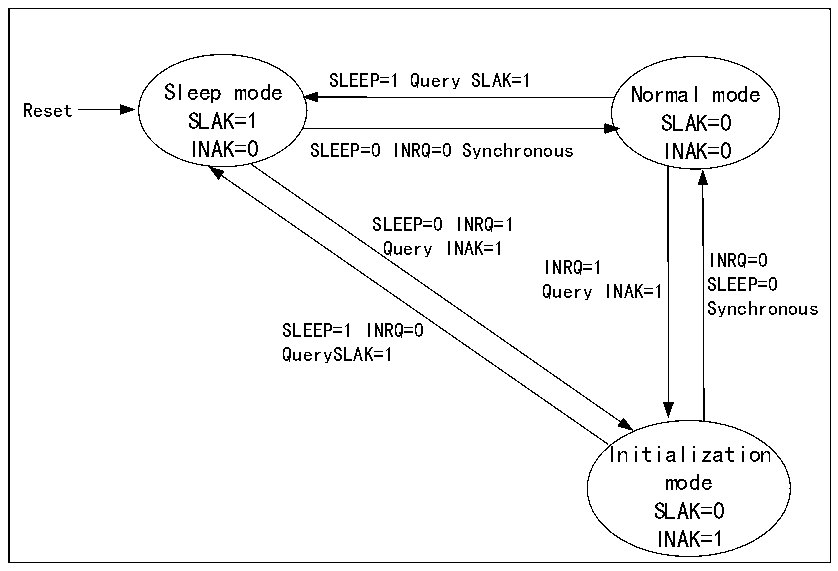

<!-- source-page: 370 -->

[← p.369](0369.md) · [index](../README.md) · [PDF p.370](https://ch32-riscv-ug.github.io/CH32V20x/datasheet_zh/CH32FV2x_V3xRM.PDF#page=370) · [p.371 →](0371.md)

<!-- header: CH32F/V20x_V30x_V31x系列应用手册 https://wch.cn -->

图24-1 CAN工作模式切换  
 <!-- rendered from the PDF; verify at https://ch32-riscv-ug.github.io/CH32V20x/datasheet_zh/CH32FV2x_V3xRM.PDF#page=370 -->

🖼 Text parsed from the figure above

SLEEP=1 Query SLAK=1  
Sleep mode Normal mode  
Reset  
SLAK=1 SLAK=0  
INAK=0 SLEEP=0 INRQ=0 Synchronous INAK=0  
SLEEP=0 INRQ=1  
Query INAK=1  
INRQ=0  
INRQ=1  
SLEEP=0  
Query INAK=1  
Synchronous  
SLEEP=1 INRQ=0  
QuerySLAK=1  
Initialization  
mode  
SLAK=0  
INAK=1  

## 24.3 CAN 控制器测试模式

在初始化模式下，对寄存器CAN_BTIMR的SILM和LBKM位进行操作，可以选择一种测试模式，然  
后通过对寄存器CAN_CTLR的INRQ位清零，退出初始化模式，进入测试模式。测试模式分为静默模式、  
环回模式和静默环回模式三种。  

### 24.3.1 静默模式

对寄存器CAN_BTIMR的SILM位置1，可选择进入静默模式。该模式下，CAN控制器可以接收，不  
能对外发送报文，对外总是处于隐性位，可以避免对总线产生影响，但是报文能够被所在节点的控制  
器所接收。通常静默模式被用于CAN总线的状态分析。  

### 24.3.2 环回模式

对寄存器CAN_BTIMR的LBKM位置1，可选择进入环回模式。该模式下，CAN控制器可以对外发送  
报文，不能接收外部报文，但是发送报文能够被所在节点的控制器所接收，接收过滤机制有效。通常  
环回模式被用于CAN控制器的收发测试。  

### 24.3.3 静默环回模式

对寄存器CAN_BTIMR的SILM和LBKM位置1，可选择进入静默环回模式。该模式通常用于CAN控  
制器封闭自测试，在该模式下，对CAN总线无影响，RX引脚与总线断开，TX引脚置隐性位。  
<!-- image: p370-draw-image-00001 bbox=[507.6, 786.0, 527.52, 797.04] -->
<!-- footer: V2.5 367 -->
