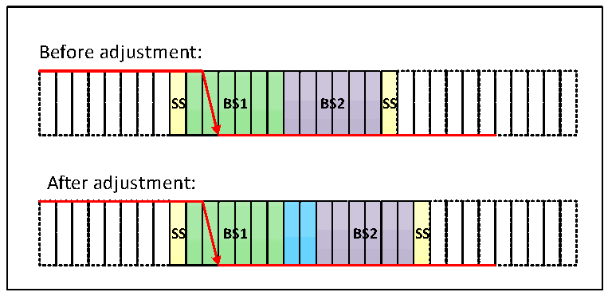
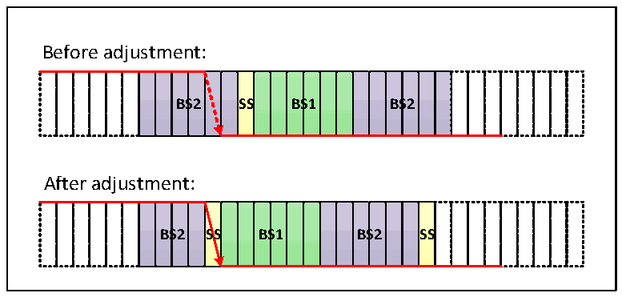

<!-- source-page: 376 -->

[← p.375](0375.md) · [index](../README.md) · [PDF p.376](https://ch32-riscv-ug.github.io/CH32V20x/datasheet_zh/CH32FV2x_V3xRM.PDF#page=376) · [p.377 →](0377.md)

<!-- header: CH32F/V20x_V30x_V31x系列应用手册 https://wch.cn -->

图24-7 跳变出现在BS1中  
 <!-- rendered from the PDF; verify at https://ch32-riscv-ug.github.io/CH32V20x/datasheet_zh/CH32FV2x_V3xRM.PDF#page=376 -->

🖼 Text parsed from the figure above

Before adjustment:  
<strong>SS BS1 BS2 SS</strong>  
After adjustment:  
<strong>SS BS1 BS2 SS</strong>  

如图24-7，SJW为2，总线电平跳变在时间段1被检测到，则需要延长时间段1的长度，最大延  
长SJW，从而延迟采样点的位置。  

图24-8 跳变出现在BS2中  
 <!-- rendered from the PDF; verify at https://ch32-riscv-ug.github.io/CH32V20x/datasheet_zh/CH32FV2x_V3xRM.PDF#page=376 -->

🖼 Text parsed from the figure above

Before adjustment:  
<strong>BS2 SS BS1 BS2</strong>  
After adjustment:  
<strong>BS2 SS BS1 BS2 SS</strong>  

如图24-8，SJW为2，总线电平跳变在时间段2被检测到，则需要缩小时间段2的长度，最大缩  
小SJW，从而提前采样点的位置。  
CAN波特率计算公式为：  
（ ）  
tpclk1  
这里tpclk1为PCBA1N时bp钟s周=期，BRP[9:0]、TS1[3:0]、TS2[2:0]为CANx_BTIMR寄存器对应位。  
TS1[3:0]+1+TS2[2:0]+1+1 ×BRP[9:0]  

## 24.6 CAN 中断

CAN 控制器有四个中断向量，分别为发送中断、FIFO_0 中断、FIFO_1 中断、错误及状态变化中  
断。  
设置CAN中断允许寄存器CAN_INTENR，可以允许或禁用各个中断源。  
发送中断由发送邮箱变空事件产生，中断产生后，查询寄存器 CAN_TSTATR 的 RQCP0、RQCP1 和  
RQCP2位来判断是哪个邮箱变空事件产生。  
FIFO0中断由接收新报文、接收邮箱变满和溢出事件产生，中断产生后，查询寄存器CAN_RFIFO0  
的FMP0、FULL0和FOVER0位来判断是哪个邮箱变空事件产生。  
FIFO1中断由接收新报文、接收邮箱变满和溢出事件产生，中断产生后，查询寄存器CAN_RFIFO1  
的FMP1、FULL1和FOVER1位来判断是哪个邮箱变空事件产生。  
<!-- image: p376-draw-image-00001 bbox=[507.6, 786.0, 527.52, 797.04] -->
<!-- footer: V2.5 373 -->
