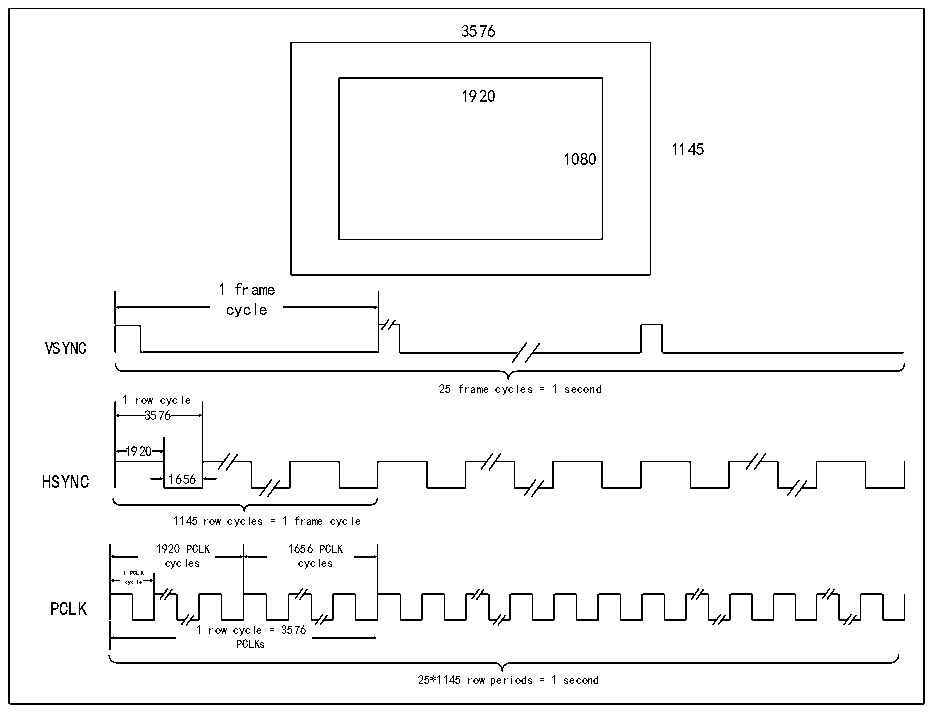

<!-- source-page: 397 -->

[← p.396](0396.md) · [index](../README.md) · [PDF p.397](https://ch32-riscv-ug.github.io/CH32V20x/datasheet_zh/CH32FV2x_V3xRM.PDF#page=397) · [p.398 →](0398.md)

<!-- header: CH32F/V20x_V30x_V31x系列应用手册 https://wch.cn -->

### 25.2.2 工作时序

一般使用的DVP接口传感器模块输出的数字信号数据流和图像大小存在一定的关系，下面以一  
个图像数据举例。  
如图25-2所示，传感器内部是一个3576*1145大小完整的图像尺寸，经过内部缩放处理，最终  
从接口输出的图像数据大小为1920*1080，图像刷新率为25。  

图25-2 时序描述  
 <!-- rendered from the PDF; verify at https://ch32-riscv-ug.github.io/CH32V20x/datasheet_zh/CH32FV2x_V3xRM.PDF#page=397 -->

🖼 Text parsed from the figure above

3576  
1920  
1145  
1080  
1 frame  
cycle  
VSYNC  
25 frame cyc les = 1 second  
1 row cycle  
3576  
1920  
HSYNC 1656  
1145 row cycles = 1 frame cycle  
1920 PCLK 1656 PCLK  
cycles cycles  
1 PCLK  
cycle  
PCLK  
1 row cycle = 3576  
PCLKs  
25*1145 row periods = 1 second  

PCLK是一个像素传输的时间，所以HSYNC是PCLK的3576倍，在3576个像素中，只有1920个  
像素是有效的，剩下的1656个像素点时间内Sensor不传输数据。VSYNC是帧同步信号，所以VSYNC  
时间是PCLK的3576*1145倍，同样，只有在1920*1080个有效像素时间内，Sensor在传输数据。  
如果传感器传输的是JPEG压缩后的数据，可能无需使用HSYNC信号。  
DVP接口信号和图像数据的关系具体以选用的传感器数据手册说明为主。  

### 25.2.3 RGB/YUV/JPEG 压缩数据格式说明

● RGB  
三原色：红色、绿色、蓝色  
● YUV  
亮度信号Y，色度信号U和V、Pb和Pr、Cb和Cr。  
● JPEG（Joint Photographic Experts Group）  
有损失压缩，但损失的部分是人视觉不易察觉的部分，利用人眼对计算机色彩中高频信息部分  
不敏感的特点。去除视觉上多余信息（空间冗余度），去除数据本身的多余信息（结构冗余度）。  
<!-- image: p397-draw-image-00001 bbox=[507.6, 786.0, 527.52, 797.04] -->
<!-- footer: V2.5 394 -->
