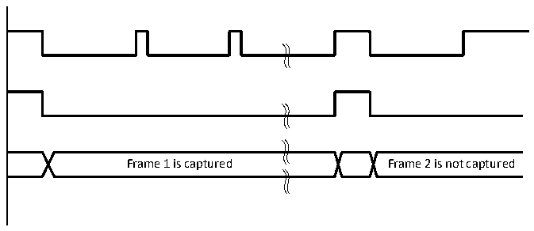
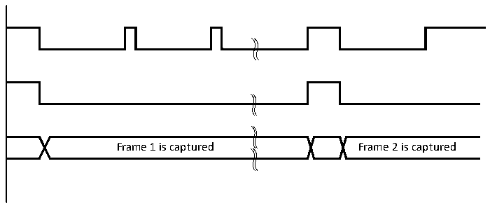
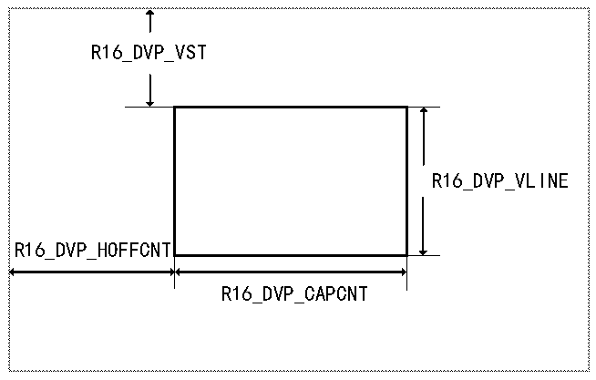

<!-- source-page: 399 -->

[← p.398](0398.md) · [index](../README.md) · [PDF p.399](https://ch32-riscv-ug.github.io/CH32V20x/datasheet_zh/CH32FV2x_V3xRM.PDF#page=399) · [p.400 →](0400.md)

<!-- header: CH32F/V20x_V30x_V31x系列应用手册 https://wch.cn -->

图25-3 快照模式下的单帧捕获波形  
 <!-- rendered from the PDF; verify at https://ch32-riscv-ug.github.io/CH32V20x/datasheet_zh/CH32FV2x_V3xRM.PDF#page=399 -->

🖼 Text parsed from the figure above

Frame 1 is captured Frame 2 is not captured  

#### 25.3.3.2 连续模式

在该模式下（R8_DVP_CR1寄存器中RB_DVP_CM清0），当使能DVP接口后，在R8_DVP_CR0寄存  
器的RB_DVP_ENABLE字段清0前，会持续采样每帧数据。连续模式下的帧捕获波形如图25-4所示。  

图25-4 连续模式下帧捕获波形  
 <!-- rendered from the PDF; verify at https://ch32-riscv-ug.github.io/CH32V20x/datasheet_zh/CH32FV2x_V3xRM.PDF#page=399 -->

🖼 Text parsed from the figure above

Frame 1 is captured Frame 2 is captured  

### 25.3.4 裁剪功能说明

DVP可以使用裁剪功能从接收到的图像中截取一个矩形窗口，该矩形窗口起始坐标（矩形左上  
角X坐标R16_DVP_HOFFCNT，Y坐标R16_DVP_VST）和窗口大小（R16_DVP_CAPCNT表示水平尺寸、  
R16_DVP_VLINE表示垂直尺寸）可配置。裁剪窗口的坐标和大小如图25-5所示。裁剪窗口数据捕获  
波形如图25-6所示。  

图25-5 裁剪窗口的坐标和大小  
 <!-- rendered from the PDF; verify at https://ch32-riscv-ug.github.io/CH32V20x/datasheet_zh/CH32FV2x_V3xRM.PDF#page=399 -->

🖼 Text parsed from the figure above

R16_DVP_VST  
R16_DVP_VLINE  
R16_DVP_HOFFCNT  
R16_DVP_CAPCNT  

<!-- image: p399-draw-image-00001 bbox=[507.6, 786.0, 527.52, 797.04] -->
<!-- footer: V2.5 396 -->
