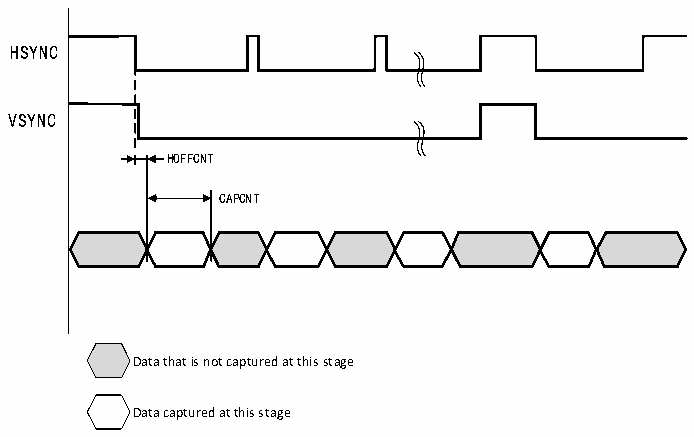

<!-- source-page: 400 -->

[← p.399](0399.md) · [index](../README.md) · [PDF p.400](https://ch32-riscv-ug.github.io/CH32V20x/datasheet_zh/CH32FV2x_V3xRM.PDF#page=400) · [p.401 →](0401.md)

<!-- header: CH32F/V20x_V30x_V31x系列应用手册 https://wch.cn -->

图25-6 裁剪窗口数据捕获波形  
 <!-- rendered from the PDF; verify at https://ch32-riscv-ug.github.io/CH32V20x/datasheet_zh/CH32FV2x_V3xRM.PDF#page=400 -->

🖼 Text parsed from the figure above

HSYNC  
VSYNC  
HOFFCNT  
CAPCNT  
Data that is not captured at this stage  
Data captured at this stage  

## 25.4 寄存器描述

<!-- p400-table-001 (table-25-2@1) -->
<table><caption>表25-2 DVP相关寄存器列表</caption><tr><th>名称</th><th>访问地址</th><th>描述</th><th>复位值</th></tr><tr><td>R8_DVP_CR0</td><td>0x50050000</td><td>DVP控制寄存器0</td><td>0x00</td></tr><tr><td>R8_DVP_CR1</td><td>0x50050001</td><td>DVP控制寄存器1</td><td>0x06</td></tr><tr><td>R8_DVP_IER</td><td>0x50050002</td><td>DVP中断使能寄存器</td><td>0x00</td></tr><tr><td>R16_DVP_ROW_NUM</td><td>0x50050004</td><td>图像行数配置寄存器</td><td>0x0000</td></tr><tr><td>R16_DVP_COL_NUM</td><td>0x50050006</td><td>图像列数配置寄存器</td><td>0x0000</td></tr><tr><td>R32_DVP_DMA_BUF0</td><td>0x50050008</td><td>DVP DMA地址0寄存器</td><td>0x00000000</td></tr><tr><td>R32_DVP_DMA_BUF1</td><td>0x5005000C</td><td>DVP DMA地址1寄存器</td><td>0x00000000</td></tr><tr><td>R8_DVP_IFR</td><td>0x50050010</td><td>DVP中断标志寄存器</td><td>0x00</td></tr><tr><td>R8_DVP_STATUS</td><td>0x50050011</td><td>DVP接收FIFO状态寄存器</td><td>0x00</td></tr><tr><td>R16_DVP_ROW_CNT</td><td>0x50050014</td><td>DVP行计数器寄存器</td><td>0x0000</td></tr><tr><td>R16_DVP_HOFFCNT</td><td>0x50050018</td><td>窗口开始的水平方向位移寄存器</td><td>0x0000</td></tr><tr><td>R16_DVP_VST</td><td>0x5005001A</td><td>窗口开始的行数寄存器</td><td>0x0000</td></tr><tr><td>R16_DVP_CAPCNT</td><td>0x5005001C</td><td>捕获计数寄存器</td><td>0x0000</td></tr><tr><td>R16_DVP_VLINE</td><td>0x5005001E</td><td>垂直行计数寄存器</td><td>0x0000</td></tr><tr><td>R32_DVP_DR</td><td>0x50050020</td><td>数据寄存器</td><td>0x00000000</td></tr></table>

### 25.4.1 DVP 配置寄存器（R8_DVP_CR0）

偏移地址：0x00  

<!-- p400-table-002 (table-25-2@1) pages 400-401 -->
<table><tr><th>位</th><th>名称</th><th>访问</th><th>描述</th><th>复位值</th></tr><tr><td>6</td><td>RB_DVP_JPEG</td><td>RW</td><td style="text-align:left">JPEG模式使能： 0：原始数据格式； 1：JPEG压缩格式。</td><td>0</td></tr><tr><td>[5:4]</td><td>RB_DVP_MSK_DAT_MOD[1:0]</td><td>RW</td><td style="text-align:left">DVP数据位宽配置： 00：8位模式； 01：10位模式； 1x：12位模式。</td><td>00b</td></tr><tr><td>3</td><td>RB_DVP_P_POLAR</td><td>RW</td><td style="text-align:left">PCLK极性配置： 0：在PCLK上升沿采样数据； 1：在PCLK下降沿采样数据。</td><td>0</td></tr><tr><td>2</td><td>RB_DVP_H_POLAR</td><td>RW</td><td style="text-align:left">HSYNC极性配置： 0：HSYNC高电平数据有效； 1：HSYNC低电平数据有效。</td><td>0</td></tr><tr><td>1</td><td>RB_DVP_V_POLAR</td><td>RW</td><td style="text-align:left">VSYNC极性配置： 0：VSYNC低电平数据有效； 1：VSYNC高电平数据有效。</td><td>0</td></tr><tr><td>0</td><td>RB_DVP_ENABLE</td><td>RW</td><td style="text-align:left">DVP功能使能： 0：禁用DVP； 1：使能DVP。</td><td>0</td></tr></table>

<!-- image: p400-draw-image-00001 bbox=[507.6, 786.0, 527.52, 797.04] -->
<!-- footer: V2.5 397 -->
