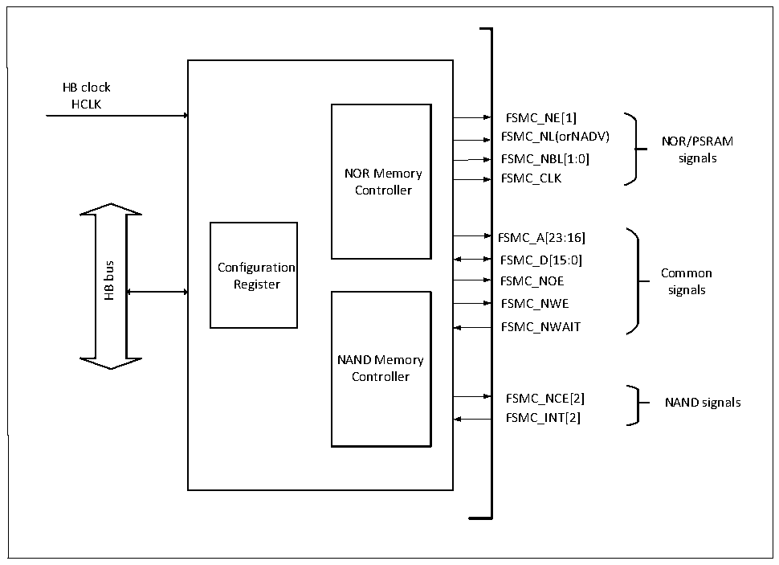

<!-- source-page: 405 -->

[← p.404](0404.md) · [index](../README.md) · [PDF p.405](https://ch32-riscv-ug.github.io/CH32V20x/datasheet_zh/CH32FV2x_V3xRM.PDF#page=405) · [p.406 →](0406.md)

<!-- header: CH32F/V20x_V30x_V31x系列应用手册 https://wch.cn -->

# 第 26 章 可变静态存储控制器（FSMC）

本章模块描述适用于CH32F20x和CH32V30x微控制器系列部分产品。  
可变静态存储控制器（FSMC），支持多种静态存储器类型以及丰富的存储操作方法，可根据系统  
应用需要，对不同类型大容量静态存储器进行扩展。  

## 26.1 主要特性

● 支持操作SRAM、ROM、NOR FLASH和PSRAM  
● 支持操作NAND FLASH，并且内置硬件ECC，最多可检测8KByte数据  
● 支持对同步器件操作，如PSRAM  
● 支持8bit或16bit数据总线宽度  
● 时序信号可软件编程  

## 26.2 功能描述

### 26.2.1 模块结构

FSMC主要包括HB总线接口、NOR存储控制器、NAND存储控制器和外部设备接口。  

图26-1 FSMC模块框图  
 <!-- rendered from the PDF; verify at https://ch32-riscv-ug.github.io/CH32V20x/datasheet_zh/CH32FV2x_V3xRM.PDF#page=405 -->

🖼 Text parsed from the figure above

HB clock  
HCLK  
FSMC_NE[1]  
FSMC_NL(orNADV) NOR/PSRAM  
FSMC_NBL[1:0] signals  
NOR Memory FSMC_CLK  
Controller  
FSMC_A[23:16]  
FSMC_D[15:0]  
bus  
Configuration  
Common  
Register FSMC_NOE  
signals  
HB  
FSMC_NWE  
FSMC_NWAIT  
NAND Memory  
Controller  
FSMC_NCE[2] NAND signals  
FSMC_INT[2]  

### 26.2.2 外部设备地址映射

FSMC根据地址线将存储块分为固定大小16MByte的两个存储块，见图26-2。  
<!-- image: p405-draw-image-00001 bbox=[507.6, 786.0, 527.52, 797.04] -->
<!-- footer: V2.5 402 -->
