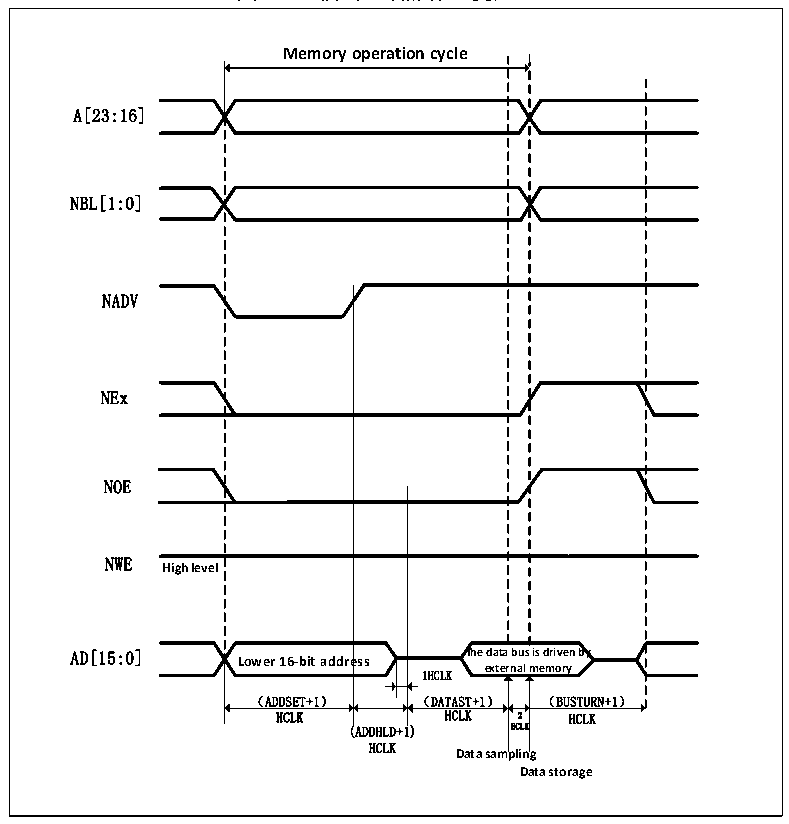
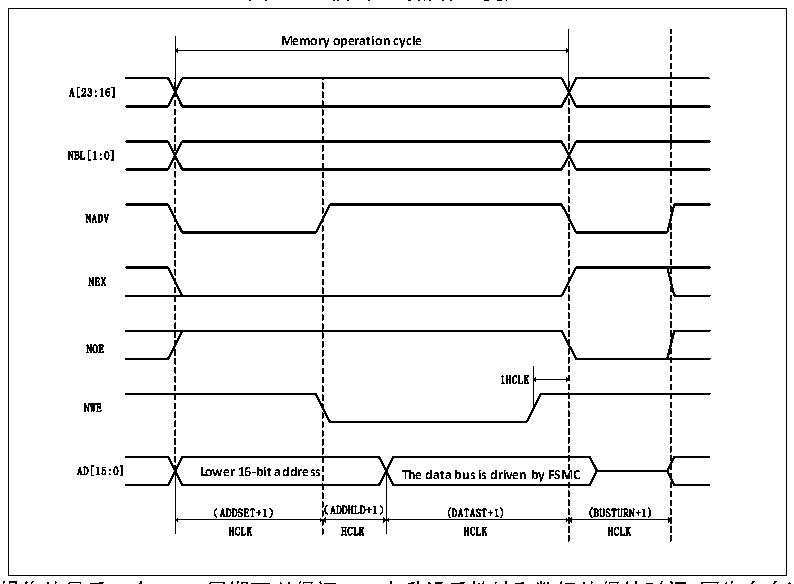

<!-- source-page: 409 -->

[← p.408](0408.md) · [index](../README.md) · [PDF p.409](https://ch32-riscv-ug.github.io/CH32V20x/datasheet_zh/CH32FV2x_V3xRM.PDF#page=409) · [p.410 →](0410.md)

<!-- header: CH32F/V20x_V30x_V31x系列应用手册 https://wch.cn -->

图26-3 模式1读操作（复用）  
 <!-- rendered from the PDF; verify at https://ch32-riscv-ug.github.io/CH32V20x/datasheet_zh/CH32FV2x_V3xRM.PDF#page=409 -->

🖼 Text parsed from the figure above

Memory operation cycle  
Lower 16-bit addre （ADDSET+1）  ess  
A[23:16]  
NBL[1:0]  
NADV  
NEx  
NOE  
NWE  
<strong>High level</strong>  
HCLK HCLK 2 HCLK  
(ADDHLD+1) HCLK  
HCLK  
<strong>Data sampling</strong>  
<strong>Data storage</strong>  

图26-4 模式1写操作（复用）  
 <!-- rendered from the PDF; verify at https://ch32-riscv-ug.github.io/CH32V20x/datasheet_zh/CH32FV2x_V3xRM.PDF#page=409 -->

🖼 Text parsed from the figure above

<strong>Memory operation cycle</strong>  
1HCLK Lower 16-bit address The data bus is driven by FSM （ADDSET+1） （ADDHLD+1） (DATAST+1)  Lower 16-bit address （ADDSET+1） （  MC (BUSTURN+1)  
A[23:16]  
NBL[1:0]  
NADV  
NEX  
NOE  
NWE  
HCLK HCLK HCLK HCLK  

注：在写操作的最后一个HCLK周期可以保证NWE上升沿后地址和数据的保持时间，因为存在这个HCLK  
<!-- image: p409-draw-image-00001 bbox=[507.6, 786.0, 527.52, 797.04] -->
<!-- footer: V2.5 406 -->
