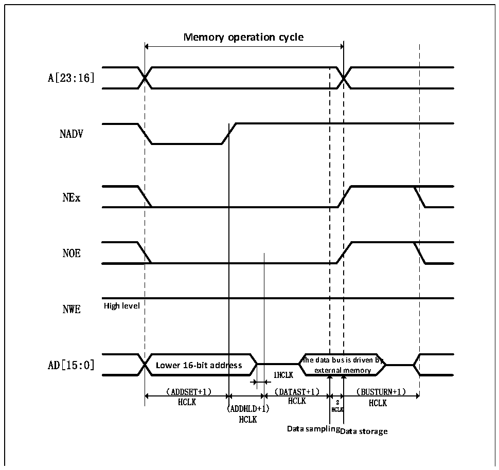

<!-- source-page: 413 -->

[← p.412](0412.md) · [index](../README.md) · [PDF p.413](https://ch32-riscv-ug.github.io/CH32V20x/datasheet_zh/CH32FV2x_V3xRM.PDF#page=413) · [p.414 →](0414.md)

<!-- header: CH32F/V20x_V30x_V31x系列应用手册 https://wch.cn -->

> ⬆ **Table continued** — rendered in full at [page 412](0412.md). <!-- p413-table-001 -->

图26-7 模式B读操作（复用）  
 <!-- rendered from the PDF; verify at https://ch32-riscv-ug.github.io/CH32V20x/datasheet_zh/CH32FV2x_V3xRM.PDF#page=413 -->

🖼 Text parsed from the figure above

<strong>Memory operation cycle</strong>  
A[23:16]  
NADV  
NEx  
NOE  
<strong>NWE High level</strong>  
<strong>AD[15:0] Lower 16-bit address The data bus is driven by</strong>  
<strong>external memory</strong>  
1HCLK  
（ADDSET+1） （DATAST+1） （BUSTURN+1）  
HCLK HCLK 2 HCLK  
(ADDHLD+1) HCLK  
HCLK  
<strong>Data samplingData storage</strong>  

<!-- image: p413-draw-image-00001 bbox=[507.6, 786.0, 527.52, 797.04] -->
<!-- footer: V2.5 410 -->
