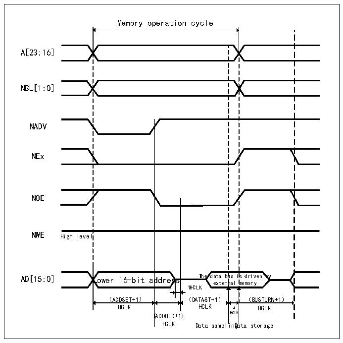
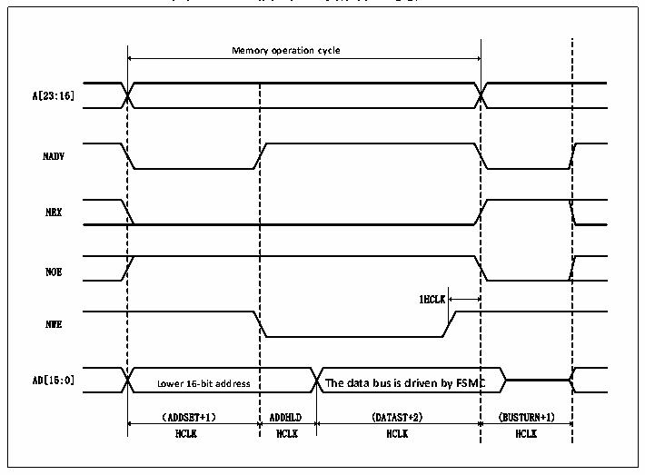

<!-- source-page: 416 -->

[← p.415](0415.md) · [index](../README.md) · [PDF p.416](https://ch32-riscv-ug.github.io/CH32V20x/datasheet_zh/CH32FV2x_V3xRM.PDF#page=416) · [p.417 →](0417.md)

<!-- header: CH32F/V20x_V30x_V31x系列应用手册 https://wch.cn -->

图26-9 模式C读操作（复用）  
 <!-- rendered from the PDF; verify at https://ch32-riscv-ug.github.io/CH32V20x/datasheet_zh/CH32FV2x_V3xRM.PDF#page=416 -->

🖼 Text parsed from the figure above

Memory operation cycle  
Lower 16-bit ad （ADDSET+1）  ddress  us i nal  
A[23:16]  
NBL[1:0]  
NADV  
NEx  
NOE  
NWE High level  
HCLK HCLK 2 HCLK  
(ADDHLD+1) HCLK  
HCLK Data samplinDgata storage  

图26-10 模式C写操作（复用）  
 <!-- rendered from the PDF; verify at https://ch32-riscv-ug.github.io/CH32V20x/datasheet_zh/CH32FV2x_V3xRM.PDF#page=416 -->

🖼 Text parsed from the figure above

<strong>Memory operation cycle</strong>  
1HCLK Lower 16-bit address The data bus is driven by FSMC （ADDSET+1） ADDHLD (DATAST+2)  Lower 16-bit address （ADDSET+1）  C (BUSTURN+1)  
A[23:16]  
NADV  
NEX  
NOE  
NWE  
HCLK HCLK HCLK HCLK  

<!-- p416-table-003 (table-26-16@1) pages 416-417 -->
<table><caption>表26-16 模式C FSMC_BCR1位域</caption><tr><th>Bitx</th><th>名称</th><th>配置值</th></tr><tr><td>[31:20]</td><td>Reserved</td><td>0x000</td></tr><tr><td>19</td><td>CBURSTRW</td><td>0x0</td></tr><tr><td>[18:16]</td><td>Reserved</td><td>0x0</td></tr><tr><td>15</td><td>ASYNCWAIT</td><td>如果存储器支持该功能则为1，否则为0</td></tr><tr><td>14</td><td>EXTMOD</td><td>0x1</td></tr><tr><td>13</td><td>WAITEN</td><td>0x0</td></tr><tr><td>12</td><td>WREN</td><td>根据需要设置</td></tr><tr><td>11</td><td>WAITCFG</td><td>该位不起作用</td></tr><tr><td>10</td><td>Reserved</td><td>0x0</td></tr><tr><td>9</td><td>WAITPOL</td><td>当bit15为1时，有意义。</td></tr><tr><td>8</td><td>BURSTEN</td><td>0x0</td></tr><tr><td>7</td><td>Reserved</td><td>0x1</td></tr><tr><td>6</td><td>FACCEN</td><td>0x1</td></tr><tr><td>[5:4]</td><td>MWID</td><td>根据需要设置</td></tr><tr><td>[3:2]</td><td>MTYP</td><td>0x2（NOR FLASH）</td></tr><tr><td>1</td><td>MUXEN</td><td>0x1</td></tr><tr><td>0</td><td>MBKEN</td><td>0x1</td></tr></table>

<!-- image: p416-draw-image-00001 bbox=[507.6, 786.0, 527.52, 797.04] -->
<!-- footer: V2.5 413 -->
