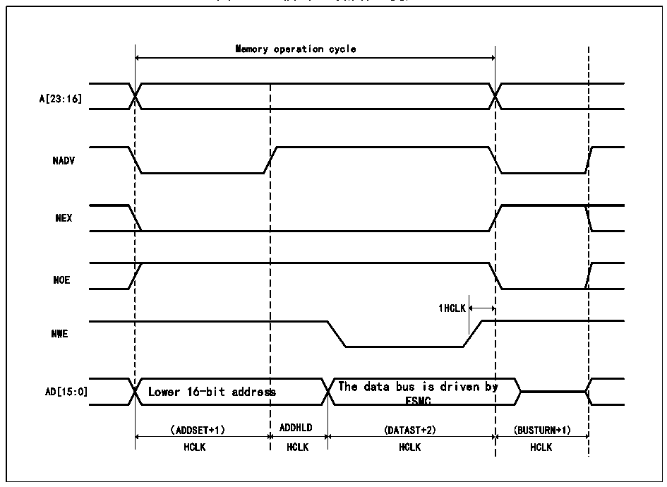

<!-- source-page: 419 -->

[← p.418](0418.md) · [index](../README.md) · [PDF p.419](https://ch32-riscv-ug.github.io/CH32V20x/datasheet_zh/CH32FV2x_V3xRM.PDF#page=419) · [p.420 →](0420.md)

<!-- header: CH32F/V20x_V30x_V31x系列应用手册 https://wch.cn -->

图26-12 模式D写操作（复用）  
 <!-- rendered from the PDF; verify at https://ch32-riscv-ug.github.io/CH32V20x/datasheet_zh/CH32FV2x_V3xRM.PDF#page=419 -->

🖼 Text parsed from the figure above

Memory operation cycle  
A[23:16]  
NADV  
NEX  
NOE  
1HCLK  
NWE  
The data bus is driven by  
AD[15:0] Lower 16-bit address  
FSMC  
（ADDSET+1） ADDHLD (DATAST+2) (BUSTURN+1)  
HCLK HCLK HCLK HCLK  

<!-- p419-table-001 (table-26-19@1) -->
<table><caption>表26-19 模式D FSMC_BCR1位域</caption><tr><th>Bitx</th><th>名称</th><th>配置值</th></tr><tr><td>[31:20]</td><td>Reserved</td><td>0x000</td></tr><tr><td>19</td><td>CBURSTRW</td><td>0x0</td></tr><tr><td>[18:16]</td><td>Reserved</td><td>0x0</td></tr><tr><td>15</td><td>ASYNCWAIT</td><td>如果存储器支持该功能则为1，否则为0</td></tr><tr><td>14</td><td>EXTMOD</td><td>0x1</td></tr><tr><td>13</td><td>WAITEN</td><td>0x0</td></tr><tr><td>12</td><td>WREN</td><td>根据需要设置</td></tr><tr><td>11</td><td>WAITCFG</td><td>该位不起作用</td></tr><tr><td>10</td><td>Reserved</td><td>0x0</td></tr><tr><td>9</td><td>WAITPOL</td><td>当bit15为1时，有意义。</td></tr><tr><td>8</td><td>BURSTEN</td><td>0x0</td></tr><tr><td>7</td><td>Reserved</td><td>0x1</td></tr><tr><td>6</td><td>FACCEN</td><td>根据需要设置</td></tr><tr><td>[5:4]</td><td>MWID</td><td>根据需要设置</td></tr><tr><td>[3:2]</td><td>MTYP</td><td>根据需要设置</td></tr><tr><td>1</td><td>MUXEN</td><td>0x1</td></tr><tr><td>0</td><td>MBKEN</td><td>0x1</td></tr></table>

<!-- p419-table-002 (table-26-20@1) pages 419-420 -->
<table><caption>表26-20 模式D FSMC_BTR1位域</caption><tr><th>Bitx</th><th>名称</th><th>配置值</th></tr><tr><td>[31:30]</td><td>Reserved</td><td>0x0</td></tr><tr><td>[29:28]</td><td>ACCMOD</td><td>0x3</td></tr><tr><td>[27:24]</td><td>DATLAT</td><td>该位不起作用</td></tr><tr><td>[23:20]</td><td>CLKDIV</td><td>该位不起作用</td></tr><tr><td>[19:16]</td><td>BUSTURN</td><td>0x0</td></tr><tr><td>[15:8]</td><td>DATAST</td><td style="text-align:left">数据建立时间。读操作为（DATAST+3HCLK）。该位最小为1。</td></tr><tr><td>[7:4]</td><td>ADDHLD</td><td>地址保持时间。（ADDHLD+1 HCLK）。</td></tr><tr><td>[3:0]</td><td>ADDSET</td><td style="text-align:left">地址建立时间。读操作为（ADDSET+1HCLK）。</td></tr></table>

<!-- image: p419-draw-image-00001 bbox=[507.6, 786.0, 527.52, 797.04] -->
<!-- footer: V2.5 416 -->
