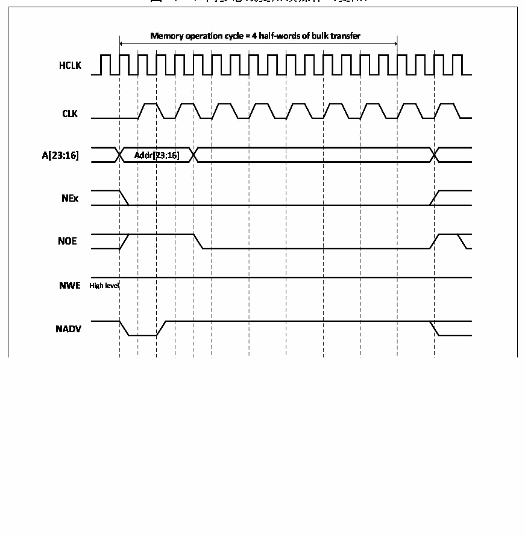

<!-- source-page: 421 -->

[← p.420](0420.md) · [index](../README.md) · [PDF p.421](https://ch32-riscv-ug.github.io/CH32V20x/datasheet_zh/CH32FV2x_V3xRM.PDF#page=421) · [p.422 →](0422.md)

<!-- header: CH32F/V20x_V30x_V31x系列应用手册 https://wch.cn -->

图26-13 同步总线复用读操作（复用）  
 <!-- rendered from the PDF; verify at https://ch32-riscv-ug.github.io/CH32V20x/datasheet_zh/CH32FV2x_V3xRM.PDF#page=421 -->

🖼 Text parsed from the figure above

<!-- image: p421-draw-image-00002 inside the figure -->
<!-- image: p421-draw-image-00003 inside the figure -->
<!-- image: p421-draw-image-00004 inside the figure -->

<!-- p421-table-001 (table-26-22@1) pages 421-422 -->
<table><caption>表26-22 FSMC_BCR1位域（同步读模式）</caption><tr><th>Bitx</th><th>名称</th><th>配置值</th></tr><tr><td>[31:20]</td><td>Reserved</td><td>0x000</td></tr><tr><td>19</td><td>CBURSTRW</td><td>该位不起作用</td></tr><tr><td>[18:16]</td><td>Reserved</td><td>0x0</td></tr><tr><td>15</td><td>ASYNCWAIT</td><td>0x0</td></tr><tr><td>14</td><td>EXTMOD</td><td>0x0</td></tr><tr><td>13</td><td>WAITEN</td><td>0x0</td></tr><tr><td>12</td><td>WREN</td><td>该位不起作用</td></tr><tr><td>11</td><td>WAITCFG</td><td>根据需要设置</td></tr><tr><td>10</td><td>Reserved</td><td>0x0</td></tr><tr><td>9</td><td>WAITPOL</td><td>根据需要设置</td></tr><tr><td>8</td><td>BURSTEN</td><td>0x1</td></tr><tr><td>7</td><td>Reserved</td><td>0x1</td></tr><tr><td>6</td><td>FACCEN</td><td>根据需要设置</td></tr><tr><td>[5:4]</td><td>MWID</td><td>根据需要设置</td></tr><tr><td>[3:2]</td><td>MTYP</td><td>0x1或0x2</td></tr><tr><td>1</td><td>MUXEN</td><td>0x1</td></tr><tr><td>0</td><td>MBKEN</td><td>0x1</td></tr></table>

<!-- image: p421-draw-image-00001 bbox=[507.6, 786.0, 527.52, 797.04] -->
<!-- footer: V2.5 418 -->
