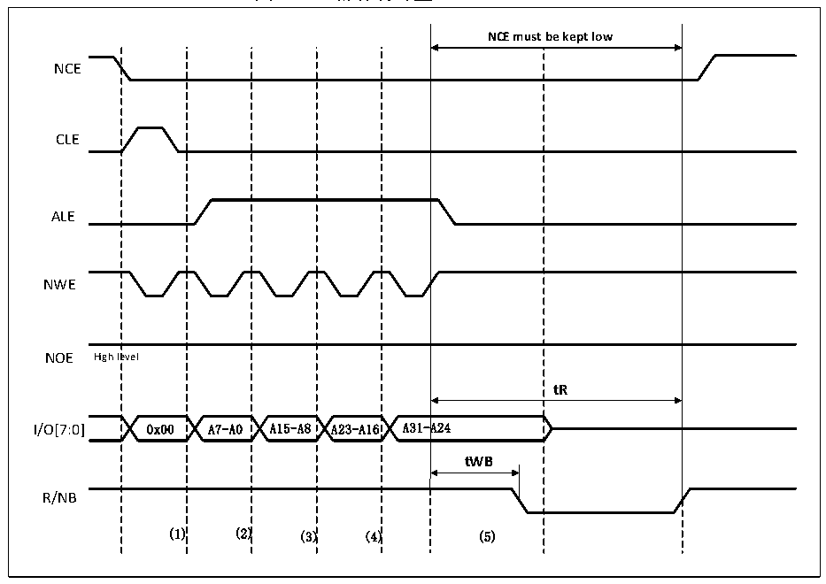

<!-- source-page: 426 -->

[← p.425](0425.md) · [index](../README.md) · [PDF p.426](https://ch32-riscv-ug.github.io/CH32V20x/datasheet_zh/CH32FV2x_V3xRM.PDF#page=426) · [p.427 →](0427.md)

<!-- header: CH32F/V20x_V30x_V31x系列应用手册 https://wch.cn -->

图26-16 操作特殊型NAND FLASH  
 <!-- rendered from the PDF; verify at https://ch32-riscv-ug.github.io/CH32V20x/datasheet_zh/CH32FV2x_V3xRM.PDF#page=426 -->

🖼 Text parsed from the figure above

<strong>NCE must be kept low</strong>  
NCE  
evel 0x00  A7-A0  A15-A8  A23-A16  A31-  A24  
CLE  
ALE  
NWE  
NOE High level  
<strong>tR</strong>  
R/NB  
(1) (2) (3) (4) (5)  

使用该功能时，通过配置FSMC_PMEM2寄存器的MEMHOLD位来保证tWB的时序，之后对NAND FLASH  
的读写操作，FSMC控制器都会在NEW信号的上升沿至下一次操作之间插入（MEMHOLD+1）HCLK保持延  
时。为了解决该问题，这里使用属性空间配置ATTHOLD数值使之符合tWB的时序，同时需要保持MEMHOLD  
为最小值。此时，只有在写入NAND FLASH地址的最后一个字节时，FSMC控制器需要写入属性存储空  
间，其余NAND FLASH的读写操作使用通用存储空间。  

#### 26.2.4.6 NAND FLASH ECC 功能

FSMC的NAND FLASH控制器包含1个纠错码计算硬件模块，可有效减少CPU在处理纠错码时的软  
件工作量。ECC模块在读写NAND FLASH时，支持每256、512、1024、2048、4096或8192个字节中，  
矫正1个bit错误并且检测出2个bit错误。页大小对应ECC结果有效位，见表26-30。在ECC计算  
电路使能后，ECC模块监测NAND FLASH的数据总线和读/写信号（NCE和NWE）。ECC使用时需注意如  
下：  
● 在访问NAND FLASH时，出现在D[15:0]总线上的数据被锁存并用于ECC计算。  
● 当规定数目的字节已经被写入NAND FLASH或从NAND FLASH读出后，软件从FSMC_ECCR2寄  
存器读出ECC值。若需再次计算ECC，先将ECCEN清0，再写1重新使能ECC计算。  

<!-- p426-table-002 (table-26-30@1) -->
<table><caption>表26-30 页大小对应ECC结果有效位</caption><tr><th>ECCPS[2:0]</th><th>页大小（字节）</th><th>ECC有效位</th></tr><tr><td>000</td><td>256</td><td>ECC[21:0]</td></tr><tr><td>001</td><td>512</td><td>ECC[23:0]</td></tr><tr><td>010</td><td>1024</td><td>ECC[25:0]</td></tr><tr><td>011</td><td>2048</td><td>ECC[27:0]</td></tr><tr><td>100</td><td>4096</td><td>ECC[29:0]</td></tr><tr><td>101</td><td>8192</td><td>ECC[31:0]</td></tr></table>

<!-- image: p426-draw-image-00001 bbox=[507.6, 786.0, 527.52, 797.04] -->
<!-- footer: V2.5 423 -->
