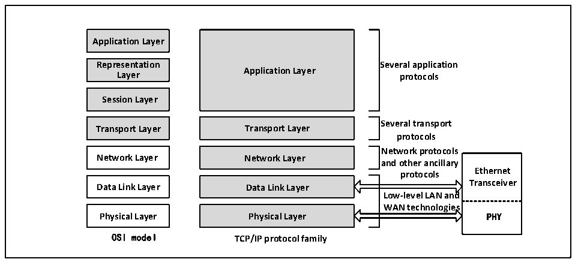
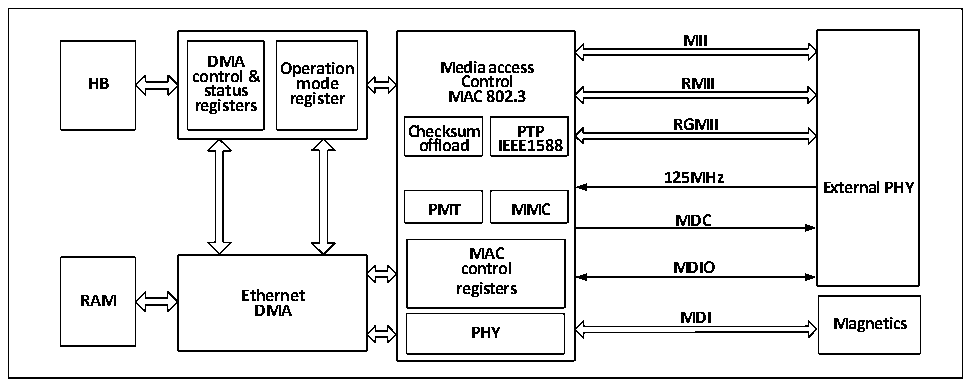

<!-- source-page: 437 -->

[← p.436](0436.md) · [index](../README.md) · [PDF p.437](https://ch32-riscv-ug.github.io/CH32V20x/datasheet_zh/CH32FV2x_V3xRM.PDF#page=437) · [p.438 →](0438.md)

<!-- header: CH32F/V20x_V30x_V31x系列应用手册 https://wch.cn -->

图27-1 以太网收发器在OSI模型和TCP/IP模型中的位置  
 <!-- rendered from the PDF; verify at https://ch32-riscv-ug.github.io/CH32V20x/datasheet_zh/CH32FV2x_V3xRM.PDF#page=437 -->

🖼 Text parsed from the figure above

<strong>Application Layer</strong>  
<strong>Representation Several application</strong>  
<strong>Application Layer</strong>  
<strong>Layer protocols</strong>  
<strong>Session Layer</strong>  
<strong>Several transport</strong>  
<strong>Transport Layer Transport Layer</strong>  
<strong>protocols</strong>  
<strong>Network protocols</strong>  
<strong>Network Layer Network Layer</strong>  
<strong>and other ancillary</strong>  
<strong>Ethernet</strong>  
<strong>protocols</strong>  
Data Link Layer  Physical Layer  
Data Link Layer  Physical Layer  
<strong>Transceiver</strong>  
<strong>Low-level LAN and</strong>  
<strong>WAN technologies</strong>  
<strong>OSI model TCP/IP protocol family</strong>  

以太网收发器的 MAC 按照 IEEE802.3 协议的规范设计，搭配 32 位宽的 DMA，保证数据能快速地  
从网线上转发到微控制器的内存中。以太网收发器拥有强大完整的DMA控制寄存器、MAC控制寄存器  
和模式控制寄存器，微控制器的 CPU 通过 HB 总线操作以太网收发器的寄存器。以太网收发器通过  
RGMII 接口和千兆以太网物理层连接，如果只需要百兆以太网的速度，则可以通过 MII 或 RMII 接口  
和百兆以太网物理层连接。以太网收发器的MII、RMII和RGMII接口的管脚是复用的，具体参看27.1.3  
节。以太网收发器通过 SMI 接口管理以太网物理层。使用以太网收发器时，HB 总线的时钟不能低于  
50MHz。  

图27-2 以太网收发器的结构框图  
 <!-- rendered from the PDF; verify at https://ch32-riscv-ug.github.io/CH32V20x/datasheet_zh/CH32FV2x_V3xRM.PDF#page=437 -->

🖼 Text parsed from the figure above

<strong>MII</strong>  
<strong>DMA Operation Media access</strong>  
<strong>HB control &amp; mode Control RMII</strong>  
<strong>status register MAC 802.3</strong>  
<strong>registers</strong>  
<strong>RGMII</strong>  
<strong>Checksum PTP</strong>  
<strong>offload IEEE1588</strong>  
<strong>125MHz</strong>  
<strong>External PHY</strong>  
<strong>PMT MMC</strong>  
<strong>MDC</strong>  
MAC control registers  PHY  
<strong>control MDIO</strong>  
<strong>RAM Ethernet</strong>  
<strong>DMA</strong>  
<strong>MDI</strong>  
<strong>Magnetics</strong>  

此外，以太网收发器还支持IEEE1588精确时间协议（PTP），为微控制器系统或片外提供精确的  
时间数据。  

### 27.1.3 以太网收发器使用引脚的分布和配置

微控制器支持三种MII接口，即标准MII、RMII和RGMII。MII/RMII接口专用于十兆和百兆以太  
网物理层，RGMII接口可用于十兆、百兆和千兆以太网。下表显示了标准MII，RMII和RGMII接口及  
内部物理层在封装引脚上的分布。  
<!-- image: p437-draw-image-00001 bbox=[507.6, 786.0, 527.52, 797.04] -->
<!-- footer: V2.5 434 -->
