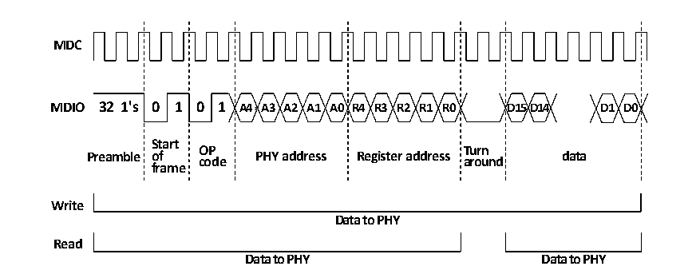

<!-- source-page: 439 -->

[← p.438](0438.md) · [index](../README.md) · [PDF p.439](https://ch32-riscv-ug.github.io/CH32V20x/datasheet_zh/CH32FV2x_V3xRM.PDF#page=439) · [p.440 →](0440.md)

<!-- header: CH32F/V20x_V30x_V31x系列应用手册 https://wch.cn -->

<!-- p439-table-001 (table-27-2@1) -->
<table><caption>表27-2 SMI帧格式</caption><tr><th></th><th>Preamble</th><th>STR</th><th>OP</th><th>PHY ADR</th><th>REG ADR</th><th>T</th><th>DATA</th><th>P</th></tr><tr><td>读</td><td style="text-align:left">32个 “1”</td><td>01</td><td>10</td><td>PPPPP</td><td>RRRRR</td><td>Z0</td><td>DDDDDDDDDDDDDDDD</td><td>Z</td></tr><tr><td>写</td><td style="text-align:left">32个 “1”</td><td>01</td><td>01</td><td>PPPPP</td><td>RRRRR</td><td>10</td><td>DDDDDDDDDDDDDDDD</td><td>Z</td></tr></table>

管理帧各域的定义如下：  
1） Preamble：先导符，由32个“1”组成，用于MAC和PHY同步；  
2） STR：起始符，固定为“01”；  
3） OP：操作符，读为“10”，写为“01”；  
4） PHY ADR：物理层地址，5位；  
5） REG ADR：寄存器地址，5位；  
6） T：转换符，两位，用来切换MAC和PHY对MDIO线的控制权。在读操作时，MAC保持对MDIO线的  
高阻，PHY对第一位保持高阻，对第二位下拉，并获取MDIO的控制权；在写操作时，MAC对MDIO  
线先置高再下拉，PHY对MDIO保持高阻状态，MAC保持对MDIO的控制权；  
7） DATA：数据域，16位，MAC对PHY读写的数据，MSB在前；  
8） P：MAC和PHY都对MDIO保持高阻状态，但PHY的上拉电阻会把MDIO拉高。  

##### 27.1.4.1.2 读写时序

写PHY寄存器操作如下：  
当用户设置了MII写位（ETH_MACMIIAR:MW）和忙位（ETH_MACMIIAR:MB），SMI接口会向PHY发  
送PHY地址和寄存器地址，然后发送数据（ETH_MACMIIDR）。在SMI接口发送数据的过程中，不能修  
改MII地址寄存器和MII数据寄存器的值；在此过程中，忙位保持为高，对MII地址寄存器或MII数  
据寄存器的写操作将被忽视，并且不对整个传输造成影响。当完成写操作时，SMI 接口将清除忙位，  
用户可以根据忙位判断写操作结束。如图27-3的写部分。  
读PHY寄存器操作如下：  
当用户把以太网MAC的MII地址寄存器（ETH_MACMIIAR）的MII忙位置位，而保持MII写位复位  
时，SMI接口则发送PHY地址和寄存器地址，执行读PHY寄存器的操作。在整个传输过程中，用户不  
能修改MII地址寄存器和MII数据寄存器的内容。在传输过程中，忙位保持为高，对MII地址寄存器  
或MII数据寄存器的写操作将被忽视，并且不影响整个传输的正确完成。在读操作完成后，SMI接口  
将清除忙位，并把从PHY读回的数据写入MII数据寄存器。如图27-3的读部分。  

图27-3 SMI接口读写时速图  
 <!-- rendered from the PDF; verify at https://ch32-riscv-ug.github.io/CH32V20x/datasheet_zh/CH32FV2x_V3xRM.PDF#page=439 -->

🖼 Text parsed from the figure above

<strong>MDC</strong>  
<strong>MDIO 32 1&#x27;s 0 1 0 1 A4 A3 A2 A1 A0 R4 R3 R2 R1 R0 D15D14 D1 D0</strong>  
<strong>Start</strong>  
<strong>OP Turn</strong>  
<strong>Preamble of code PHY address Register address around data</strong>  
<strong>frame</strong>  
<strong>Write</strong>  
<strong>Data to PHY</strong>  
<strong>Read</strong>  
<strong>Data to PHY Data to PHY</strong>  

##### 27.1.4.1.3 SMI时钟

<!-- image: p439-draw-image-00001 bbox=[507.6, 786.0, 527.52, 797.04] -->
<!-- footer: V2.5 436 -->
