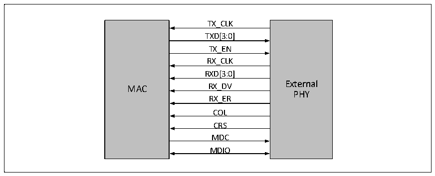
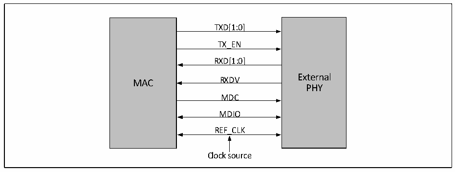

<!-- source-page: 441 -->

[← p.440](0440.md) · [index](../README.md) · [PDF p.441](https://ch32-riscv-ug.github.io/CH32V20x/datasheet_zh/CH32FV2x_V3xRM.PDF#page=441) · [p.442 →](0442.md)

<!-- header: CH32F/V20x_V30x_V31x系列应用手册 https://wch.cn -->

图27-4 以太网收发器使用MII接口，MAC和PHY如何接线  
 <!-- rendered from the PDF; verify at https://ch32-riscv-ug.github.io/CH32V20x/datasheet_zh/CH32FV2x_V3xRM.PDF#page=441 -->

🖼 Text parsed from the figure above

TX_CLK  
TX_CLKTXD[3:0] TX_ENRX_CLK  RX_CLKRXD[3:0]  RXD[3:0] RX_DV  RX_DVRX_ER  RX_ERCOL  COLCRS  
PHY  
MDC  
MDIO  

RMII接口的引脚和功能如下：  

<!-- p441-table-002 (table-27-5@1) -->
<table><caption>表27-5 RMII接口的引脚和功能</caption><tr><th>引脚</th><th>功能</th></tr><tr><td>CLK_REF</td><td>收发时钟（50MHz）</td></tr><tr><td>TXEN</td><td>发送数据使能</td></tr><tr><td>TXD0</td><td rowspan="2">发送数据线[0:1]</td></tr><tr><td>TXD1</td></tr><tr><td>CRSDV</td><td>接收数据有效</td></tr><tr><td>RXD0</td><td rowspan="2">接收数据线[0:1]</td></tr><tr><td>RXD1</td></tr></table>

使用RMII接口时，收发时钟共用同一根线传输，时钟频率固定为50MHz。当RMII使用在10Mbps  
的速率时，RX和 TX每隔10个周期采样一个数据，数据线需要将数据保留 10个周期；MAC和PHY需  
要使用同一个时钟源。可以将 MAC的 MCO输出接到PHY的外部时钟源输入引脚上。图 27-5显示了使  
用RMII接口时，MAC和PHY如何接线。  

图27-5 使用RMII接口，MAC和PHY的接线示意图  
 <!-- rendered from the PDF; verify at https://ch32-riscv-ug.github.io/CH32V20x/datasheet_zh/CH32FV2x_V3xRM.PDF#page=441 -->

🖼 Text parsed from the figure above

TXD[1:0]  
TX_EN  
RXD[1:0]  
External  
MAC RXDV  
PHY  
MDC  
MDIO  
REF_CLK  
Clock source  

注：以太网收发器需要从RXC引脚输入外界提供的REF_CLK 50MHz时钟频率。  

##### 27.1.4.2.3 时序

RMII和MII的时序的区别在于：  
● RMII的时钟固定为50MHz，而MII的收发时钟随着实际连接速度的不同而工作在2.5MHz或25MHz；  
● RMII收发共用同一个时钟线；  
<!-- image: p441-draw-image-00001 bbox=[507.6, 786.0, 527.52, 797.04] -->
<!-- footer: V2.5 438 -->
