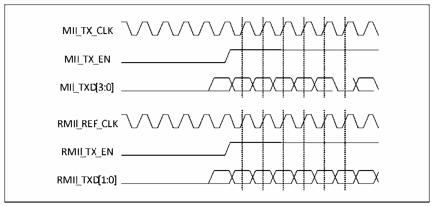

<!-- source-page: 442 -->

[← p.441](0441.md) · [index](../README.md) · [PDF p.442](https://ch32-riscv-ug.github.io/CH32V20x/datasheet_zh/CH32FV2x_V3xRM.PDF#page=442) · [p.443 →](0443.md)

<!-- header: CH32F/V20x_V30x_V31x系列应用手册 https://wch.cn -->
● RMII是两位数据线，而MII是四位数据线。  
如图27-6 显示了RMII和MII的时序。  

图27-6 MII和RMII的时序图  
 <!-- rendered from the PDF; verify at https://ch32-riscv-ug.github.io/CH32V20x/datasheet_zh/CH32FV2x_V3xRM.PDF#page=442 -->

🖼 Text parsed from the figure above

<!-- image: p442-draw-image-00033 inside the figure -->
<!-- image: p442-draw-image-00034 inside the figure -->
<!-- image: p442-draw-image-00035 inside the figure -->
<!-- image: p442-draw-image-00036 inside the figure -->
<!-- image: p442-draw-image-00037 inside the figure -->
MII_TX_ CLK  
<!-- image: p442-draw-image-00020 inside the figure -->
<!-- image: p442-draw-image-00021 inside the figure -->
<!-- image: p442-draw-image-00022 inside the figure -->
<!-- image: p442-draw-image-00023 inside the figure -->
<!-- image: p442-draw-image-00024 inside the figure -->
MII_TX_ EN  
<!-- image: p442-draw-image-00025 inside the figure -->
<!-- image: p442-draw-image-00026 inside the figure -->
<!-- image: p442-draw-image-00027 inside the figure -->
<!-- image: p442-draw-image-00028 inside the figure -->
<!-- image: p442-draw-image-00029 inside the figure -->
<!-- image: p442-draw-image-00030 inside the figure -->
<!-- image: p442-draw-image-00031 inside the figure -->
<!-- image: p442-draw-image-00032 inside the figure -->
MII_TXD[3: 0]  
<!-- image: p442-draw-image-00015 inside the figure -->
<!-- image: p442-draw-image-00016 inside the figure -->
<!-- image: p442-draw-image-00017 inside the figure -->
<!-- image: p442-draw-image-00018 inside the figure -->
<!-- image: p442-draw-image-00019 inside the figure -->
RMII_ REF_CLK  
<!-- image: p442-draw-image-00002 inside the figure -->
<!-- image: p442-draw-image-00003 inside the figure -->
<!-- image: p442-draw-image-00004 inside the figure -->
<!-- image: p442-draw-image-00005 inside the figure -->
<!-- image: p442-draw-image-00006 inside the figure -->
RMII_TX_ EN  
<!-- image: p442-draw-image-00007 inside the figure -->
<!-- image: p442-draw-image-00008 inside the figure -->
<!-- image: p442-draw-image-00009 inside the figure -->
<!-- image: p442-draw-image-00010 inside the figure -->
<!-- image: p442-draw-image-00011 inside the figure -->
<!-- image: p442-draw-image-00012 inside the figure -->
<!-- image: p442-draw-image-00013 inside the figure -->
<!-- image: p442-draw-image-00014 inside the figure -->
RMII_TXD[1: 0]  

#### 27.1.4.3 RGMII 接口

27.1.4.3.1引脚  
RGMII的引脚和功能如下表  

<!-- p442-table-001 (table-27-6@1) -->
<table><caption>表27-6 RGMII的引脚和功能</caption><tr><th>引脚</th><th>功能</th></tr><tr><td>GTXC</td><td>发送时钟</td></tr><tr><td>TXCTL</td><td>发送数据控制</td></tr><tr><td>TXD0</td><td rowspan="4">发送数据线[0:3]</td></tr><tr><td>TXD1</td></tr><tr><td>TXD2</td></tr><tr><td>TXD3</td></tr><tr><td>GRXC</td><td>接收时钟</td></tr><tr><td>RXCTL</td><td>接收数据控制</td></tr><tr><td>RXD0</td><td rowspan="4">接收数据线[0:3]</td></tr><tr><td>RXD1</td></tr><tr><td>RXD2</td></tr><tr><td>RXD3</td></tr></table>

注：1.TXCTL/RXCTL在本微控制器的以太网收发器中用作收发数据有效信号来使用；  
2.RGMII有独立的SMI接口。  
27.1.4.3.2时序  
RGMII工作在十兆和百兆速率的模式下，时序和MII类似；工作在千兆时，RGMII的时钟为125MHz，  
采用双边沿采样的方式。RGMII不支持半双工。  
由于 RGMII 使用双边沿采样且工作在 125MHz 的时钟频率下，因此电路设计人员应注意信号完整  
性问题。  
RGMII的接收方接收到的时钟应相对数据滞后90°以保证正确采样。以太网收发器设计了发送时  
钟延迟输出和相位翻转的功能。  
<!-- image: p442-draw-image-00001 bbox=[507.6, 786.0, 527.52, 797.04] -->
<!-- footer: V2.5 439 -->
