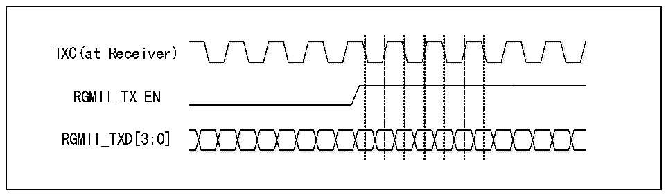

<!-- source-page: 443 -->

[← p.442](0442.md) · [index](../README.md) · [PDF p.443](https://ch32-riscv-ug.github.io/CH32V20x/datasheet_zh/CH32FV2x_V3xRM.PDF#page=443) · [p.444 →](0444.md)

<!-- header: CH32F/V20x_V30x_V31x系列应用手册 https://wch.cn -->

图27-7 RGMII的时序示意图  
 <!-- rendered from the PDF; verify at https://ch32-riscv-ug.github.io/CH32V20x/datasheet_zh/CH32FV2x_V3xRM.PDF#page=443 -->

🖼 Text parsed from the figure above

<!-- image: p443-draw-image-00002 inside the figure -->
<!-- image: p443-draw-image-00003 inside the figure -->
TXC(at Receiver)  
RGMII_TX_EN  
RGMII_TXD[3:0]  
<!-- image: p443-draw-image-00004 inside the figure -->
<!-- image: p443-draw-image-00005 inside the figure -->

#### 27.1.4.4 内部 10M、100M 物理层使用时的注意事项

##### 27.1.4.4.1 内部 10M物理层使用时的注意事项（仅适用于 CH32F207、CH32V307）

在置位扩展寄存器的内部物理层使能位时，所有的MII相关的配置都将被无视，对SMI接口的读  
写将直接映射到内部物理层，且忽略SMI接口写入的物理层地址。用户可以对内部物理层的寄存器进  
行访问以获取物理层连接状态，详见27.1.8.5章节。  

##### 27.1.4.4.2 内部 10/100M物理层使用时的注意事项（仅适用于 CH32V317）

内部10/100M物理层由Control register（地址0x00）和Auto-Negotiation Advertisement（地  
址0x04）寄存器进行配置，相关配置位已默认开启，相关寄存器请参考《CH182DS2》手册。  
10/100M以太网收发器使用RMII接口，MAC和内部PHY接线如下图所示：  
PE7 RSTB  
PE8 TXEN  
PE9 CRSDV  
PE10 TXD1  
PE11 TXD0  
MAC Internal  
PE12 TXC PHY  
PE13 RXD1  
PE14 RXD0  
PE15 MDC  
PD8 MDI0  
10/100M以太网收发器使用RMII接口相关的引脚分布和需要进行的配置，如下表所示（以下引脚  
仅用于EHT）：  

<!-- p443-table-001 (table-27-6@1) pages 443-444 -->
<table><tr><th>引脚</th><th>RMII</th><th>RMII的引脚配置</th></tr><tr><td>PE7</td><td>RSTB</td><td>推挽复用输出</td></tr><tr><td>PE8</td><td>TXEN</td><td>推挽复用输出</td></tr><tr><td>PE9</td><td>CRSDV</td><td>浮空输入</td></tr><tr><td>PE10</td><td>TXD1</td><td>推挽复用输出</td></tr><tr><td>PE11</td><td>TXD0</td><td>推挽复用输出</td></tr><tr><td>PE12</td><td>GTXC</td><td>推挽复用输出</td></tr><tr><td>PE13</td><td>RXD1</td><td>浮空输入</td></tr><tr><td>PE14</td><td>RXD0</td><td>浮空输入</td></tr><tr><td>PE15</td><td>MDC</td><td>推挽复用输出</td></tr><tr><td>PD8</td><td>MDIO</td><td>推挽复用输出/浮空输入</td></tr></table>

<!-- image: p443-draw-image-00001 bbox=[507.6, 786.0, 527.52, 797.04] -->
<!-- footer: V2.5 440 -->
