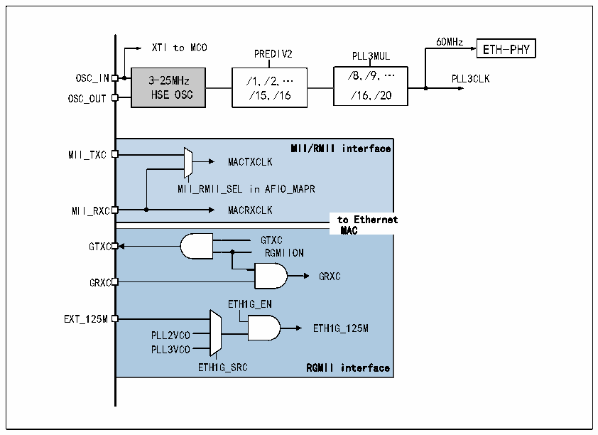

<!-- source-page: 444 -->

[← p.443](0443.md) · [index](../README.md) · [PDF p.444](https://ch32-riscv-ug.github.io/CH32V20x/datasheet_zh/CH32FV2x_V3xRM.PDF#page=444) · [p.445 →](0445.md)

<!-- header: CH32F/V20x_V30x_V31x系列应用手册 https://wch.cn -->

> ⬆ **Table continued** — rendered in full at [page 443](0443.md). <!-- p444-table-001 -->

#### 27.1.4.5 时钟产生和输出

##### 27.1.4.5.1 外设时钟源配置

图27-8 以太网外设时钟树  
 <!-- rendered from the PDF; verify at https://ch32-riscv-ug.github.io/CH32V20x/datasheet_zh/CH32FV2x_V3xRM.PDF#page=444 -->

🖼 Text parsed from the figure above

60MHz  
XTI to MCO ETH-PHY  
PREDIV2 PLL3MUL  
OSC_IN 3-25MHz /1,/2,… /8,/9,… PLL3CLK  
OSC_OUT HSE OSC /15,/16 /16,/20  
MII/RMII interface MACTXCLK MII__RMII_SEL in AFIO_MAPRMACRXCLK to Ethernet  to Ethernet  MACGTXCRGMIIONGRXCETH1G_ENETH1G_125MPLL2VCOPLL3VCO ETH1G_SRC RGMII interface  MAC  
MII_TXC  
GTXC  
GRXC  
EXT_125M  

内部10M以太网物理层的时钟由PLL3提供，且必须为60MHz。使用内部物理层时，需要把扩展寄  
存器的第2位置位，置位后，MII/RMII/RGMII相关的设置均无效。  
在使用MII时，收发时钟都由外部的物理层提供，为2.5MHz或25MHz。在使用RMII时，REF_CLK  
是唯一的时钟，从RXC引脚输入微控制器，固定为50MHz，使用RMII时需要将AFIO重映射寄存器中  
的第23位置位。  
在使用 RGMII 时，MAC 需要频率为 125MHz 的时钟，由内部 PLL2/PLL3 的 VCO 产生（VCO 输出是  
PLL 输出频率的两倍）或外部输入，通过 EXT_125M 引脚输入 125MHz 时钟。RGMII 的发送时钟由 MAC  
产生，接收时钟由PHY产生。开启RGMII需要在扩展寄存器中将第3位置位，并在RCC的第二个配置  
寄存器中将第22位置位，同时在[21:20]中选择合适的125MHz时钟源，详见官网EVT例程。  

##### 27.1.4.5.2 MCO输出

已知MCO支持HSE、HSI、系统主频、PLLCLK/2、PLL2CLK、PLL3CLK、PLL3CLK/2和XTI这八种时  
钟的输出，用户可以利用 MCO 输出应用中所需要的频率，比如常见物理层芯片所需要的 25MHz 时钟，  
并以此节省一颗晶体。MCO的输出频率不应大于100MHz。  

### 27.1.5 IEEE802.3 和 IEEE1588

IEEE802.3协议及其补充协议组成目前以太网的官方标准，它详细定义了目前使用的以太网的方  
方面面。我们可以认为以太网处于OSI模型中的物理层和数据链路层的一部分。本节在应用的角度上  
讨论IEEE802.3协议中用户需要用到的部分，即帧格式和MAC地址相关的内容。同时，微控制器的以  
太网收发器还支持IEEE1588精确时间协议，本文还将讨论IEEE1588的部分内容。  
<!-- image: p444-draw-image-00001 bbox=[507.6, 786.0, 527.52, 797.04] -->
<!-- footer: V2.5 441 -->
