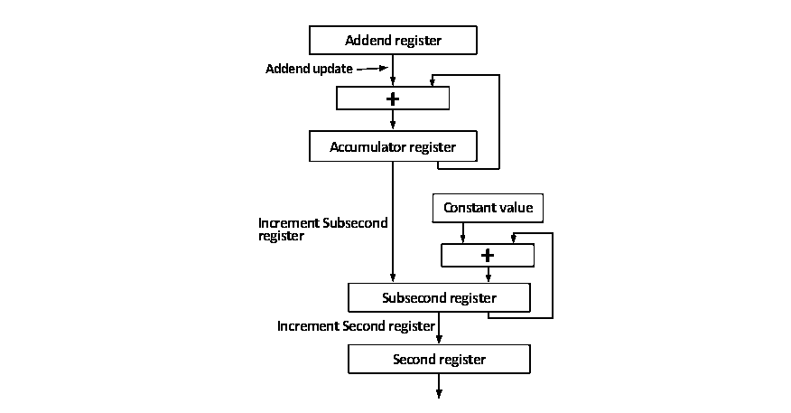

<!-- source-page: 450 -->

[← p.449](0449.md) · [index](../README.md) · [PDF p.450](https://ch32-riscv-ug.github.io/CH32V20x/datasheet_zh/CH32FV2x_V3xRM.PDF#page=450) · [p.451 →](0451.md)

<!-- header: CH32F/V20x_V30x_V31x系列应用手册 https://wch.cn -->

图27-10 使用精调方式更新时间的流程  
 <!-- rendered from the PDF; verify at https://ch32-riscv-ug.github.io/CH32V20x/datasheet_zh/CH32FV2x_V3xRM.PDF#page=450 -->

🖼 Text parsed from the figure above

<strong>Addend register</strong>  
<strong>Addend update</strong>  
+  
<strong>Accumulator register</strong>  
<strong>Constant value</strong>  
<strong>Increment Subsecond</strong>  
<strong>register</strong>  
+  
<strong>Subsecond register</strong>  
<strong>Increment Second register</strong>  
<strong>Second register</strong>  

使用精调模式的方式需要对系统主频和精调的流程有较清晰的了解。与粗调方式不同，精调方式  
更新事件的时机是累加器（32位，寄存器列表中未列出。图中的Accumlator register）溢出，累加  
器在每个系统主频时钟周期都会自增加数寄存器（PTPTSAR，图中的Addend register）的值，一旦溢  
出就会产生时间更新事件，即亚秒自增寄存器（PTPSSIR，图中的Constant Value）的值会加到亚秒  
计数器（Subsecond register），完成时间更新。在亚秒计数器溢出时，秒计数器会自增。而实际上，  
亚秒计数器自增一位的时间为1/（2^31）=0.46566128730…纳秒，用户需要自行保证累加器溢出花费  
的时间刚好等于亚秒自增寄存器的值乘以亚秒计数器自增一位的时间。  
本地时间的校正较为简单，将时间戳控制寄存器的时间校正位（PTPTSCR:TSSTI）置位，则秒计数  
器和亚秒计数器的值会被时间戳更新计数器（TSHUR、TSLUR）的值替代。  

### 27.1.6 DMA 操作

#### 27.1.6.1 概述

在以太网收发器中，数据从MII接口进入FIFO，然后被DMA转入RAM中。即使是最大的普通以太  
网帧，数据部分达到最大的 1500 字节，也只需要几十微秒左右就能接收发送完毕，即使算上 MAC 的  
接收检测，DMA 转移时间和帧间隔时间，CPU 也需要在一百微秒内就要处理一个帧。以太网收发器的  
优势是速度快和吞吐量大，为了维持这个优势，必须把以太网帧接受发送过程中，需要CPU进行的干  
预尽可能得减少，这里就要使用以太网收发器专用DMA。  
以太网使用的DMA是32位的，它通过两种数据结构接受CPU的管理：传统的控制和状态寄存器，  
接收和发送描述符。由于DMA是 32位宽的，所以要求收发描述符队列在 RAM中的基地址是 4字节对  
齐的。收发缓冲区则没有对齐要求。  

#### 27.1.6.2 DMA 描述符（DMA Desciptor）

用户使用传统外设主要是通过写寄存器的控制位实现，并且以读取状态寄存器的方式来获取外设  
的状态和返回信息。这些寄存器是独立于内核，SRAM和非易失性存储器之外的空间，是实际存在的，  
可以称之为“硬件寄存器”。传统的通讯外设，比如USART或SPI，都有一个数据寄存器来暂存收发  
的数据，有一组DMA将收到的所有数据统一保存到特定的地址空间。  
而以太网收发器以其极高的数据传输速度、极大的数据吞吐量和独特的数据帧组织形式，使得它  
的操作不同于传统的通讯收发器。以太网收发器尽可能密集地接收大量的数据，它必须将收到的数据  
流以帧为单位存到单独的内存空间，自行完成接收和发送操作，使CPU能以最少的操作就能读取并处  
理掉这些数据，释放出对应的内存空间，并保证DMA控制器和CPU不会就内存的使用权限起冲突。内  
<!-- image: p450-draw-image-00001 bbox=[507.6, 786.0, 527.52, 797.04] -->
<!-- footer: V2.5 447 -->
