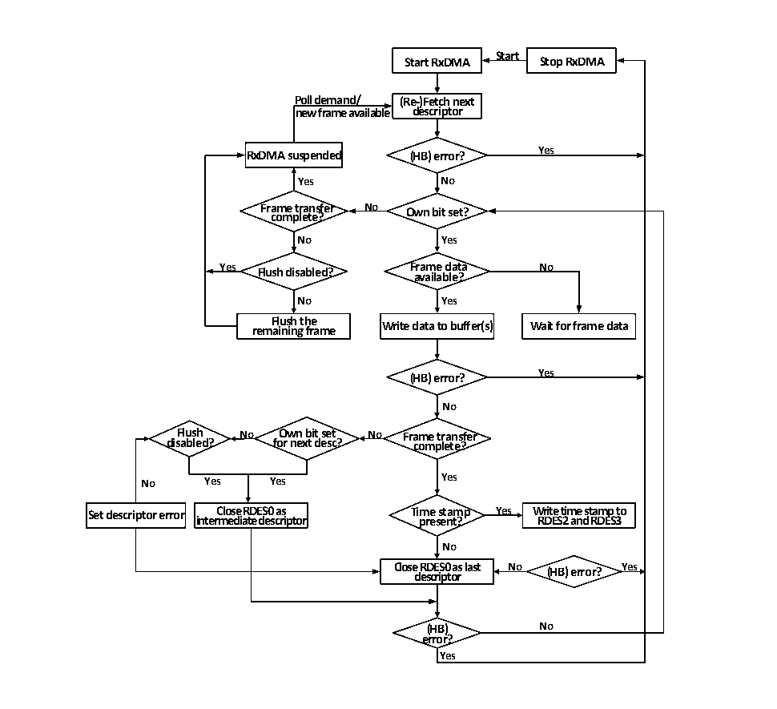

<!-- source-page: 460 -->

[← p.459](0459.md) · [index](../README.md) · [PDF p.460](https://ch32-riscv-ug.github.io/CH32V20x/datasheet_zh/CH32FV2x_V3xRM.PDF#page=460) · [p.461 →](0461.md)

<!-- header: CH32F/V20x_V30x_V31x系列应用手册 https://wch.cn -->
5） 如果使能了PTP时间戳，再DMA控制器转存数据，写描述符状态域时，同时也会将当前的时间戳  
写进描述符的后两个字。用户应及时将时间戳读出并补全原写在后两个字的缓冲区地址和下一描  
述符地址。  
下图展示了默认接收流转机制：  

图27-12 接收流程  
 <!-- rendered from the PDF; verify at https://ch32-riscv-ug.github.io/CH32V20x/datasheet_zh/CH32FV2x_V3xRM.PDF#page=460 -->

🖼 Text parsed from the figure above

<strong>Start</strong>  
<strong>Start RxDMA Stop RxDMA</strong>  
<strong>Poll demand/ (Re-)Fetch next</strong>  
<strong>new frame available descriptor</strong>  
<strong>RxDMA suspended (HB) error? Yes</strong>  
<strong>Yes No</strong>  
<strong>Frame transfer No Own bit set?</strong>  
<strong>complete?</strong>  
<strong>No Yes</strong>  
<strong>Yes Flush disabled? Frame data No</strong>  
<strong>available?</strong>  
<strong>No Yes</strong>  
<strong>rem F a l i u n s i h ng t h fr e a me Write data to buffer(s) Wait for frame data</strong>  
<strong>(HB) error? Yes</strong>  
<strong>No</strong>  
<strong>Flush No Own bit set No Frame transfer</strong>  
<strong>disabled? for next desc? complete?</strong>  
<strong>No Yes Yes Yes</strong>  
<strong>Set descriptor error inter C m lo e s d e i a R t D e E d S e 0 s c a r s i ptor Ti p m re e s s e t n a t m ? p Yes W R r D it E e S t 2 im an e d s t R a D m E p S 3 to</strong>  
<strong>No</strong>  
<strong>Close d e R s D c E ri S p 0 t o a r s last No (HB) error? Yes</strong>  
<strong>(HB) No</strong>  
<strong>error?</strong>  
<strong>Yes</strong>  

### 27.1.7 中断

以太网收发器拥有两个中断向量，一个是以太网唤醒事件，另一个是普通的收发事件。当检测  
到唤醒帧或魔法帧的时候，会触发以太网唤醒事件。普通的以太网收发中断事件包括DMA中断和  
ETH中断。  

#### 27.1.7.1 DMA 中断

DMA中断大致可以分为两组，即正常的中断（NIS）和异常的中断（AIS），异常的中断一般意味  
着数据收发的异常，需要特别注意。用户在处理中断时需要检索所有的中断标志位，并将已经产生的  
中断源全部处理掉。下图是以太网收发器的中断示意图。  
<!-- image: p460-draw-image-00001 bbox=[507.6, 786.0, 527.52, 797.04] -->
<!-- footer: V2.5 457 -->
