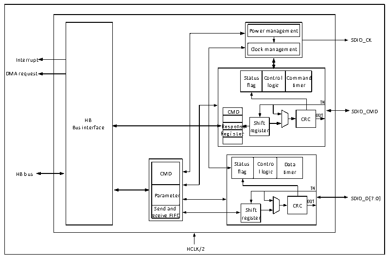

<!-- source-page: 500 -->

[← p.499](0499.md) · [index](../README.md) · [PDF p.500](https://ch32-riscv-ug.github.io/CH32V20x/datasheet_zh/CH32FV2x_V3xRM.PDF#page=500) · [p.501 →](0501.md)

<!-- header: CH32F/V20x_V30x_V31x系列应用手册 https://wch.cn -->

图28-1 SDIO的结构图  
 <!-- rendered from the PDF; verify at https://ch32-riscv-ug.github.io/CH32V20x/datasheet_zh/CH32FV2x_V3xRM.PDF#page=500 -->

🖼 Text parsed from the figure above

Power management  Clock management  
SDIO_CK  
Interrupt  
Status flag  Contro logic  ol Command timer  
DMA request  
IN  
CMD SDIO_CMD  
OUT  
Bus in H t B erface R R e e g s i p s o t n e s r e re S g h is if t t e r CRC  
CMD  Parameter  Send and receive FIFO  
Statu flag  us Contro g l logic  Data timer  
IN  
Parameter SDIO_D[7:0]  
OUT  
Send and Shift CRC  
receive FIFO register  
HCLK/2  

SDIO是微控制器作为主机直接操作SDIO设备的外设，其大概由HB接口、时钟控制部分、CMD线  
控制部分，数据线控制部分和控制寄存器部分这五个模块组成，SDIO是一个半双工的外设，CPU向控  
制寄存器写入需要发送的命令和数据，命令线和数据线控制模块负责将命令或数据推到 IO 上，并加  
上CRC。SDIO的数据流由通用DMA负责完成从RAM到SDIO的FIFO的搬移，SDIO的FIFO有32个32  
位的大小。  

### 28.2.2 引脚及其配置

SDIO需要配置的引脚及其模式见表28-1。  

<!-- p500-table-005 (table-28-1@1) -->
<table><caption>表28-1 SDIO的引脚配置</caption><tr><th>GPIO</th><th>SDIO复用功能</th><th>需要配置成的引脚模式</th><th>需要配置成的引脚速度</th></tr><tr><td>PC[8:11]</td><td>SDIO_D[0:3]</td><td>推挽复用输出</td><td>50MHz</td></tr><tr><td>PC12</td><td>SDIO_CK</td><td>推挽复用输出</td><td>50MHz</td></tr><tr><td>PD2</td><td>SDIO_CMD</td><td>推挽复用输出</td><td>50MHz</td></tr><tr><td>PB8</td><td>SDIO_D4</td><td>推挽复用输出</td><td>50MHz</td></tr><tr><td>PB9</td><td>SDIO_D5</td><td>推挽复用输出</td><td>50MHz</td></tr><tr><td>PC6</td><td>SDIO_D6</td><td>推挽复用输出</td><td>50MHz</td></tr><tr><td>PC7</td><td>SDIO_D7</td><td>推挽复用输出</td><td>50MHz</td></tr></table>

注：从机模式时，SDIO_CK引脚应配置为浮空输入，且从机模式仅适用于CH32F20x_D8、  
CH32F20x_D8C、CH32V30x_D8、CH32V30x_D8C、CH32V31x_D8C批号倒数第六位不为0的产品。  

### 28.2.3 时钟

SDIO 的时钟引脚为 SDIO_CK，其输出时钟由 HCLK分频得到，分频系数可配置为 2-261之间的任  
意整数值。SDIO设备在初始化的时候一般只支持最高400kHz时钟的单总线模式，在初始化后，主机  
一般会发起切换至低电压的操作，同时将时钟提升至微控制器和 SDIO 设备双方能接受的最大时钟。  
不同版本和速度等级的SD卡所支持时钟速度和切换流程有所区别，用户需要自行了解。  
<!-- image: p500-draw-image-00001 bbox=[507.6, 786.0, 527.52, 797.04] -->
<!-- footer: V2.5 497 -->
