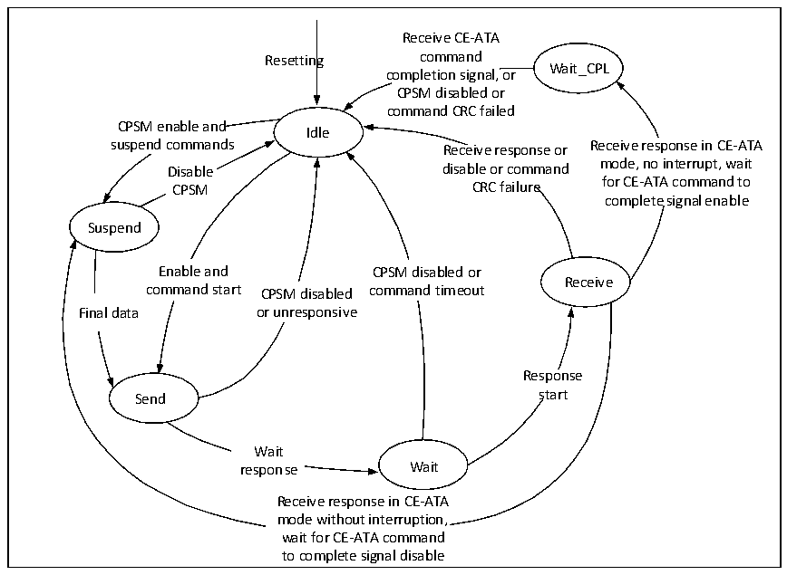
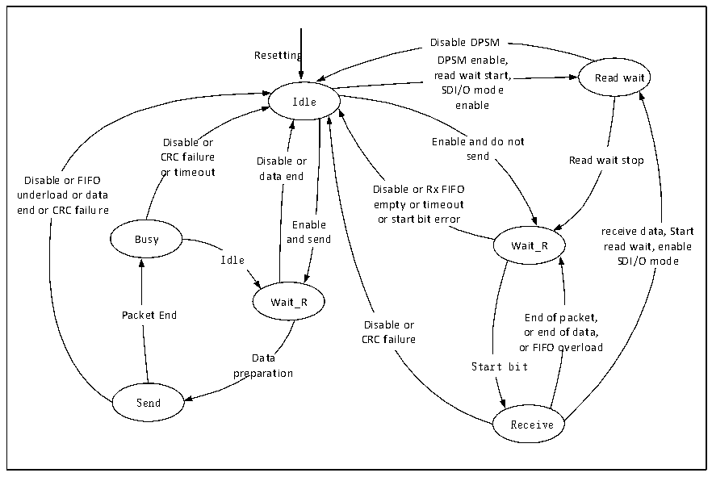

<!-- source-page: 501 -->

[← p.500](0500.md) · [index](../README.md) · [PDF p.501](https://ch32-riscv-ug.github.io/CH32V20x/datasheet_zh/CH32FV2x_V3xRM.PDF#page=501) · [p.502 →](0502.md)

<!-- header: CH32F/V20x_V30x_V31x系列应用手册 https://wch.cn -->

### 28.2.4 命令状态机

SDIO的命令工作流程遵循如下图的状态机。  

图28-2 命令状态机  
 <!-- rendered from the PDF; verify at https://ch32-riscv-ug.github.io/CH32V20x/datasheet_zh/CH32FV2x_V3xRM.PDF#page=501 -->

🖼 Text parsed from the figure above

Receive CE-ATA  
Resetting command  
Wait_CPL  
completion signal, or  
CPSM disabled or  
command CRC failed  
CPSM enable and  
Idle  
suspend commands Receive response or Receive response in CE-ATA  
Disable disable or command mode, no interrupt, wait  
CPSM CRC failure for CE-ATA command to  
complete signal enable  
Suspend  
Enable and CPSM disabled or  
Receive  
command start CPSM disabled command timeout  
Final data or unresponsive  
Response  
Send start  
Wait  
response Wait  
Receive response in CE-ATA  
mode without interruption,  
wait for CE-ATA command  
to complete signal disable  

### 28.2.5 数据状态机

SDIO的数据工作流程遵循如下图的状态机。  

图28-3 数据状态机  
 <!-- rendered from the PDF; verify at https://ch32-riscv-ug.github.io/CH32V20x/datasheet_zh/CH32FV2x_V3xRM.PDF#page=501 -->

🖼 Text parsed from the figure above

Disable DPSM  
Resetting DPSM enable,  
read wait start, Read wait  
SDI/O mode  
Idle enable  
Disable or Enable and do not  
CRC failure Disable or send Read wait stop  
Disable or FIFO or timeout data end  
Disable or Rx FIFO  
underload or data  
empty or timeout  
end or CRC failure  
Enable or start bit error  
receive data, Start  
Busy and send  
Wait_R read wait, enable  
Idle SDI/O mode  
Wait_R  
End of packet, or end of data, or FIFO overload  o Start bit  
Packet End End of packet,  
Disable or  
CRC failure  
Data  
preparation  
Send  
Receive  

<!-- image: p501-draw-image-00001 bbox=[507.6, 786.0, 527.52, 797.04] -->
<!-- footer: V2.5 498 -->
