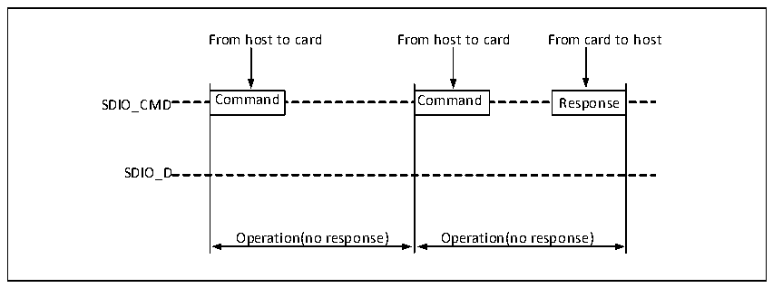
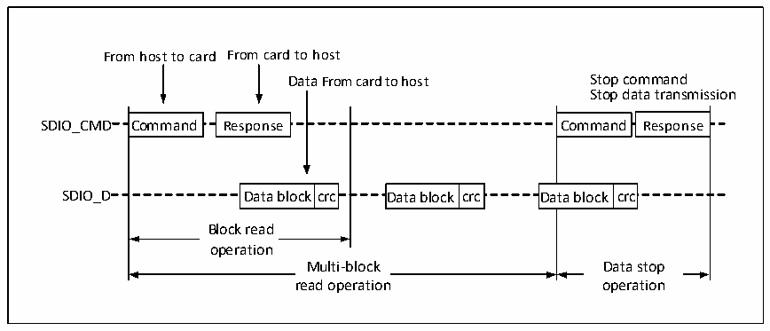

<!-- source-page: 502 -->

[← p.501](0501.md) · [index](../README.md) · [PDF p.502](https://ch32-riscv-ug.github.io/CH32V20x/datasheet_zh/CH32FV2x_V3xRM.PDF#page=502) · [p.503 →](0503.md)

<!-- header: CH32F/V20x_V30x_V31x系列应用手册 https://wch.cn -->

## 28.3 SDIO 协议简述

SDIO 上的通讯以传输为最小单位，每个传输总是以主机在 CMD 线上发送命令为起始，有的命令  
发送之后，SDIO设备同样会在CMD线上发送一段数据回复主机，称为“响应”，有时还会伴随着数据  
的传输，数据的传输是在D线上。命令和响应的格式是固定的，各域各位的定义根据不同的命令或响  
应而确定。响应和数据传输需要在命令或响应结束后规定的时间内发出或停止，否则将产生超时错误。  
本小节的目的是以较小的篇幅让用户对使用 SDIO 所必要的一些规范的细节有初步的了解，并不  
保证详尽和更新及时。微控制器的SDIO也仅仅保证其实现了SD 2.0，SDIO 2.0及MMC 4.5规范的硬  
件操作基础，对于更高版本规范定义的功能，例如双边沿采样等，并不一定支持。用户在做具体开发  
时应以SD规范，SDIO规范和MMC规范为依据进行SDIO交互编程。  

### 28.3.1 总线时序

SD 卡的传输都是以主机发起 CMD 发起的，SD 卡可能不回复响应，可能回复短响应和长响应，有  
的响应后面还会伴随数据传输。而在SDIO卡或MMC卡的通讯中，还可能会有SDIO设备主动报中断的  
情况。时序如下图组所示。  

图28-4 SDIO的无响应时序和无数据时序（以SD卡为例）  
 <!-- rendered from the PDF; verify at https://ch32-riscv-ug.github.io/CH32V20x/datasheet_zh/CH32FV2x_V3xRM.PDF#page=502 -->

🖼 Text parsed from the figure above

From host to card From host to card From card to host  
Command  Command  
Command  Command  
Response  Response  
SDIO_CMD Command Command Response  
SDIO_D  
Operation(no response) Operation(no response)  

图28-5 SDIO的多块读时序（以SD卡为例）  
 <!-- rendered from the PDF; verify at https://ch32-riscv-ug.github.io/CH32V20x/datasheet_zh/CH32FV2x_V3xRM.PDF#page=502 -->

🖼 Text parsed from the figure above

From host to card From card to host  
Data From card to host Stop command  
Stop data transmission  
Command  Command  
Response  Response  
Command  Response  Data block crc Da  Command  Response  ata block crc  Da  ata block  crc  Da  ata block  crc  
Data block  crc  Data block  crc  
Data block  crc  Data block  crc  
SDIO_D Data block crc Data block crc Data block crc  
Block read  operation  
Multi-block Data stop  
Multi-block  reMadu oltpi-ebrloatciko n  
Data stop  oDpaetara sttioopn  
read operation operation  

<!-- image: p502-draw-image-00001 bbox=[507.6, 786.0, 527.52, 797.04] -->
<!-- footer: V2.5 499 -->
