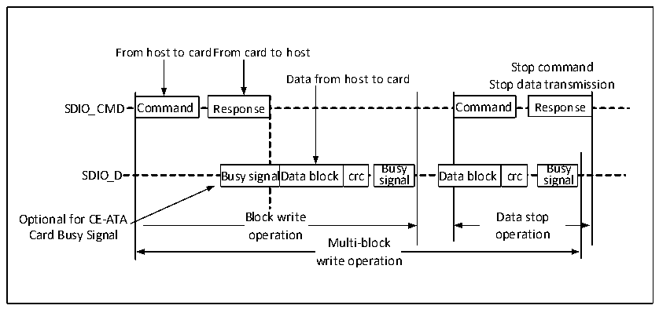
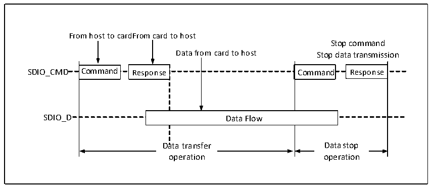
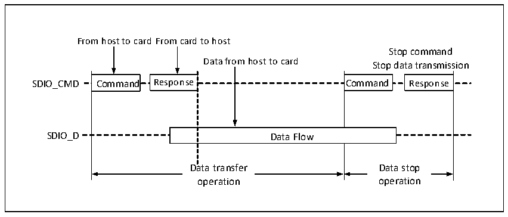

<!-- source-page: 503 -->

[← p.502](0502.md) · [index](../README.md) · [PDF p.503](https://ch32-riscv-ug.github.io/CH32V20x/datasheet_zh/CH32FV2x_V3xRM.PDF#page=503) · [p.504 →](0504.md)

<!-- header: CH32F/V20x_V30x_V31x系列应用手册 https://wch.cn -->

图28-6 SDIO的多块写时序（以SD卡为例）  
 <!-- rendered from the PDF; verify at https://ch32-riscv-ug.github.io/CH32V20x/datasheet_zh/CH32FV2x_V3xRM.PDF#page=503 -->

🖼 Text parsed from the figure above

From host to cardFrom card to host  
Stop command  
Data from host to card  
Stop data transmission  
Command  Command  
Response  Response  Busy nalData block crc signal  CDat  Command Response Busy ta block crc signal  Busy sign  nal  lData block  crc  Busy signal  Dat  ta block  crc  Busy sign  nal  Data block  crc  sBigunsayl  Dat  a block  crc  
Busy signal  sBigunsayl  
Block write  operation  Multi-block  write operation  
Data stop  operation  

图28-7 SDIO的数据流读时序（以SDIO卡为例）  
 <!-- rendered from the PDF; verify at https://ch32-riscv-ug.github.io/CH32V20x/datasheet_zh/CH32FV2x_V3xRM.PDF#page=503 -->

🖼 Text parsed from the figure above

From host to cardFrom card to host  
Stop command  
Data from card to host Stop data transmission  
Command  Command  
Response  Command  Response  Command  Data Flow  Data Flow  
Response  Response  
Data transfer Data stop  
Data transfer  Daotpae trraatniosnfer  
Data stop  operation  
operation operation  

图28-8 SDIO的数据流写时序（以SDIO卡为例）  
 <!-- rendered from the PDF; verify at https://ch32-riscv-ug.github.io/CH32V20x/datasheet_zh/CH32FV2x_V3xRM.PDF#page=503 -->

🖼 Text parsed from the figure above

From host to card From card to host  
Stop command  
Data from host to card  
Stop data transmission  
Command  Command  
Response  Response  Command Response  Data Flow  Data Flow  
Data transfer Data stop  
Data transfer  operation  
Data stop  operation  
operation operation  

### 28.3.2 命令

SDIO传输大部分以命令（CMD）开始，SDIO主机通过命令向设备告知自己的意图。命令的格式如  
下表。  
<!-- image: p503-draw-image-00001 bbox=[507.6, 786.0, 527.52, 797.04] -->
<!-- footer: V2.5 500 -->
