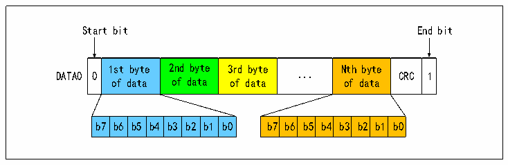
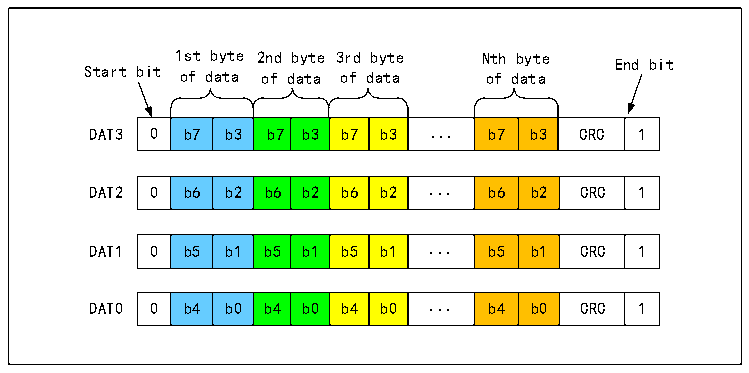
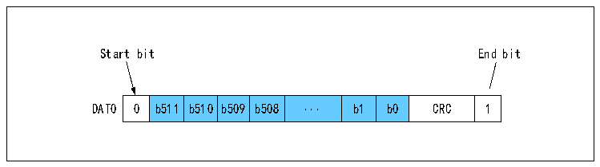

<!-- source-page: 508 -->

[← p.507](0507.md) · [index](../README.md) · [PDF p.508](https://ch32-riscv-ug.github.io/CH32V20x/datasheet_zh/CH32FV2x_V3xRM.PDF#page=508) · [p.509 →](0509.md)

<!-- header: CH32F/V20x_V30x_V31x系列应用手册 https://wch.cn -->
结束后还跟着CRC校验。  
开启RANDOM_LEN_EN位，配置DBLOCKSIZE2表示的字节长度，配置R32_SDIO_DLEN表示的传输数  
据总长度，使能 DTEN 位，填写数据至 R32_SDIO_FIFO，即可完成任意字节长度且带 CRC 校验的块传  
输。（注：仅适用于CH32F20x_D8、CH32F20x_D8C、CH32V30x_D8、CH32V30x_D8C、CH32V31x_D8C批号  
倒数第六位不为0的产品）  
MMC卡还支持数据流传输模式，此时不附带CRC。下图为数据传输的格式。  

图28-9 SD卡单总线数据传输字节的格式  
 <!-- rendered from the PDF; verify at https://ch32-riscv-ug.github.io/CH32V20x/datasheet_zh/CH32FV2x_V3xRM.PDF#page=508 -->

🖼 Text parsed from the figure above

Start bit End bit  
0  1st byte of data  2nd byte of data  3rd byte of data  ...  Nth byte of data  CRC  1  b7  b6  b5  b4  b3  b2  b1  b0  b7  b6  b5  b4  b3  b2  b1  b0  

图28-10 SD卡4总线数据传输字节的格式  
 <!-- rendered from the PDF; verify at https://ch32-riscv-ug.github.io/CH32V20x/datasheet_zh/CH32FV2x_V3xRM.PDF#page=508 -->

🖼 Text parsed from the figure above

1st byte 2nd byte 3rd byte Nth byte End bit  
Start bit of data of data of data of data  
0  b7  b3  b7  b3  b7  b3  ...  b7  b3  CRC  1  
0  b6  b2  b6  b2  b6  b2  ...  b6  b2  CRC  1  
0  b5  b1  b5  b1  b5  b1  ...  b5  b1  CRC  1  
0  b4  b0  b4  b0  b4  b0  ...  b4  b0  CRC  1  

图28-11 SD卡单总线数据传输一个512位字的格式  
 <!-- rendered from the PDF; verify at https://ch32-riscv-ug.github.io/CH32V20x/datasheet_zh/CH32FV2x_V3xRM.PDF#page=508 -->

🖼 Text parsed from the figure above

Start bit End bit  
0  b511  b510  b509  b508  ...  b1  b0  CRC  1  

<!-- image: p508-draw-image-00001 bbox=[507.6, 786.0, 527.52, 797.04] -->
<!-- footer: V2.5 505 -->
