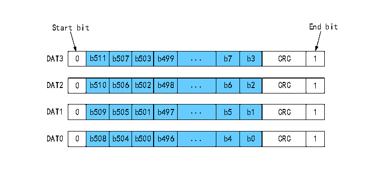

<!-- source-page: 509 -->

[← p.508](0508.md) · [index](../README.md) · [PDF p.509](https://ch32-riscv-ug.github.io/CH32V20x/datasheet_zh/CH32FV2x_V3xRM.PDF#page=509) · [p.510 →](0510.md)

<!-- header: CH32F/V20x_V30x_V31x系列应用手册 https://wch.cn -->

图28-12 SD卡4总线数据传输一个512位字的格式  
 <!-- rendered from the PDF; verify at https://ch32-riscv-ug.github.io/CH32V20x/datasheet_zh/CH32FV2x_V3xRM.PDF#page=509 -->

🖼 Text parsed from the figure above

Start bit End bit  
0  b511  b507  b503  b499  ...  b7  b3  CRC  1  
0  b510  b506  b502  b498  ...  b6  b2  CRC  1  
0  b509  b505  b501  b497  ...  b5  b1  CRC  1  
0  b508  b504  b500  b496  ...  b4  b0  CRC  1  

### 28.3.5 从模式

开启SLV_MODE位，即处于等待主机命令的状态，接收到的命令参数会放在RESP1，接收到的命令  
索引会放在RESP2，同时自动向主机应答R1类型的应答，应答参数为CMDARG的值。  
从模式下的数据收发参考主模式，但从机可以使用SLV_FORCE_ERR位强制数据块CRC错，从而表  
示不期望的数据读写。  
注：（1）从机只支持R1类型的应答，主从通信所用的命令索引和参数含义均由软件定义；  
（2）从机模式仅适用于CH32F20x_D8、CH32F20x_D8C、CH32V30x_D8、CH32V30x_D8C、CH32V31x_D8C  
批号倒数第六位不为0的产品。  

## 28.4 应用

### 28.4.1 设备初始化和设备寄存器

#### 28.4.1.1 OCR 寄存器

操作条件寄存器（Operation Conditions Register）存储了SD卡的一些其接收的供电电压的信  
息和相关的状态位。相关的位定义如下表。  

<!-- p509-table-005 (table-28-14@1) pages 509-510 -->
<table><caption>表28-14 OCR寄存器位定义</caption><tr><th>位次</th><th>位定义</th><th>描述</th></tr><tr><td>0-3</td><td>保留。</td><td rowspan="15" style="text-align:left">支持的V 电压范围，单位为伏特。 DD</td></tr><tr><td>4</td><td>保留。</td></tr><tr><td>5</td><td>保留。</td></tr><tr><td>6</td><td>保留。</td></tr><tr><td>7</td><td>为低电压范围保留</td></tr><tr><td>8</td><td>保留</td></tr><tr><td>9</td><td>保留</td></tr><tr><td>10</td><td>保留</td></tr><tr><td>11</td><td>保留</td></tr><tr><td>12</td><td>保留</td></tr><tr><td>13</td><td>保留</td></tr><tr><td>14</td><td>保留</td></tr><tr><td>15</td><td>2.7-2.8</td></tr><tr><td>16</td><td>2.8-2.9</td></tr><tr><td>17</td><td>2.9-3.0</td></tr><tr><td>18</td><td>3.0-3.1</td><td rowspan="6"></td></tr><tr><td>19</td><td>3.1-3.2</td></tr><tr><td>20</td><td>3.2-3.3</td></tr><tr><td>21</td><td>3.3-3.4</td></tr><tr><td>22</td><td>3.4-3.5</td></tr><tr><td>23</td><td>3.5-3.6</td></tr><tr><td>24</td><td>接受切换到1.8V</td><td></td></tr><tr><td>25-26</td><td>保留</td><td></td></tr><tr><td>27</td><td>超过2TB支持状态位</td><td></td></tr><tr><td>28</td><td>保留</td><td></td></tr><tr><td>29</td><td>UHS-II卡状态位</td><td>此位被置位表示此卡支持UHS-II接口。</td></tr><tr><td>30</td><td>卡容量状态（CCS）</td><td>此位被置位表示卡容量大于2GB。</td></tr><tr><td>31</td><td>卡上电状态位（busy）</td><td>此位在卡上电完成后被置位。上电完成后，其他位才有意义。</td></tr></table>

<!-- image: p509-draw-image-00001 bbox=[507.6, 786.0, 527.52, 797.04] -->
<!-- footer: V2.5 506 -->
