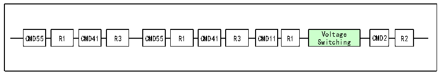

<!-- source-page: 511 -->

[← p.510](0510.md) · [index](../README.md) · [PDF p.511](https://ch32-riscv-ug.github.io/CH32V20x/datasheet_zh/CH32FV2x_V3xRM.PDF#page=511) · [p.512 →](0512.md)

<!-- header: CH32F/V20x_V30x_V31x系列应用手册 https://wch.cn -->

> ⬆ **Table continued** — rendered in full at [page 510](0510.md). <!-- p511-table-001 -->

#### 28.4.1.4 RCA 寄存器

相对卡地址寄存器存储了卡的地址，为16位，默认值为0.  

### 28.4.2 电压切换

在 SD 卡初始化后期，需要进行接口电平切换，将 SD卡的时钟线数据线和命令线的 IO 电平切换  
到1.8V水平。对于压摆率不是足够优秀的器件，使用更低的电平标准有助于提升频率。但是SD的供  
电电压并不一定变化，只在较新版本的协议才出现了低电压供电的SD卡。  
切换电压的步骤如下图。  

图28-13 电压切换序列  
 <!-- rendered from the PDF; verify at https://ch32-riscv-ug.github.io/CH32V20x/datasheet_zh/CH32FV2x_V3xRM.PDF#page=511 -->

🖼 Text parsed from the figure above

CMD55  R1  
Voltage  
CMD55 R1 CMD41 R3 CMD55 R1 CMD41 R3 CMD11 R1 CMD2 R2  
Switching  

<!-- image: p511-draw-image-00001 bbox=[507.6, 786.0, 527.52, 797.04] -->
<!-- footer: V2.5 508 -->
