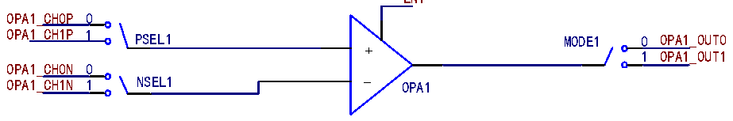

<!-- source-page: 527 -->

[← p.526](0526.md) · [index](../README.md) · [PDF p.527](https://ch32-riscv-ug.github.io/CH32V20x/datasheet_zh/CH32FV2x_V3xRM.PDF#page=527) · [p.528 →](0528.md)

<!-- header: CH32F/V20x_V30x_V31x系列应用手册 https://wch.cn -->

# 第 30 章 运算放大器（OPA）

本章模块描述适用于CH32F20x、CH32V20x、CH32V30x和CH32V31x微控制器系列部分产品。  
运算放大器模块（OPA），包含4个可独立配置的运算放大器。每个运算放大器的输入和输出均  
连接至I/O口，且输入引脚可选择，输出引脚可选择配置到通用I/O口或复用为ADC采样通道的  
I/O。  

## 30.1 主要特性

● 输入引脚可选择  
● 输出引脚可选择通用I/O口或ADC采样通道  

## 30.2 功能描述

置位OPAx_EN，即可使能对应的OPAx，配置OPAx_MODE可选择OPAx的输出通道为ADC采样通道  
或者普通I/O口，配置OPAx_PSEL，可选择OPAx的正向输入引脚，配置OPAx_NSEL，可选择OPAx的  
负向输入引脚。  

图30-1 OPA结构框图  
 <!-- rendered from the PDF; verify at https://ch32-riscv-ug.github.io/CH32V20x/datasheet_zh/CH32FV2x_V3xRM.PDF#page=527 -->

EN1  

🖼 Text parsed from the figure above

OPA1_CH0P 0  
OPA1_CH1P 1 PSEL1 MODE1 0 OPA1_OUT0  
+  
1 OPA1_OUT1  
OPA1_CH0N 0  
OPA1_CH1N 1 NSEL1 - OPA1  

EN2  
OPA2_CH0P 0  
OPA2_CH1P 1 PSEL2 MODE2 0 OPA2_OUT0  
+  
1 OPA2_OUT1  
OPA2_CH0N 0  
OPA2_CH1N 1 NSEL2 - OPA2  
EN3  
OPA3_CH0P 0  
OPA3_CH1P 1 PSEL3 MODE3 0 OPA3_OUT0  
+  
1 OPA3_OUT1  
OPA3_CH0N 0  
OPA3_CH1N 1 NSEL3 - OPA3  
EN4  
OPA4_CH0P 0  
OPA4_CH1P 1 PSEL4 MODE4 0 OPA4_OUT0  
+  
1 OPA4_OUT1  
OPA4_CH0N 0  
OPA4_CH1N 1 NSEL4 - OPA4  
注：各OPA详细说明请参考对应型号的数据手册。  
<!-- image: p527-draw-image-00001 bbox=[507.6, 786.0, 527.52, 797.04] -->
<!-- footer: V2.5 524 -->
