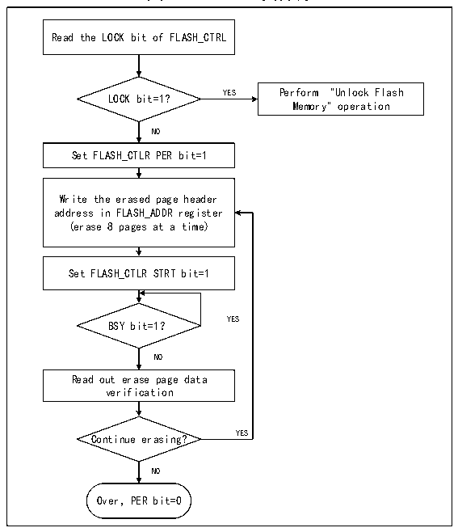
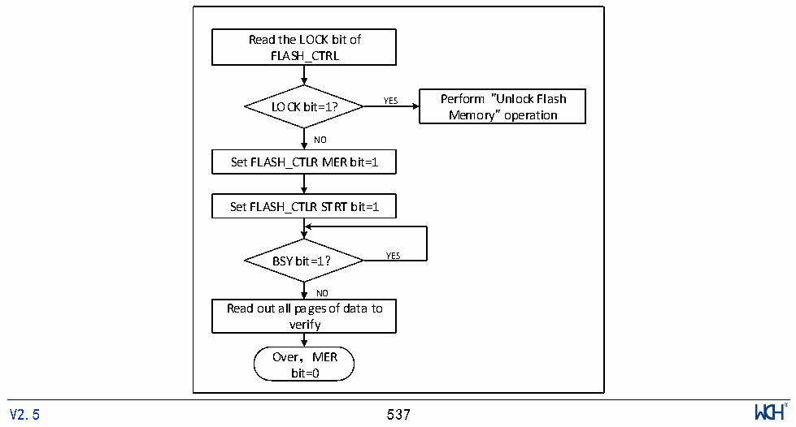

<!-- source-page: 540 -->

[← p.539](0539.md) · [index](../README.md) · [PDF p.540](https://ch32-riscv-ug.github.io/CH32V20x/datasheet_zh/CH32FV2x_V3xRM.PDF#page=540) · [p.541 →](0541.md)

<!-- header: CH32F/V20x_V30x_V31x系列应用手册 https://wch.cn -->

图32-2 FLASH页擦除  
 <!-- rendered from the PDF; verify at https://ch32-riscv-ug.github.io/CH32V20x/datasheet_zh/CH32FV2x_V3xRM.PDF#page=540 -->

🖼 Text parsed from the figure above

Read the LOCK bit of FLASH_CTRL  
LOCK bit=1? YES Perform &quot;Unlock Flash  
Memory&quot; operation  
NO  
Set FLASH_CTLR PER bit=1  
Write the erased page header  
address in FLASH_ADDR register  
(erase 8 pages at a time)  
Set FLASH_CTLR STRT bit=1  
BSY bit=1？ YES  
NO  
Read out erase page data  
verification  
Continue erasing? YES  
NO  
Over，PER bit=0  

1）检查FLASH_CTLR寄存器LOCK位，如果为1，需要执行“解除闪存锁”操作。  
2）设置FLASH_CTLR寄存器的PER位为‘1’，开启扇区擦除模式。  
3）向FLASH_ADDR寄存器写入选择擦除的页首地址。  
4）设置FLASH_CTLR寄存器的STRT位为‘1’，启动一次擦除动作。  
5）等待BSY位变为‘0’或FLASH_STATR寄存器的EOP位为‘1’表示擦除结束，将EOP位清0。  
6）读擦除页的数据进行校验。  
7）继续扇区擦除可以重复3-5步骤，结束擦除将PER位清0。  
注：擦除成功后，字读- 0xe339e339，半字读- 0xe339，偶地址字节读- 0x39，奇地址读0xe3。  

图32-3 FLASH整片擦除  
 <!-- rendered from the PDF; verify at https://ch32-riscv-ug.github.io/CH32V20x/datasheet_zh/CH32FV2x_V3xRM.PDF#page=540 -->

🖼 Text parsed from the figure above

Read the LOCK bit of  
FLASH_CTRL  
LOCK bit=1? YES Perform &quot;Unlock Flash  
Memory&quot; operation  
NO  
Set FLASH_CTLR MER bit=1  
Set FLASH_CTLR STRT bit=1  
BSY bit=1？ YES  
NO  
Read out all pages of data to  
verify  
Over，MER  
bit=0  
<!-- image: p540-draw-image-00001 inside the figure -->
<!-- footer: V2.5 537 -->

