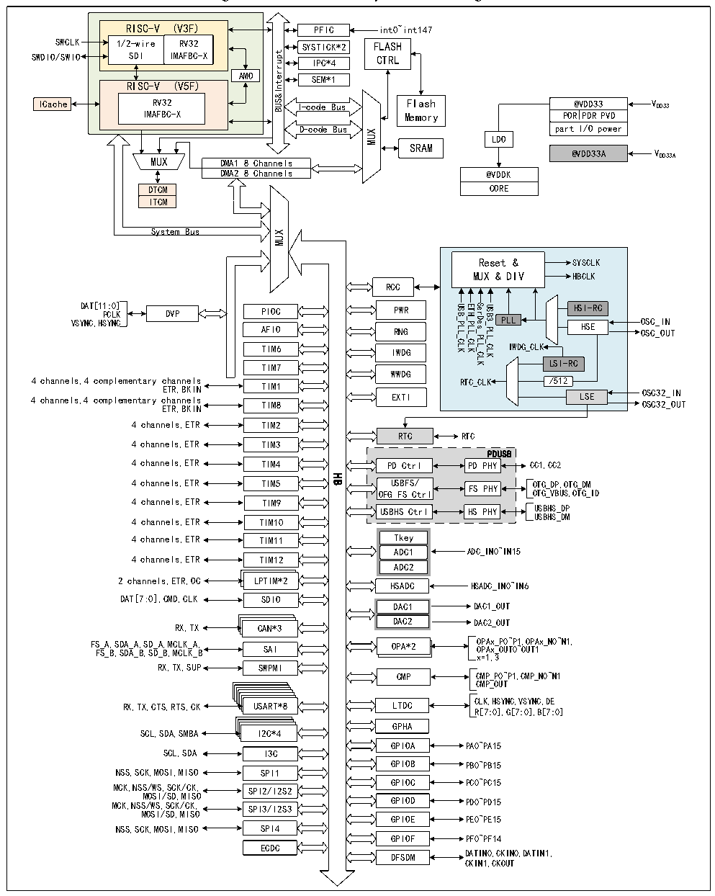

<!-- source-page: 8 -->

[← p.7](0007.md) · [index](../README.md) · [PDF p.8](https://ch32-riscv-ug.github.io/CH32H417/datasheet_en/CH32H417DS0.PDF#page=8) · [p.9 →](0009.md)

<!-- header: CH32H417/H416/H415 Datasheet https://wch-ic.com -->

Figure 1-1-3 CH32H416 system block diagram  
 <!-- rendered from the PDF; verify at https://ch32-riscv-ug.github.io/CH32H417/datasheet_en/CH32H417DS0.PDF#page=8 -->

🖼 Text parsed from the figure above

RISC-V (V3F) 1/2-wire RV32 SDI IMAFBC-XAMO RISC-V (V5F)  AMO  
PFIC  SYSTICK*2  IPC*4SEM*1  
int0~int147  
SWCLK  
1/2-wire SDI  RV32IMAFBC-X  
FLASH  
SWDIO/SWIO  
CTRL  
AMOtpurretnI&amp;SUB SEM*1  
RISC-V (V5F)  
RV32 I-code Bus Flash  
@VDD33 VDD33  
ICache  
IMAFBC-X Memory  
POR PDR PVD  
part I/O power  
D-code Bus  
MUX  
LDO  
SRAM  
@VDD33A VDD33A  
MUX DMA1 8 Channels  
DMA2 8 Channels  
@VDDK  
CORE  
DTCM  
ITCM  
System Bus  
MUX  
Reset &amp; SYSCLK  
MUX &amp; DIV HBCLK  
RCC  
DAT[11 PC :0 L ] K DVP PIOC PWR  
USB_PLL_CLK ETH_PLL_CLK SerDes_PLL_CLK USB3_PLL_CLK  
HSI-RC  
PLL OSC_IN HSE OSC_OUT  
VSYNC,HSYNC AFIO RNG  
IWDG_CLK  
TIM6 IWDG  
LSI-RC  
TIM7  
WWDG  
4 channels,4 complementary channels ETR,BKIN TIM1 4 channels,4 complementary channels EXTI ETR,BKIN TIM8  
/512  
RTC_CLK LSE OSC32_IN OSC32_OUT  
4 channels,ETR TIM2  
RTC  
RTC  
4 channels,ETR TIM3  
PDUSB  
4 channels,ETR TIM4 PD Ctrl PD PHY CC1,CC2  
HB  
4 channels,ETR TIM5 USBFS/ FS PHY OTG_DP,OTG_DM  
OFG FS Ctrl OTG_VBUS,OTG_ID  
4 channels,ETR TIM9  
USBHS Ctrl HS PHY USBHS_DP  
USBHS_DM  
4 channels,ETR TIM10  
4 channels,ETR TIM11 Tkey  
ADC1 ADC_IN0~IN15  
4 channels,ETR TIM12  
ADC2  
2 channels,ETR,OC LPTIM*2  
HSADC HSADC_IN0~IN6  
DAT[7:0],CMD,CLK SDIO  
DAC1 DAC1_OUT  
DAC2 DAC2_OUT  
RX,TX CAN*3  
FS F _ S A _ , B S , D S A D _ A A _ , B S , D S _ D A _ , B M , C M L C K L _ K A _ , B SAI OPA*2 O O P P A A x x _ _ P OU 0~ T P 0 1 ~ , OU OP T1 Ax_N0~N1,  
x=1,3  
RX,TX,SUP SWPMI  
CMP CMP_P0~P1,CMP_N0~N1  
CMP_OUT  
RX,TX,CTS,RTS,CK USART*8 LTDC CLK,HSYNC,VSYNC,DE  
R[7:0],G[7:0],B[7:0]  
GPHA  
SCL,SDA,SMBA I2C*4  
GPIOA PA0~PA15  
SCL,SDA I3C  
GPIOB PB0~PB15  
NSS,SCK,MOSI,MISO SPI1  
GPIOC PC0~PC15  
MCK,NSS/WS,SCK/CK, SPI2/I2S2  
MOSI/SD,MISO  
MCK,NSS/WS,SCK/CK, SPI3/I2S3 GPIOD PD0~PD15  
MOSI/SD,MISO  
GPIOE PE0~PE15  
NSS,SCK,MOSI,MISO SPI4  
GPIOF PF0~PF14  
ECDC  
DFSDM DATIN0,CKIN0,DATIN1,  
CKIN1,CKOUT  

<!-- image: p8-draw-image-00001 bbox=[506.88, 783.6, 526.32, 793.8] -->
<!-- footer: V1.8 4 -->
