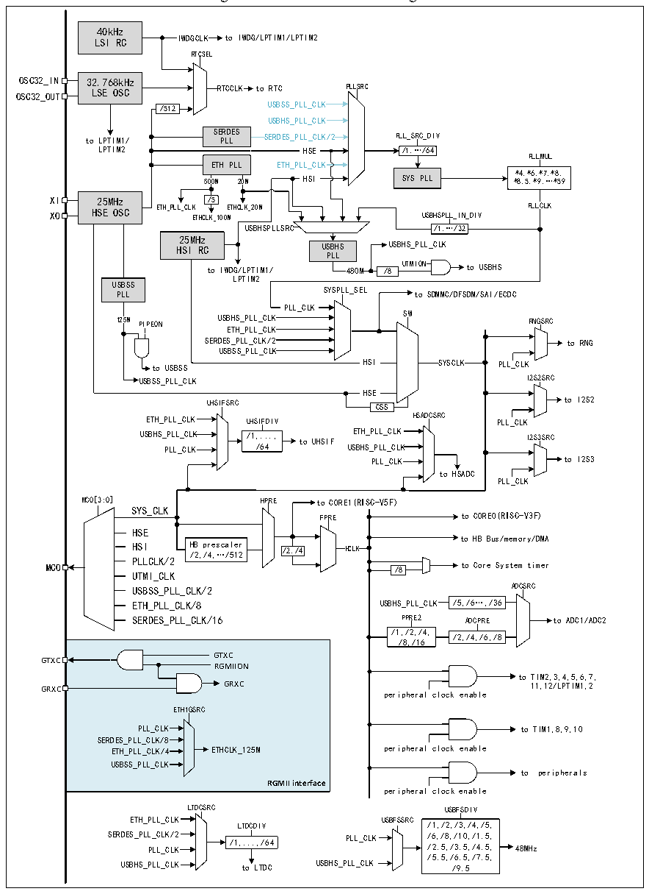

<!-- source-page: 10 -->

[← p.9](0009.md) · [index](../README.md) · [PDF p.10](https://ch32-riscv-ug.github.io/CH32H417/datasheet_en/CH32H417DS0.PDF#page=10) · [p.11 →](0011.md)

<!-- header: CH32H417/H416/H415 Datasheet https://wch-ic.com -->

## 1.3 Clock Tree

4 groups of clock sources are introduced into the system: internal high frequency RC oscillator (HSI), internal low  
frequency RC oscillator (LSI), external high frequency oscillator (HSE), external low frequency oscillator (LSE).  

Figure 1-3 Clock tree block diagram  
 <!-- rendered from the PDF; verify at https://ch32-riscv-ug.github.io/CH32H417/datasheet_en/CH32H417DS0.PDF#page=10 -->

🖼 Text parsed from the figure above

40kHz  
LSI RC IWDGCLK to IWDG/LPTIM1/LPTIM2  
RTCSEL  
OSC32_IN 32.768kHz  
OSC32_OUT LSE OSC RTCCLK to RTC PLLSRC  
/512 USBSS_PLL_CLK  
USBHS_PLL_CLK  
SERDESPLL  SERDES_PLL_CLK/2HSE  
PLLMUL  
500M 20M HSI SYS PLL * * 8 4 . , 5 * , 6 * , 9 * , 7 … ,* * 8 5 , 9  
XI 25MHz /5  
XO HSE OSC ETH_PLL_CL E K THCLK_100 E M THCLK_20M USBHSPLL_IN_DIV PLLCLK  
USBHSPLLSRC /1,…/32  
25MHz  
HSI RC USBHS USBHS_PLL_CLK  
PLL  
to IWDG/LPTIM1/ 480M /8 UTMION to USBHS  
LPTIM2  
U P SB LL SS SYSPLL_SEL to SDMMC/DFSDM/SAI/ECDC  
PLL_CLK  
SW  
125M PIPEON USBHS_PLL_CLK RNGSRC  
ETH_PLL_CLK  
SERDES_PLL_CLK/2 to RNG  
USBSS_PLL_CLK  
to USBSS HSI SYSCLK PLL_CLK  
USBSS_PLL_CLK I2S2SRC  
HSE  
UHSIFSRC CSS to I2S2  
ETH_PLL_CLK UHSIFDIV HSADCSRC PLL_CLK  
USBHS_PLL_CLK /1,..., to UHSIF ETH_PLL_CLK I2S3SRC  
PLL_CLK /64 USBHS_PLL_CLK  
PLL_CLK to I2S3  
to HSADC  
PLL_CLK  
MCO[3:0] HPRE to CORE1(RISC-V5F)  
SYS_CLK  
FPRE to CORE0(RISC-V3F)  
HSE  
to HB Bus/memory/DMA  
HSI H /2 B ,/ p 4 re , s … ca / l 5 e 1 r 2 /2,/4 HCLK  
PLLCLK/2  
MCO /8 to Core System timer  
UTMI_CLK  
USBSS_PLL_CLK/2 ADCSRC  
ETH_PLL_CLK/8 USBHS_PLL_CLK /5,/6…,/36  
SERDES_PLL_CLK/16 PPRE2 ADCPRE to ADC1/ADC2  
/1,/2,/4,  
/2,/4,/6,/8  
/8,/16  
GTXC  
GTXC  
RGMIION  
to TIM2,3,4,5,6,7,  
GRXC GRXC 11,12/LPTIM1,2  
peripheral clock enable  
ETH1GSRC  
PLL_CLK to TIM1,8,9,10  
SERDES_PLL_CLK/8  
ETH_PLL_CLK/4 ETHCLK_125M peripheral clock enable  
USBSS_PLL_CLK  
to peripherals  
<strong>RGMII interface</strong>  
peripheral clock enable  
LTDCSRC USBFSDIV  
ETH_PLL_CLK USBFSSRC  
LTDCDIV /1,/2,/3,/4,/5,  
SERDES_PLL P _ LL C _ LK C / LK 2 /1,...,/64 PLL_CLK / / 6 2 , . / 5 8 , , / / 3 1 .5 0, , / / 1 4 . . 5 5 , , 48MHz  
/5.5,/6.5,/7.5,  
USBHS_PLL_CLK to LTDC USBHS_PLL_CLK /9.5  

Note: The blue-marked sections in the above diagram apply only to chips with a fifth digit greater than 0 in the lot  
number.  
<!-- image: p10-draw-image-00001 bbox=[506.88, 783.6, 526.32, 793.8] -->
<!-- footer: V1.8 6 -->
