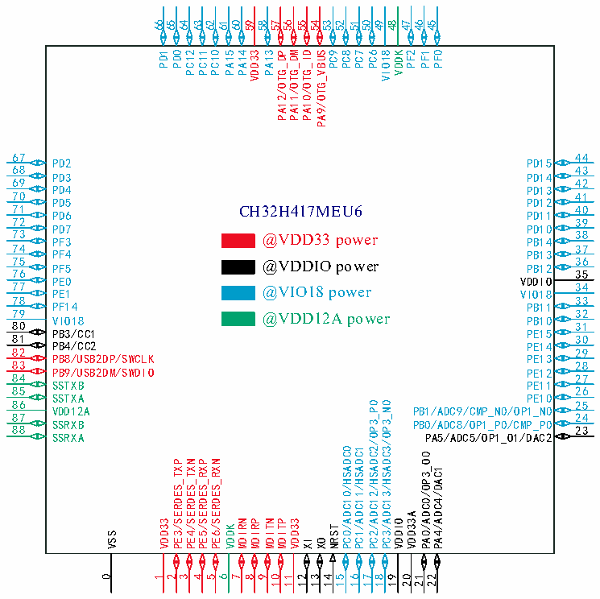

<!-- source-page: 30 -->

[← p.29](0029.md) · [index](../README.md) · [PDF p.30](https://ch32-riscv-ug.github.io/CH32H417/datasheet_en/CH32H417DS0.PDF#page=30) · [p.31 →](0031.md)

<!-- header: CH32H417/H416/H415 Datasheet https://wch-ic.com -->

 <!-- p30-cluster-01 uncaptioned graphics, rendered from the PDF; verify at https://ch32-riscv-ug.github.io/CH32H417/datasheet_en/CH32H417DS0.PDF#page=30 -->

🖼 Text parsed from the figure above

66 65 64 63 62 61 60 59 58 57 56 55 54 53 52 51 50 49 48 47 46 45  
PD1 PD0 PC12 PC11 PC10 PA15 PA14 VDD33 PA13 PA12/OTG_DP PA11/OTG_DM PA10/OTG_ID PA9/OTG_VBUS PC9 PC8 PC7 PC6 VIO18 VDDK PF2 PF1 PF0  
67  
44  
PD2  
PD15  
68  
43  
PD3 69  
PD14 42  
PD4  
PD13  
70  
41  
PD5  
PD12  
71  
40  
CH32H417MEU6  
PD6  
PD11  
72  
39  
PD7 73 PF3 @VDD33 power  
PD10 38 PB14  
74  
37  
PF4  
PB13  
75 PF5 @VDDIO power 76  
36 PB12 35  
PE0 77 PE1 @VIO18 power  
VDDIO 34 VIO18  
78  
33  
PF14  
PB11  
79 VIO18 @VDD12A power 80  
32 PB10 31  
PB3/CC1 81  
PE15 30  
PB4/CC2  
PE14  
82  
29  
PB8/USB2DP/SWCLK  
PE13  
83  
28  
PB9/USB2DM/SWDIO 84  
PE12 27  
SSTXB 85  
PE11 26  
SSTXA  
PE10  
86 VDD12A  
25 PB1/ADC9/CMP_N0/OP1_N0  
PC2/ADC12/HSADC2/OP3_P0  
PC3/ADC13/HSADC3/OP3_N0  
87  
24  
SSRXB 88  
PB0/ADC8/OP1_P0/CMP_P0 23  
SSRXA  
PA5/ADC5/OP1_O1/DAC2  
PC0/ADC10/HSADC0  
PC1/ADC11/HSADC1  
PA0/ADC0/OP3_O0  
PE3/SERDES_TXP  
PE4/SERDES_TXN  
PE5/SERDES_RXP  
PE6/SERDES_RXN  
PA4/ADC4/DAC1  
VDD33A  
VDD33  
MDIRN  
MDIRP  
MDITN  
MDITP  
VDD33  
VDDIO  
VDDK  
NRST  
VSS  
XI  
XO  
0  
1  
2  
3  
4  
5  
6  
7  
8  
9  
10  
11  
12  
13  
14  
15  
16  
17  
18  
19  
20  
21  
22  

<!-- image: p30-draw-image-00001 bbox=[511.32, 783.6, 530.76, 793.8] -->
<!-- footer: V1.8 26 -->
