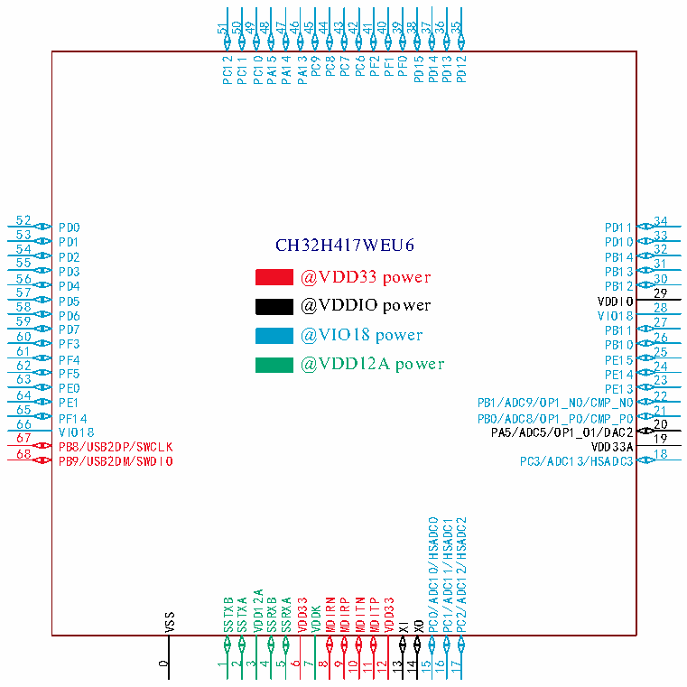

<!-- source-page: 31 -->

[← p.30](0030.md) · [index](../README.md) · [PDF p.31](https://ch32-riscv-ug.github.io/CH32H417/datasheet_en/CH32H417DS0.PDF#page=31) · [p.32 →](0032.md)

<!-- header: CH32H417/H416/H415 Datasheet https://wch-ic.com -->

 <!-- p31-cluster-01 uncaptioned graphics, rendered from the PDF; verify at https://ch32-riscv-ug.github.io/CH32H417/datasheet_en/CH32H417DS0.PDF#page=31 -->

🖼 Text parsed from the figure above

51 50 49 48 47 40  
46 45  
44 43 39  
42  
41  
38 37 36 35  
PC12 PC11 PC10 PA15 PA14 PA13 PC9 PC8 PC7 PC6 PF2 PF1 PF0 PD15 PD14 PD13 PD12  
52  
34  
PD0 PD11  
53  
33  
PD1 PD10 54  
CH32H417WEU6  
32  
55 PD2 PB14  
31  
PD3 PB13 56  
@VDD33 power  
30  
PD4 PB12  
57  
29  
58 PD5 VDDIO  
@VDDIO power  
28  
59 PD6 VIO18  
27  
PD7 PB11 60  
@VIO18 power  
26  
PF3 PB10  
61  
25  
62 PF4 PE15  
@VDD12A power  
24  
63 PF5 PE14  
23  
PE0 PE13  
64  
22  
PE1 PB1/ADC9/OP1_N0/CMP_N0  
65  
21  
66 PF14 PB0/ADC8/OP1_P0/CMP_P0  
20  
67 VIO18 PA5/ADC5/OP1_O1/DAC2  
19  
PB8/USB2DP/SWCLK VDD33A  
68  
18  
PB9/USB2DM/SWDIO PC3/ADC13/HSADC3  
PC0/ADC10/HSADC0  
PC1/ADC11/HSADC1  
PC2/ADC12/HSADC2  
VDD12A  
SSTXB  
SSTXA  
SSRXB  
SSRXA  
VDD33  
MDIRN  
MDIRP  
MDITN  
MDITP  
VDD33  
VDDK  
VSS  
XI  
XO  
0  
1  
2  
3  
4  
5  
6  
7  
8  
9  
10  
11  
12  
13  
14  
15  
16  
17  

<!-- image: p31-draw-image-00001 bbox=[511.32, 783.6, 530.76, 793.8] -->
<!-- footer: V1.8 27 -->
