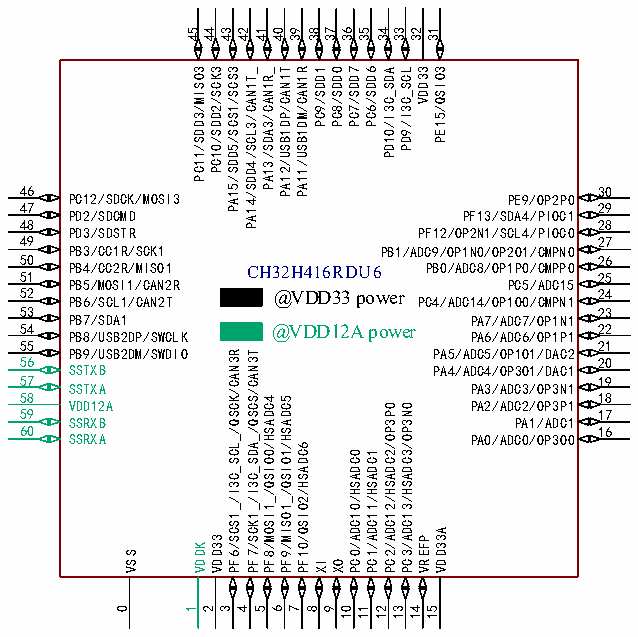

<!-- source-page: 32 -->

[← p.31](0031.md) · [index](../README.md) · [PDF p.32](https://ch32-riscv-ug.github.io/CH32H417/datasheet_en/CH32H417DS0.PDF#page=32) · [p.33 →](0033.md)

<!-- header: CH32H417/H416/H415 Datasheet https://wch-ic.com -->

### 2.1.2 CH32H416 Pinouts

 <!-- p32-cluster-01 uncaptioned graphics, rendered from the PDF; verify at https://ch32-riscv-ug.github.io/CH32H417/datasheet_en/CH32H417DS0.PDF#page=32 -->

🖼 Text parsed from the figure above

45 44 43 41 40 39 38 37 36 35 34 32 31  
42 33  
PC11/SDD3/MISO3  
PC10/SDD2/SCK3  
PA15/SDD5/SCS1/SCS3  
PA12/USB1DP/CAN1T  
PA11/USB1DM/CAN1R  
PC9/SDD1  
PC8/SDD0  
PC7/SDD7  
PC6/SDD6  
PD9/I3C_SCL  
VDD33  
PE15/QSIO3  
PA14/SDD4/SCL3/CAN1T_  
PA13/SDA3/CAN1R_  
PD10/I3C_SDA  
46  
30  
PC12/SDCK/MOSI3  
PE9/OP2P0  
47 29  
PD2/SDCMD  
PF13/SDA4/PIOC1  
48 28  
PD3/SDSTR  
PF12/OP2N1/SCL4/PIOC0  
49 27  
PB3/CC1R/SCK1  
PB1/ADC9/OP1N0/OP2O1/CMPN0  
50 26  
51 PB4/CC2R/MISO1 CH32H416RDU6 25  
PB0/ADC8/OP1P0/CMPP0  
PB5/MOSI1/CAN2R  
PC5/ADC15  
52 24  
@VDD33 power  
PB6/SCL1/CAN2T  
PC4/ADC14/OP1O0/CMPN1  
53 23  
PB7/SDA1  
PA7/ADC7/OP1N1  
54 22  
@VDD12A power  
PB8/USB2DP/SWCLK  
PA6/ADC6/OP1P1  
55 21  
PB9/USB2DM/SWDIO  
PA5/ADC5/OP1O1/DAC2  
PF6/SCS1_/I3C_SCL_/QSCK/CAN3R  
PF7/SCK1_/I3C_SDA_/QSCS/CAN3T  
56 20  
SSTXB  
PA4/ADC4/OP3O1/DAC1  
57 19  
SSTXA  
PA3/ADC3/OP3N1  
58 18 VDD12A 59 17  
PF8/MOSI1_/QSIO0/HSADC4  
PF9/MISO1_/QSIO1/HSADC5  
PA2/ADC2/OP3P1  
PC2/ADC12/HSADC2/OP3P0  
PC3/ADC13/HSADC3/OP3N0  
SSRXB  
PA1/ADC1  
60 16  
SSRXA  
PA0/ADC0/OP3O0  
PF10/QSIO2/HSADC6  
PC0/ADC10/HSADC0  
PC1/ADC11/HSADC1  
VDD33A  
VDD33  
VREFP  
VDDK  
VSS  
XI  
XO  
0 1 2 3 4 5 6 7 8 9 10 11 12 13 14 15  

<!-- image: p32-draw-image-00001 bbox=[511.32, 783.6, 530.76, 793.8] -->
<!-- footer: V1.8 28 -->
