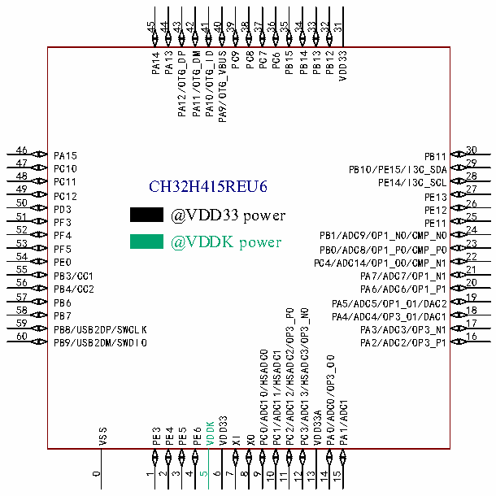

<!-- source-page: 33 -->

[← p.32](0032.md) · [index](../README.md) · [PDF p.33](https://ch32-riscv-ug.github.io/CH32H417/datasheet_en/CH32H417DS0.PDF#page=33) · [p.34 →](0034.md)

<!-- header: CH32H417/H416/H415 Datasheet https://wch-ic.com -->

### 2.1.3 CH32H415 Pinouts

 <!-- p33-cluster-01 uncaptioned graphics, rendered from the PDF; verify at https://ch32-riscv-ug.github.io/CH32H417/datasheet_en/CH32H417DS0.PDF#page=33 -->

🖼 Text parsed from the figure above

45  
44 43 42 41 40 39 38 37 36 35 34 33 31  
32  
PA14 PA13 PA12/OTG_DP PA11/OTG_DM PA10/OTG_ID PA9/OTG_VBUS PC9 PC8 PC7 PC6 PB15 PB14 PB13 PB12 VDD33  
46  
30  
PA15  
PB11  
29  
47  
PC10  
PB10/PE15/I3C_SDA  
48  
28  
PC11  
PE14/I3C_SCL  
49 CH32H415REU6  
27  
PC12  
PE13  
50  
26  
PD3  
PE12  
51PF3@VDD33 power  
25  
PE11  
24  
52  
PF4  
PB1/ADC9/OP1_N0/CMP_N0  
53 @VDDK power  
23  
PF5  
PB0/ADC8/OP1_P0/CMP_P0  
54  
22  
PE0  
PC4/ADC14/OP1_O0/CMP_N1  
21  
55  
PB3/CC1  
PA7/ADC7/OP1_N1  
56  
20  
PB4/CC2  
PA6/ADC6/OP1_P1  
57  
19  
PB6  
PA5/ADC5/OP1_O1/DAC2  
18  
58  
PC2/ADC12/HSADC2/OP3_P0  
PC3/ADC13/HSADC3/OP3_N0  
PB7  
PA4/ADC4/OP3_O1/DAC1  
59  
17  
PB8/USB2DP/SWCLK  
PA3/ADC3/OP3_N1  
60  
16  
PB9/USB2DM/SWDIO  
PA2/ADC2/OP3_P1  
PC0/ADC10/HSADC0  
PC1/ADC11/HSADC1  
PA0/ADC0/OP3_O0  
PA1/ADC1  
VDD33A  
VDD33  
VDDK  
VSS  
PE3  
PE4  
PE5  
PE6  
XI  
XO  
0  
1  
2  
3  
4  
5  
6  
7  
8  
9  
10  
11  
12  
13  
14  
15  

Note: The alternate functions in the pin diagram are abbreviated.  
Example: ADC_: (ADC0:ADC_IN0)  
HSADC_: (HSADC4:HSADC_IN4)  
DAC_: (DAC1:DAC_OUT1)  
USB2DP: USBHS_DP  
USB2DN: USBHS_DN  
SSRXA: USBSS_RXA  
SSRXB: USBSS_RXB  
SSTXA: USBSS_TXA  
SSTXB: USBSS_TXB  
OP: OPA_(OP1_P1:OPA1_P1, OP1_N1:OPA1_N1, OP1_O1:OPA1_OUT1)  
<!-- image: p33-draw-image-00001 bbox=[511.32, 783.6, 530.76, 793.8] -->
<!-- footer: V1.8 29 -->
