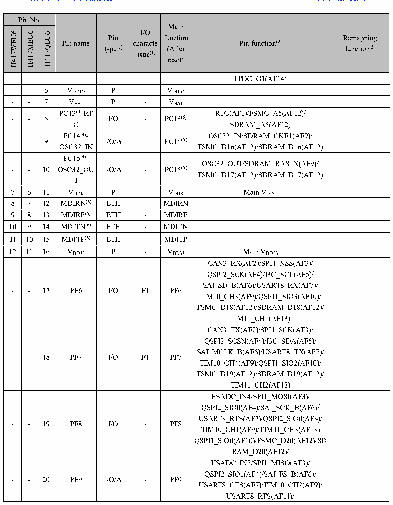

<!-- source-page: 35 -->

[← p.34](0034.md) · [index](../README.md) · [PDF p.35](https://ch32-riscv-ug.github.io/CH32H417/datasheet_en/CH32H417DS0.PDF#page=35) · [p.36 →](0036.md)

<!-- header: CH32H417/H416/H415 Datasheet https://wch-ic.com -->

 <!-- p35-cluster-01 uncaptioned graphics, rendered from the PDF; verify at https://ch32-riscv-ug.github.io/CH32H417/datasheet_en/CH32H417DS0.PDF#page=35 -->

🖼 Text parsed from the figure above

> ⬆ **Table continued** — rendered in full at [page 34](0034.md). <!-- p35-table-001 -->

- 6 VDDIO P - VDDIO  
- 7 VBAT P - VBAT  

<!-- image: p35-draw-image-00001 bbox=[511.32, 783.6, 530.76, 793.8] -->
<!-- footer: V1.8 31 -->
