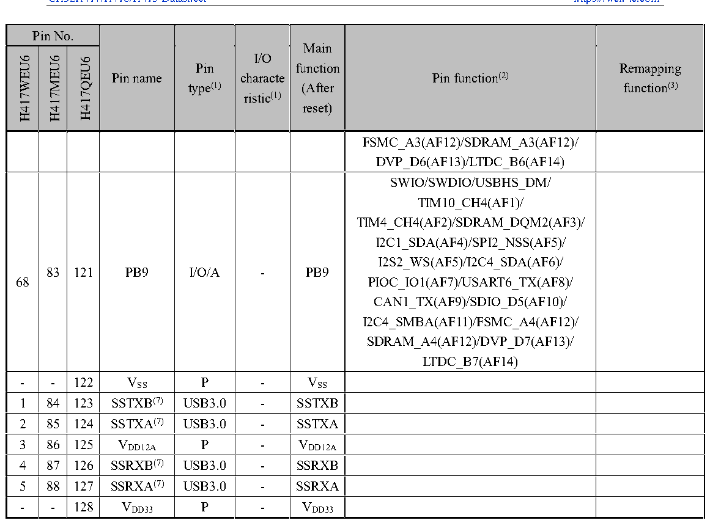

<!-- source-page: 50 -->

[← p.49](0049.md) · [index](../README.md) · [PDF p.50](https://ch32-riscv-ug.github.io/CH32H417/datasheet_en/CH32H417DS0.PDF#page=50) · [p.51 →](0051.md)

<!-- header: CH32H417/H416/H415 Datasheet https://wch-ic.com -->

 <!-- p50-cluster-01 uncaptioned graphics, rendered from the PDF; verify at https://ch32-riscv-ug.github.io/CH32H417/datasheet_en/CH32H417DS0.PDF#page=50 -->

🖼 Text parsed from the figure above

> ⬆ **Table continued** — rendered in full at [page 34](0034.md). <!-- p50-table-001 -->

<em>Note 1: Explanation of table abbreviations:</em>  
<em>I = TTL/CMOS level Schmitt input; O = CMOS level tri-state output; A = analog signal input or output;</em>  
<em>P = power supply; FT = tolerant 5V; USB3.0 = USB3.0 signal; ETH = Ethernet signal; SDP = SerDes</em>  
<em>PHY signal.</em>  
<em>Note 2: The I/O pins are connected to the on-board peripherals/modules through a multiplexer that allows only</em>  
<em>one peripheral&#x27;s multiplexing function (AF) to be connected to the I/O pins at a time. The multiplexer utilizes up to</em>  
<em>16 multiplexing function inputs (AF0 to AF15), which can be configured through the GPIOx_AFLR and</em>  
<em>GPIOx_AFHR registers: after reset, the multiplexer selects for multiplexing function 0, i.e. (AF0). For more</em>  
<em>detailed information, please refer to the Multiplexing Function I/O section and the Debug Setup section of the</em>  
<em>CH32H417RM manual.</em>  
<em>Note 3: The value after the remap function underline indicates the configuration value of the corresponding bit in</em>  
<em>the AFIO_PCFR1 register. For example, UHSIF_CLK_1 indicates that the corresponding bit of the register is</em>  
<em>configured as 01b.</em>  
<em>Note 4: Both VDD33 and VBAT can be connected to an internal analog switch to power the backup area as well as</em>  
<em>the PC13, PC14 and PC15 pins; this analog switch is only capable of passing a limited amount of current (3mA).</em>  
<em>When powered by VDD33: PC14 and PC15 can be used for GPIO or LSE pins, PC13 can be used as a GPIO, an</em>  
<em>RTC calibration clock, an RTC alarm clock, or a seconds output; PC13, PC14, and PC15 can only operate in</em>  
<em>2MHz mode when used as GPIO output pins, with a maximum drive load of 30pF and cannot be used as a current</em>  
<!-- image: p50-draw-image-00001 bbox=[511.32, 783.6, 530.76, 793.8] -->
<!-- footer: V1.8 46 -->
