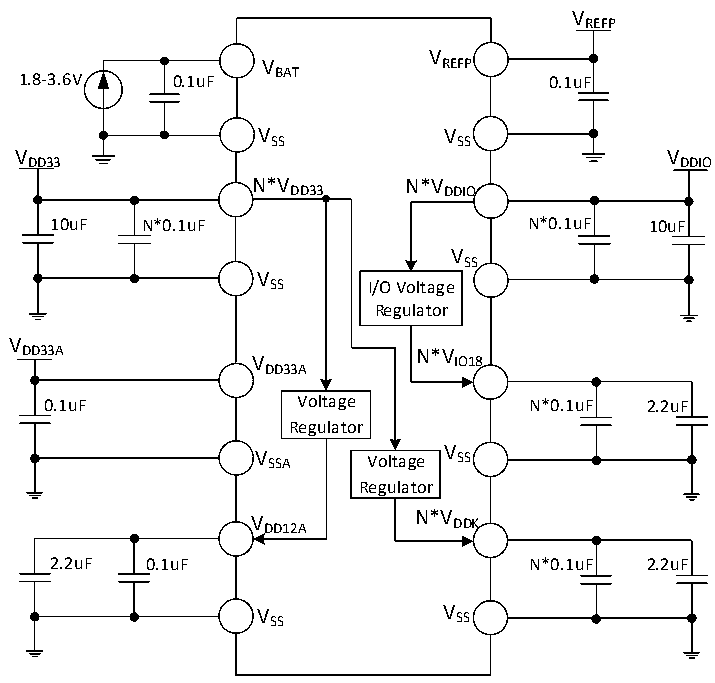

<!-- source-page: 87 -->

[← p.86](0086.md) · [index](../README.md) · [PDF p.87](https://ch32-riscv-ug.github.io/CH32H417/datasheet_en/CH32H417DS0.PDF#page=87) · [p.88 →](0088.md)

<!-- header: CH32H417/H416/H415 Datasheet https://wch-ic.com -->

Figure 3-1-1 CH32H417 Conventional power supply typical circuit  
 <!-- rendered from the PDF; verify at https://ch32-riscv-ug.github.io/CH32H417/datasheet_en/CH32H417DS0.PDF#page=87 -->

🖼 Text parsed from the figure above

VREFP  
V  
V REFP  
1.8-3.6V 0.1uF BAT 0.1uF  
VSS VSS  
VDD33 VDDIO  
N*VDD33 N*VDDIO  
10uF N*0.1uF N*0.1uF 10uF  
VSS  
V  
SS I/O Voltage  
Regulator  
V  
DD33A N*V  
V IO18  
DD33A  
0.1uF Voltage N*0.1uF 2.2uF  
Regulator  
V SSA Voltage V SS  
Regulator  
V DD12A N*V DDK  
2.2uF 0.1uF N*0.1uF 2.2uF  
V SS V SS  

<!-- image: p87-draw-image-00001 bbox=[511.32, 783.6, 530.76, 793.8] -->
<!-- footer: V1.8 83 -->
