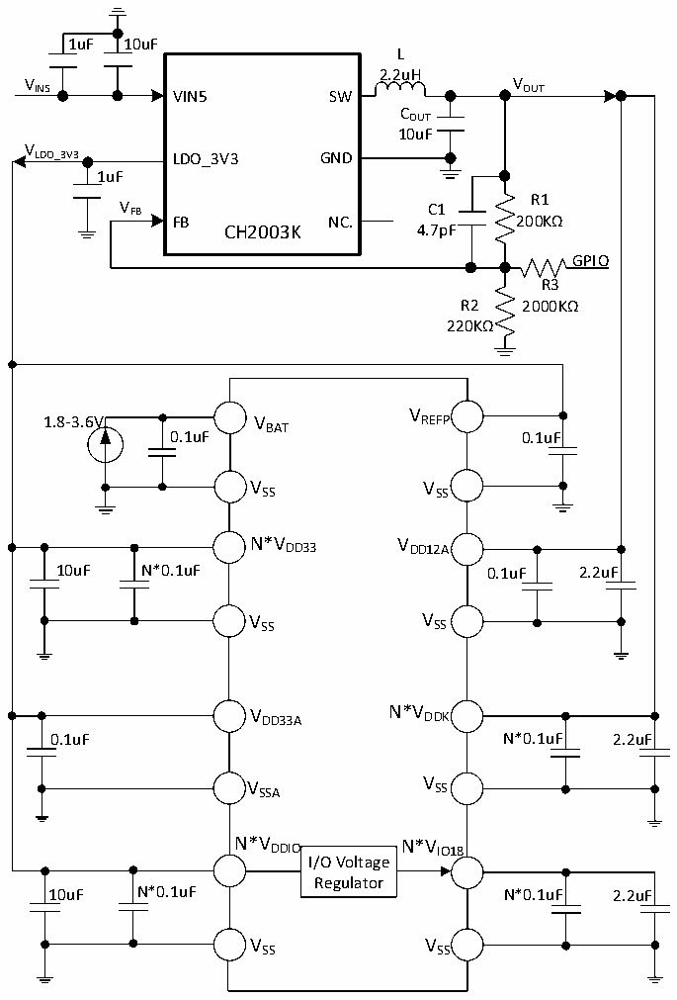

<!-- source-page: 89 -->

[← p.88](0088.md) · [index](../README.md) · [PDF p.89](https://ch32-riscv-ug.github.io/CH32H417/datasheet_en/CH32H417DS0.PDF#page=89) · [p.90 →](0090.md)

<!-- header: CH32H417/H416/H415 Datasheet https://wch-ic.com -->

Figure 3-1-3 CH32H417 regulator is a low-power DC-DC single 5V power supply circuit  
 <!-- rendered from the PDF; verify at https://ch32-riscv-ug.github.io/CH32H417/datasheet_en/CH32H417DS0.PDF#page=89 -->

🖼 Text parsed from the figure above

1uF 10uF  
L  
2.2uH  
V V  
IN5 VIN5 SW OUT  
COUT  
10uF  
V  
LDO_3V3 LDO_3V3 GND  
1uF  
R1  
V FB C1  
FB NC. 200KΩ  
CH2003K 4.7pF  
GPIO  
R3  
R2 2000KΩ  
220KΩ  
V  
1.8-3.6V V REFP  
BAT  
0.1uF 0.1uF  
VSS VSS  
N*V DD33 V DD12A  
10uF N*0.1uF 0.1uF 2.2uF  
V SS V SS  
V DD33A N*V DDK  
0.1uF N*0.1uF 2.2uF  
V SSA V SS  
N*V DDIO N*V IO18  
I/O Voltage  
Regulator  
10uF N*0.1uF N*0.1uF 2.2uF  
VSS VSS  

<em>Note: For CH32H417 chip, VDD33, VDDIO, VIO18 and VDDK may have multiple pins in some chip packages, and the</em>  
<em>power supply pins with the same name must be shorted.</em>  
<em>Connect a 0.1uF decoupling capacitor in parallel with a capacitor of at least 10uF to the main VDD33 pin</em>  
<em>(adjacent to the Ethernet signal pins); the remaining VDD33 pins only require a 0.1uF decoupling capacitor.</em>  
<em>Connect a 0.1uF decoupling capacitor in parallel with a capacitor of at least 10uF to the main VDDIO pin</em>  
<em>(adjacent to VIO18); the remaining VDDIO pins only require a 0.1uF decoupling capacitor.</em>  
<em>Connect a 0.1uF decoupling capacitor in parallel with a capacitor of at least 2.2uF to the main VIO18 pin</em>  
<em>(adjacent to VDDIO); the remaining VIO18 pins only require a 0.1uF decoupling capacitor.</em>  
<em>Connect a 0.1uF decoupling capacitor in parallel with a capacitor of at least 2.2uF to the main VDDK pin</em>  
<em>(adjacent to VDD33); the remaining VDDK pins only require a 0.1uF decoupling capacitor.</em>  
<!-- image: p89-draw-image-00001 bbox=[511.32, 783.6, 530.76, 793.8] -->
<!-- footer: V1.8 85 -->
