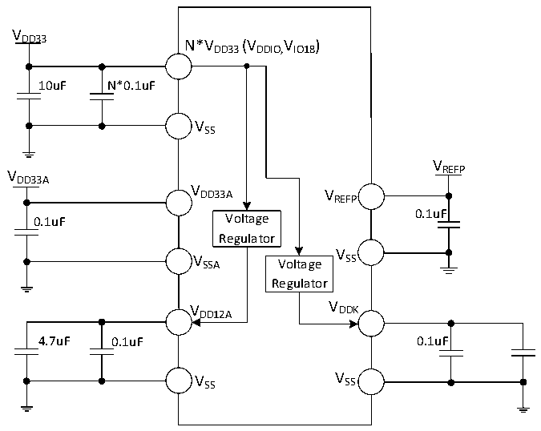

<!-- source-page: 90 -->

[← p.89](0089.md) · [index](../README.md) · [PDF p.90](https://ch32-riscv-ug.github.io/CH32H417/datasheet_en/CH32H417DS0.PDF#page=90) · [p.91 →](0091.md)

<!-- header: CH32H417/H416/H415 Datasheet https://wch-ic.com -->

Figure 3-1-4 CH32H416 Conventional power supply typical circuit  
 <!-- rendered from the PDF; verify at https://ch32-riscv-ug.github.io/CH32H417/datasheet_en/CH32H417DS0.PDF#page=90 -->

🖼 Text parsed from the figure above

VDD33  
N*VDD33(VDDIO,IO18 V )  
10uF N*0.1uF  
VSS  
V  
V REFP  
DD33A  
V  
DD33A V  
REFP  
0.1uF Voltage 0.1uF  
Regulator  
V  
V SSA Voltage SS  
Regulator  
V DD12A V DDK  
4.7uF 0.1uF 0.1uF  
V SS V SS  

<!-- image: p90-draw-image-00001 bbox=[511.32, 783.6, 530.76, 793.8] -->
<!-- footer: V1.8 86 -->
